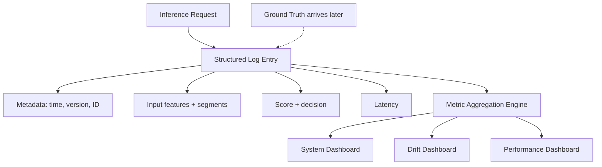

# Model Performance Metrics and Production Logging

## Why Logging Is the Prerequisite for All Metrics

Every monitoring metric discussed in the three-layer framework — system health, data drift, model accuracy, business KPIs — depends on one foundation: **structured, per-prediction logging**.

Without logs that capture inputs, outputs, metadata, and (eventually) ground truth, metrics cannot be computed retrospectively by time window, segment, or model version. Logging is not an afterthought; it is the **data pipeline for observability**.

---

## What to Log Per Prediction

Log every prediction, or a statistically representative sample (e.g., 10% stratified by segment):

| Category | Fields | Purpose |
|----------|--------|---------|
| Request metadata | Timestamp, model version, endpoint, request ID | Traceability, version comparison |
| Input | Feature values (privacy-safe), segment tags (country, product) | Drift detection, segment analysis |
| Output | Raw score, final decision after thresholds/rules | Performance and calibration tracking |
| Ground truth | Actual outcome (when available) | Delayed metric computation |
| System | Per-request latency | Tail latency analysis |

### Privacy-safe representation

In production, raw PII may not be loggable. Use:

- Hashed identifiers
- Binned numeric values
- Aggregated feature summaries
- Feature importance snapshots instead of full vectors

The goal is enough signal for drift and performance analysis without violating data governance.



---

## Computing Metrics from Logs

Once logs flow into an aggregation system (Prometheus, ELK, cloud-native logging), compute metrics by:

- **Time window** — Last hour, day, week
- **Segment** — Country, product line, device type
- **Model version** — Compare v2.3 vs. v2.4 after canary deploy

### Example: delayed label workflow

1. **T+0**: Log prediction with features and score.
2. **T+24h**: Fraud label arrives from investigation team.
3. **T+24h**: Backfill ground truth; recompute precision/recall for last 7 days.

This pattern is standard in fraud detection, credit scoring, and churn prediction where outcomes are not instantaneous.

---

## Model Performance Metrics by Task

| Task | Core Metrics | Business Tie-In |
|------|--------------|-----------------|
| Binary classification | AUC, precision, recall, F1 | Fraud caught, false positive cost |
| Regression | RMSE, MAE, $R^2$ | Revenue forecast error |
| Ranking | NDCG@K, MAP | CTR, session revenue |
| Multi-class | Macro F1, per-class recall | Support ticket routing accuracy |

### Calibration monitoring

For probabilistic classifiers, track whether predicted probabilities match observed frequencies:

- Predicted 20% risk → approximately 20% of those cases should be positive.
- Miscalibration means thresholds tuned at training time no longer optimise business outcomes.

### Threshold monitoring

The decision threshold that maximised business value at launch (e.g., approve loans with score > 0.7) may need adjustment after label drift — even if raw model scores remain well-ranked (AUC stable).

---

## Segment-Level Performance

**Never rely on global metrics alone.**

| Segment | AUC | Action |
|---------|-----|--------|
| Global | 0.90 | Appears healthy |
| US-East | 0.91 | OK |
| EU-West | 0.88 | OK |
| APAC-New | 0.61 | Critical — new market, covariate drift |

Segment breakdowns are the primary mechanism for catching **local failures invisible in global averages** and **fairness degradation**.

---

## Production Onboarding Checklist

### System metrics
- [ ] Latency distribution (P95, P99)
- [ ] Error rates (4xx, 5xx, timeouts)
- [ ] CPU and memory for serving stack

### Data metrics
- [ ] Schema and type checks
- [ ] Missing rates and basic statistics
- [ ] At least one drift measure (PSI or stat comparison) per critical feature

### Prediction and business metrics
- [ ] Model metrics on recent labelled data compared to training baseline
- [ ] Segment-level breakdowns for critical groups
- [ ] At least 1–2 business KPIs tied to real impact

### Logging foundation
- [ ] Sufficient per-prediction context to compute all above metrics after the fact

---

## Real-World Example: Fraud Model on GCP

A fraud detection service on Cloud Run logs each `/score` call to Cloud Logging with structured JSON:

```json
{
  "request_id": "abc-123",
  "model_version": "fraud-v3.2",
  "timestamp": "2026-06-05T10:00:00Z",
  "features": {"amount": 450.0, "merchant_category": "electronics"},
  "segment": {"country": "IN"},
  "score": 0.87,
  "decision": "block",
  "latency_ms": 42
}
```

Ground truth (`is_fraud: true`) arrives 48 hours later via BigQuery ETL. A scheduled job recomputes weekly precision/recall by country and triggers alerts if any segment drops >10% below baseline.

---

## Common Pitfalls / Exam Traps

- **Print statements instead of structured logs** — Unsearchable, no severity levels, cannot be ingested by ELK/Prometheus.
- **Logging without model version** — Cannot compare performance across deployments or rollbacks.
- **No segment tags in logs** — Fairness and localised drift analysis become impossible.
- **Perfect metrics on tiny samples** — 17 requests with AUC=1.0 proves nothing; check sample size.
- **Ignoring evaluation integrity** — Data leakage into features can produce perfect metrics on broken systems.

---

## Quick Revision Summary

- All monitoring metrics depend on structured per-prediction logging.
- Log: metadata, inputs (privacy-safe), outputs, latency; backfill ground truth when available.
- Compute metrics by time window, segment, and model version.
- Task-appropriate ML metrics: AUC/F1 (classification), RMSE (regression), NDCG (ranking).
- Monitor calibration and decision thresholds, not just ranking metrics.
- Segment breakdowns are mandatory — global metrics hide local failures.
- Use the five-category checklist when onboarding new production models.
