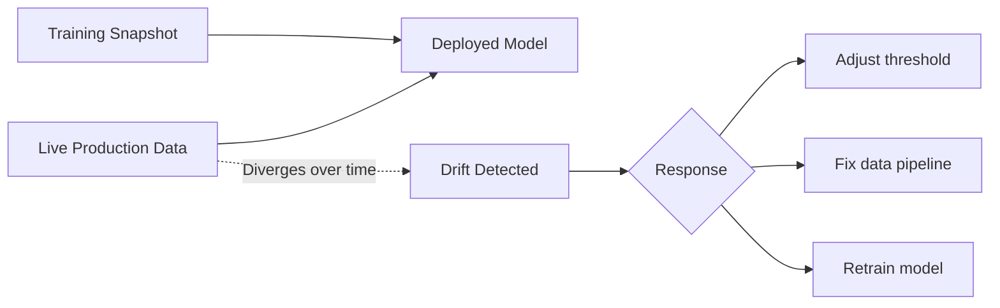

# Types of Drift in Production ML Systems

## Intuition: The World Moves; The Model Does Not

A model is a frozen snapshot of patterns learned at training time. Production is a live, changing environment. **Drift** is what happens when the world changes but the model's code and weights stay the same.

Sources of drift include:

- Users adopting new behaviour
- Product changes adding features or altering workflows
- Adversaries adapting (fraudsters, spam bots)
- Upstream data pipelines quietly changing format or logic
- Economic or regulatory shifts altering label definitions

Without drift monitoring, a model that was excellent at launch slowly becomes misaligned with reality. The damage surfaces only when business impact becomes painful.



---

## Three Types of Drift

People use "drift" loosely. In production ML, three distinct types matter — each requires different detection methods and responses.

| Type | What Changes | Detection Signal | Typical Response |
|------|--------------|------------------|------------------|
| **Covariate drift** | Input feature distributions | PSI, KS test, mean/std shift | Investigate population or pipeline change |
| **Label drift** | Target variable distribution | Class ratio shift, base rate change | Recalibrate thresholds, update business rules |
| **Concept drift** | Feature–label relationship | Performance degradation despite stable inputs | Retrain on fresh data |

These are related but **not identical** problems.

---

## Covariate Drift (Feature Drift)

**Definition**: The distribution of input features $P(X)$ changes between training and production.

### Common causes

- Launching in a new geographic market (location features shift)
- Price increases changing transaction amount scales
- Data pipeline changes introducing new categories or different formatting
- Seasonal patterns (holiday shopping spikes)

### Detection signals

- Feature histograms no longer align between training and recent production
- Mean, standard deviation, or PSI crosses thresholds
- Spike in out-of-range values or previously unseen categories

### Example

A credit model trained on Region A users (mean age 35, mean income ₹6L) is deployed to Region B (mean age 24, mean income ₹3.4L). The model code is unchanged; the API is healthy. Covariate drift on `age` and `income` signals the model operates on an unfamiliar population.

**Important**: The model may still perform adequately for a while. Covariate drift is a **strong early warning**, not an automatic retrain trigger.

---

## Label Drift (Target Drift)

**Definition**: The distribution of the target variable $P(Y)$ changes.

### Common causes

- Churn rate doubles after a pricing change
- Fraud becomes rarer after tighter onboarding
- Disease prevalence shifts during an epidemic
- Regulatory changes alter what counts as a positive label

### Impact

The model may still **rank** instances correctly (AUC stable), but:

- Precision and recall at the existing threshold shift dramatically
- Business expectations around false positives/negatives change
- Cost-sensitive operating points need recalibration

### Example

A fraud model trained on 1% fraud rate now sees 5% fraud in production after a new attack campaign. Precision tanks because the model was calibrated for a rare-event regime. AUC may remain high while business outcomes deteriorate.

---

## Concept Drift (Relationship Drift)

**Definition**: The conditional relationship $P(Y|X)$ changes — the mapping from features to labels shifts.

### Common causes

- Fraudsters adopt new attack patterns
- Product changes alter which behaviours lead to churn
- Economic conditions redefine what constitutes a "good borrower"
- Competitor actions change customer preferences

### Detection

Concept drift is the **hardest to detect early** because input distributions may look normal. It typically appears as:

- Model performance metrics degrading on fresh labelled data
- Stable feature stats but declining precision/recall/AUC

Detection **requires ground truth** and ongoing performance tracking.

### Example

A recommendation model's features (user history, item metadata) look stable, but click-through rate drops because user preferences shifted after a competitor launch. The feature distributions did not change much; the meaning of those features for predicting engagement did.

---

## Relationship Between Drift Types

```mermaid
flowchart TB
    CD[Covariate Drift<br/>P(X) changes]
    LD[Label Drift<br/>P(Y) changes]
    CoD[Concept Drift<br/>P(Y|X) changes]
    CD -->|May cause| CoD
    LD -->|Affects thresholds| PERF[Apparent Performance Change]
    CoD --> PERF
    CD -.->|Independent of| LD
```

- Covariate drift can **lead to** concept drift if the model encounters regions of feature space it never learned.
- Label drift affects **threshold selection** without necessarily changing ranking ability.
- Concept drift can occur **without** obvious input distribution changes.

---

## Drift as a Signal, Not an Automatic Retrain

Drift detection should always trigger **investigation**, not blind retraining:

1. **Detect** — Metric crosses threshold
2. **Investigate** — Real business change? Pipeline bug? Expected seasonality?
3. **Decide** — Adjust threshold, fix upstream data, or retrain and redeploy

Drift means *something changed*. The right response depends on **what** changed and **why**.

---

## Common Pitfalls / Exam Traps

- **Treating all drift as covariate drift** — Label and concept drift require different responses.
- **Retraining immediately on every PSI alert** — May be seasonality or a pipeline bug fixable without retraining.
- **Detecting concept drift without ground truth** — Requires delayed labels and performance tracking.
- **Ignoring label drift when AUC is stable** — Threshold-based metrics (precision, recall) can collapse while ranking stays good.
- **Assuming drift means the model is wrong** — Sometimes only thresholds or business rules need adjustment.

---

## Quick Revision Summary

- Drift = world changes, model does not; primary cause of silent production degradation.
- **Covariate drift**: $P(X)$ shifts — detect via PSI, histograms, mean/std comparison.
- **Label drift**: $P(Y)$ shifts — affects precision/recall at fixed thresholds.
- **Concept drift**: $P(Y|X)$ shifts — shows as performance drop; needs ground truth to detect.
- Covariate drift is an early warning; concept drift is the most insidious.
- Drift triggers investigate → decide (threshold fix, data fix, or retrain), not automatic retrain.
- All three types are related but require different detection methods and responses.
