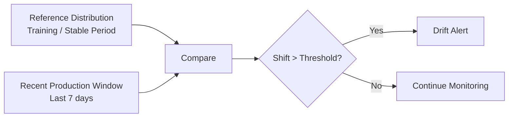
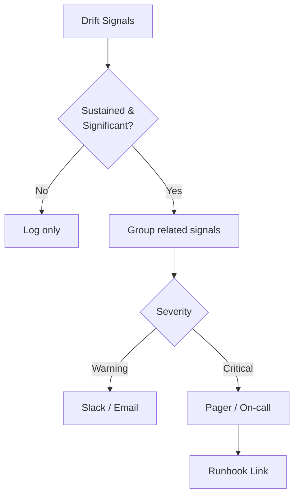

# Drift Detection Methods and Alert Design

## Start Simple, Then Add Statistical Rigor

Drift detection does not require exotic machine learning. The most effective production systems combine **simple descriptive statistics** with a few **well-understood statistical tests**. The goal is useful, explainable signals — not perfect statistics.

---

## Per-Feature Monitoring Basics

For every important feature, track over rolling time windows:

| Statistic | What It Catches |
|-----------|-----------------|
| Mean | Central tendency shift |
| Standard deviation | Spread/volatility change |
| Min / max | Out-of-range values |
| Missing rate | Pipeline or source degradation |
| Histogram | Full distribution shape change |

### Workflow

1. Define a **reference distribution** (training data or a known-stable production period).
2. Compare against a **recent window** (last day, week, or month).
3. Flag features whose distributions shifted beyond a threshold.

---

## Statistical Drift Tests

### PSI — Population Stability Index

A single-number stability score comparing binned distributions.

**Algorithm**:
1. Bin both reference and production distributions identically.
2. Compute percentage of observations in each bin for both.
3. Sum bin-wise contributions: $\text{PSI} = \sum (A_i - E_i) \cdot \ln(A_i / E_i)$

Where $A_i$ = actual (production) proportion in bin $i$, $E_i$ = expected (reference) proportion.

| PSI Value | Interpretation |
|-----------|----------------|
| < 0.1 | No significant shift |
| 0.1 – 0.2 | Minor shift — monitor closely |
| > 0.2 | Major shift — investigate, likely need action |

**Use case**: Mission-critical numeric or binned features in banking, insurance, and credit scoring where regulators expect PSI reporting.

### KS Test (Kolmogorov–Smirnov)

Compares cumulative distribution functions of two continuous samples. Returns a statistic and p-value indicating whether distributions differ significantly.

**Best for**: Continuous variables where full distribution shape matters, not just mean.

### Chi-Square Test

Compares observed vs. expected frequencies for categorical features.

**Best for**: Detecting category distribution shifts (e.g., `merchant_category` proportions change).

---

## Comparison of Drift Detection Methods

| Method | Feature Type | Output | Explainability | Compute Cost |
|--------|-------------|--------|----------------|--------------|
| Mean / std comparison | Numeric | Per-feature delta | Very high | Very low |
| Histogram overlay | Any | Visual | High | Low |
| PSI | Numeric (binned) | Single score | High | Low |
| KS test | Continuous | p-value | Medium | Medium |
| Chi-square | Categorical | p-value | Medium | Low |

**Production recommendation**: Start with mean/std + histograms. Add PSI for top 5–10 critical features. Use KS/chi-square for deeper investigations.

---

## When to Alert Humans

Good alert candidates:

- **Multiple key features** show strong drift simultaneously (systemic change, not noise)
- **Label rates** or overall model performance cross a bad threshold
- **Critical segment** (country, product line) shows large metric change
- **Sustained drift** over hours/days, not a single noisy spike

### Avoiding alert fatigue

| Bad Practice | Good Practice |
|--------------|---------------|
| Page on every PSI bump > 0.05 | Alert on PSI > 0.2 sustained for 4+ hours |
| Separate alert per feature | Group related drift signals into one incident |
| Same channel for info and critical | Route by severity: Slack for warning, pager for critical |
| No owner assigned | Primary + escalation owner per alert type |

### Alert routing by ownership

| Issue Type | Primary Owner |
|------------|---------------|
| Schema change, missing data, pipeline failure | Data engineering |
| Drift, performance degradation, retrain decision | ML engineering |
| Latency, CPU, scaling, network | Platform / infra |

**Goal**: An alert means "stop and look at this — something materially changed," not "mute this channel because it is always noisy."

---

## Real-World Example: E-Commerce Feature Monitoring

An AWS-hosted product ranking model monitors 12 features via a daily batch job:

1. Load training baseline stats from S3.
2. Aggregate last 7 days of production logs from Kinesis.
3. Compute PSI for `price`, `category`, `user_tenure`.
4. If any PSI > 0.2 for 2 consecutive days → PagerDuty alert to ML team with dashboard link.
5. If only 1 feature PSI 0.1–0.2 → Slack info message, no page.

This balances sensitivity with operational sustainability.

---

## Common Pitfalls / Exam Traps

- **PSI > 0.2 always means retrain** — Investigate first; may be fixable upstream or expected seasonality.
- **Single-feature alerts in isolation** — Correlated features drifting together signal systemic change.
- **Alerting on instantaneous spikes** — Require sustained breach to reduce noise.
- **No reference baseline** — PSI and KS require a stored training or stable-period distribution.
- **Perfect ML metrics despite high PSI** — Check for data leakage, selection bias, or tiny sample sizes.

---

## Quick Revision Summary

- Start drift detection with mean, std, min/max, missing rates, and histograms.
- PSI: single stability score; <0.1 stable, 0.1–0.2 minor, >0.2 major shift.
- KS test for continuous features; chi-square for categorical features.
- Compare reference (training/stable) vs. recent production window.
- Alert on sustained, significant, multi-feature drift — not every tiny bump.
- Group related signals; route to correct team; link to runbooks.
- Drift alerts trigger investigation, not automatic retraining.
