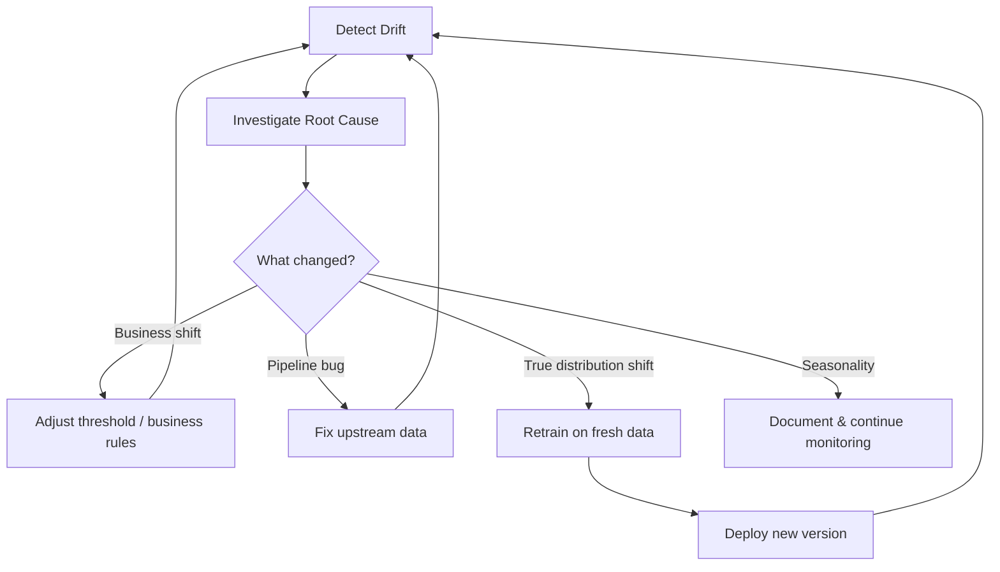
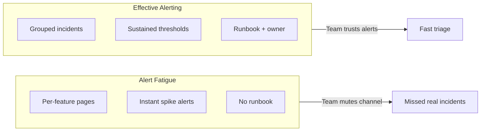

# Responding to Drift: Detection, Investigation, and Action

## Drift Is a Signal, Not a Verdict

Detecting drift is only the first step. The operational value comes from a **structured response workflow** that converts signals into correct actions — whether that means adjusting a threshold, fixing a data pipeline, or retraining and redeploying.

---

## The Detect → Investigate → Decide Pattern

### Step 1: Detect

Drift can appear in:

- **Inputs** — Feature distributions shift (covariate drift)
- **Labels** — Target base rates change (label drift)
- **Performance** — Metrics degrade on fresh ground truth (concept drift)

Detection methods include PSI, statistical tests, histogram comparison, and rolling performance metrics.

### Step 2: Investigate

Before taking action, determine the root cause:

| Question | Distinguishes... |
|----------|------------------|
| Is this a real business change? | Market expansion vs. bug |
| Is this a data pipeline bug? | Fixable without retraining |
| Is this expected seasonality? | Holiday spike vs. true drift |
| Is this isolated to one segment? | Localised issue vs. global shift |

### Step 3: Decide

Based on investigation:

| Finding | Action |
|---------|--------|
| Threshold no longer optimal after label drift | Adjust decision threshold or business rules |
| Upstream ETL introduced bad encoding | Fix data pipeline; no retrain needed |
| Genuine population or behaviour shift | Retrain on fresher data; evaluate; deploy |
| Seasonal pattern within expected bounds | Document; update monitoring baselines |

**Critical principle**: Drift does not always mean retrain immediately. It should **always** trigger human or automated investigation.

---

## Three Drift Types Recap

| Type | What Shifts | Primary Detection | Common Response |
|------|-------------|-------------------|-----------------|
| Covariate | $P(X)$ — features | PSI, KS, mean/std | Investigate population; may retrain |
| Label | $P(Y)$ — targets | Class ratio monitoring | Recalibrate thresholds |
| Concept | $P(Y|X)$ — relationship | Performance on fresh labels | Retrain on updated data |

---

## Detection Toolkit Summary

| Method | Best For |
|--------|----------|
| Basic stats (mean, std, min, max) | Quick per-feature screening |
| Histogram comparison | Visual distribution shape |
| PSI | Single-score stability for critical features |
| KS test | Continuous distribution comparison |
| Chi-square | Categorical frequency comparison |

Always compare **training data** (or stable reference period) against a **recent production window** (last week/month).

---

## Alert Design Principles

### When to notify

- Several key features show strong drift simultaneously
- Label rates or model performance cross bad thresholds
- Critical segment shows significant change
- Issue is **sustained**, not a single noisy spike

### How to avoid alert fatigue

1. **Sustained breach** — Metric must exceed threshold for N consecutive evaluation periods.
2. **Grouped incidents** — Combine related drift signals into one alert, not per-feature spam.
3. **Severity tiers** — Info (log), warning (Slack), critical (pager).
4. **Clear ownership** — Data engineering for pipeline; ML for drift/performance; platform for infra.
5. **Runbook links** — Every alert includes what to check next.

---

## Connecting Drift to the Retraining Lifecycle

When investigation confirms a true distribution or concept shift:

1. Trigger retraining pipeline on updated data
2. Evaluate candidate model against current production model
3. Register new version in model registry
4. Deploy via existing CI/CD (canary → full rollout)
5. Resume monitoring loop on the new version

Drift detection becomes an **automatic input** to the retraining pipeline — not a manual, ad-hoc process discovered weeks after damage accumulates.

---

## Real-World Scenario: Fraud Model Label Drift

**Situation**: Fraud rate shifts from 1% (training) to 5% (production) after a coordinated attack.

**Detection**: Label rate monitor fires; precision at existing 0.8 threshold drops from 0.75 to 0.41.

**Investigation**: Confirmed real fraud surge, not pipeline bug.

**Decision**: Short-term — lower threshold to catch more fraud (accept higher false positives). Medium-term — retrain on last 90 days of labelled data with updated class weights.

**Outcome**: Precision recovers to 0.68 at new operating point; full retrain deployed within 2 weeks.

---

## Common Pitfalls / Exam Traps

- **"Drift detected = retrain now"** — Always investigate root cause first.
- **Ignoring seasonality** — Holiday traffic patterns mimic drift; document expected cycles.
- **Alert fatigue from per-feature pages** — Group signals; use sustained thresholds.
- **No runbook for drift alerts** — Teams panic or ignore without a playbook.
- **Fixing data but not updating baselines** — After pipeline fix, reset reference distributions.

---

## Quick Revision Summary

- Drift response: detect → investigate → decide (threshold, data fix, or retrain).
- Drift is a signal for investigation, not an automatic retrain command.
- Three drift types: covariate ($P(X)$), label ($P(Y)$), concept ($P(Y|X)$).
- Detection: basic stats, histograms, PSI, KS, chi-square vs. training reference.
- Alert on sustained, significant, grouped signals with clear ownership and runbooks.
- Confirmed concept/covariate shifts feed into automated retraining pipelines.
- Avoid alert fatigue: severity tiers, sustained breaches, grouped incidents.
