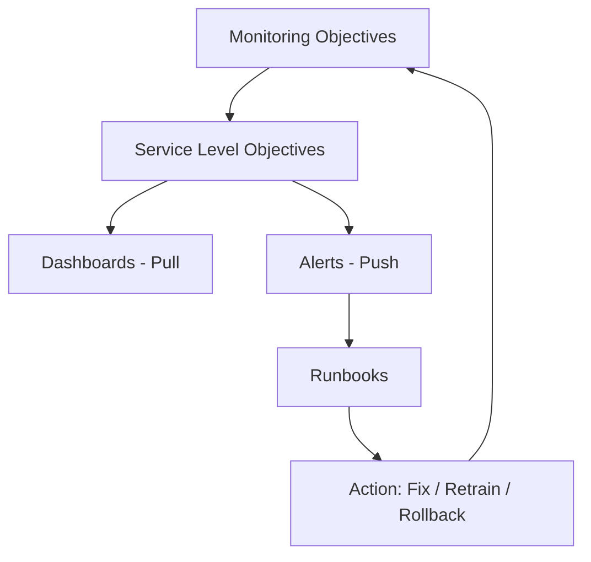
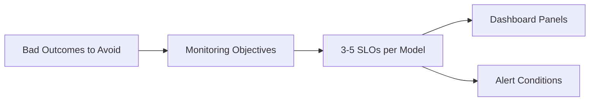
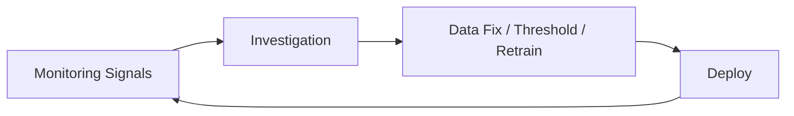

# From Metrics to Action: Designing an ML Monitoring Workflow

## Beyond Collection: Monitoring That Drives Decisions

Collecting metrics is necessary but not sufficient. A monitoring setup must **organise signals so humans can see issues, triage them, and fix them**. This note covers objectives, the observability pillars (logs, metrics, traces), SLOs, and the workflow that connects signals to action.

---

## The Three Observability Pillars

Production ML systems rely on the same observability foundation as any distributed service, extended with ML-specific signals.

### Logs

**What**: Discrete event records — one per inference request.

**Properties**: High cardinality, rich context, immutable, searchable.

**ML use**: Per-prediction feature values, scores, decisions, model version, segment tags. Enables retrospective drift and performance analysis.

**Stack examples**: ELK (Elasticsearch, Logstash, Kibana), AWS CloudWatch Logs, GCP Cloud Logging, Fluentd → object storage.

### Metrics

**What**: Numeric time-series aggregations — counters, gauges, histograms.

**Properties**: Low cardinality, efficient storage, ideal for alerting.

**ML use**: P99 latency, error rate, PSI per feature, rolling AUC, prediction volume, business KPIs.

**Stack examples**: Prometheus + Grafana, Datadog, CloudWatch Metrics, Azure Monitor.

### Traces

**What**: End-to-end request paths across services.

**Properties**: Show latency breakdown across microservices and dependencies.

**ML use**: Trace a `/predict` call through API gateway → feature store lookup → model inference → post-processing. Identifies whether slowness is in feature retrieval or model compute.

**Stack examples**: Jaeger, Zipkin, AWS X-Ray, OpenTelemetry.

| Pillar | Best For | ML-Specific Signal |
|--------|----------|-------------------|
| Logs | Forensics, drift analysis, audit | Feature values, ground truth backfill |
| Metrics | Dashboards, alerting, trends | PSI, AUC, error rate, latency percentiles |
| Traces | Latency debugging across services | Feature store vs. inference bottleneck |

---

## Setting Monitoring Objectives

Effective monitoring starts with **clear objectives**: what bad outcomes are we trying to avoid?

| Risk | Objective Example |
|------|-------------------|
| Accuracy collapse | AUC or recall above threshold on recent labelled data |
| Revenue impact | Conversion rate within 5% of baseline |
| Unfair treatment | Acceptance rate gap between segments < 3% |
| Latency degradation | P95 latency < 100 ms |
| Data pipeline failure | PSI < 0.2 on top 5 features |

### Translate objectives into SLOs

A **Service Level Objective (SLO)** is a measurable target with a threshold and evaluation window:

- **Latency SLO**: P95 < 100 ms over rolling 1-hour window
- **Accuracy SLO**: AUC ≥ 0.85 on last 7 days of labelled data
- **Drift SLO**: PSI < 0.2 on critical features over rolling 24-hour window

The result: a short per-model list — *"This model is healthy if these metrics stay within these bands."* Dashboards and alerts are built around these SLOs, not around every possible metric.

---

## Dashboard Design

### One primary dashboard per important model

| Section | Content | Scan Time |
|---------|---------|-----------|
| System health | Traffic, latency, error rates | 10 seconds |
| Data health | Drift scores, schema checks, missing value summaries | 10 seconds |
| Prediction health | Recent ML metrics vs. baseline, segment breakdowns | 10 seconds |

**Design principle**: Someone should answer *"Is this model basically fine?"* in **30 seconds**.

- Highlight **exceptions** — red/amber indicators for out-of-range values.
- Do not force operators to read a wall of numbers.
- Dashboards are **pull monitoring** — people look when curious or during triage.

---

## Alert Design

Alerts are **push monitoring** — the system taps you on the shoulder.

### Alert conditions tied to SLOs

| Condition | Example |
|-----------|---------|
| Latency breach | P95 > 200 ms for > 15 minutes |
| Drift breach | PSI > 0.2 for > 4 consecutive hours |
| Performance breach | AUC drops > 10% below baseline on fresh labels |

### Severity routing

| Severity | Channel | When |
|----------|---------|------|
| Info | Dashboard only / log | Minor deviation, self-resolving |
| Warning | Slack / email | Needs investigation within hours |
| Critical | Pager / on-call | Immediate action required |

### Avoiding alert fatigue

- Trigger on **sustained** issues, not single noisy spikes.
- Require metric to return inside band before alert is fully resolved.
- Each alert includes a **runbook link**.

---

## Ownership and Runbooks

### Responsibility split

| Team | Owns |
|------|------|
| Data engineering | Schema changes, missing data, pipeline failures |
| ML engineering | Drift, performance degradation, retrain decisions |
| Platform / infra | Latency, CPU, scaling, network |

Each alert type needs: **primary owner**, **escalation path**, **destination** (Slack channel, on-call rotation, ticket queue).

### Runbook contents

1. One-line explanation in business terms
2. Common causes (schema change, traffic spike, rollout issue)
3. Check sequence (which dashboard, which logs, which queries)
4. Menu of next actions (rollback, disable feature, open retrain ticket, escalate)

**Benefit**: Faster triage, less panic, onboarding-friendly operations.

---

## Closing the Loop: Monitoring → Model Updates

When repeated drift on important features or persistent performance drops occur:

1. Create investigation ticket
2. Determine root cause (data fix, threshold adjustment, or retrain)
3. If retrain: train on updated data → evaluate vs. current → register → deploy
4. Monitoring loop restarts on new version

---

## Common Pitfalls / Exam Traps

- **Metrics without objectives** — Collecting everything but alerting on nothing meaningful.
- **Dashboards without exception highlighting** — Operators cannot triage in 30 seconds.
- **Alerts without runbooks** — On-call engineers reinvent triage every incident.
- **No ownership matrix** — Alerts bounce between teams with no resolution.
- **Logs only, no metrics** — Cannot efficiently alert on trends; logs are for forensics, metrics for monitoring.

---

## Quick Revision Summary

- Observability pillars: logs (events), metrics (time-series), traces (request paths) — all needed for ML.
- Start with monitoring objectives → translate to 3–5 SLOs per model.
- One dashboard per model: system + data + prediction health; scannable in 30 seconds.
- Alerts are push monitoring tied to SLOs; dashboards are pull monitoring.
- Severity tiers: info (log), warning (Slack), critical (pager).
- Assign ownership: data eng (pipelines), ML eng (drift/performance), platform (infra).
- Runbooks accelerate triage; monitoring signals feed retraining pipelines.
