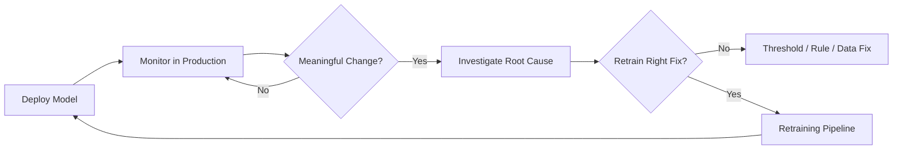

# When and Why to Retrain ML Models

## From Monitoring Signals to Retraining Decisions

Model deployment is not the end of engineering work — it is the start of operational life. Monitoring (drift detection, performance metrics, business KPIs, alerts) produces **signals**. Retraining is the **response loop** that turns those signals into an updated model when the current one is no longer fit for purpose.

The central question this module addresses:

> **Is this drift alert worth a new model, or is something else going on?**

---

## What This Module Covers

| Topic | Focus |
|-------|-------|
| **Triggers** | When drift, performance, or policy changes justify retraining |
| **Retraining patterns** | Scheduled vs event-driven (and hybrid) approaches |
| **Pipeline design** | Data snapshot → train → evaluate → register → promote |
| **Evaluation** | Offline, backtest, shadow, A/B testing before full rollout |
| **Governance** | Approvals, lineage, rollback, guardrails |
| **Hands-on** | MLflow registry, champion/challenger, config-driven retraining |

---

## The Decision Framework (Preview)

Before triggering retraining, four questions must be answered affirmatively:

1. Is there a **real, persistent** change in data, performance, or policy?
2. Could the issue be fixed by **tweaking a threshold**, adding a rule, or fixing a **data pipeline bug** instead?
3. Do we have **enough fresh labelled data** to learn something genuinely better?
4. Do we have a **pipeline** to train, evaluate, and compare candidates against the current champion in a controlled way?

If all four are yes, retraining is a sensible next step — not before investigation.

---

## Why Retraining Is Not "Version 2.0 Once and Done"

Production environments are non-stationary:

- User behaviour shifts (seasonality, product changes, adversarial adaptation)
- Data pipelines evolve (new features, schema changes, missing-value spikes)
- Business rules and regulations change (fairness requirements, feature bans)

A model trained on last year's world silently degrades even when infrastructure metrics (latency, uptime) remain green. Retraining closes the loop between **observation** (monitoring) and **adaptation** (new model).

---

## Real-World Example: Credit Risk at Scale

A fintech credit-scoring model processes thousands of loan applications per hour. Each prediction has direct financial impact:

- **False negative** (approve risky loan): potential loss of tens of thousands of dollars
- **False positive** (reject good customer): lost revenue and damaged brand trust

Monitoring detects rising default rates among a new customer segment the model never saw during training. Drift alerts fire — but the first step is investigation: is this a data bug, a product change, or genuine distribution shift? Only after confirming a new data regime does retraining on recent labelled data become the right move.

---

## Common Pitfalls / Exam Traps

- **Treating every drift alert as a retrain trigger** — drift is a warning sign, not an automatic button; investigation comes first.
- **Retraining without fresh labels** — retraining on unlabelled or stale data produces no meaningful improvement.
- **Skipping the "could we fix it another way?" step** — threshold tuning or pipeline fixes are cheaper and often sufficient.
- **No champion comparison** — deploying a new model without head-to-head evaluation against production risks regression.
- **Confusing scheduled retraining with reactive retraining** — both have roles; neither alone covers all scenarios.

---

## Quick Revision Summary

- Monitoring produces signals; retraining is the controlled response when the current model is misaligned with reality.
- Always ask: drift alert → new model, or threshold fix / data bug / business rule change?
- Four-gate checklist: persistent change, alternatives ruled out, sufficient fresh data, pipeline ready.
- Retraining is a **continuous loop** (deploy → monitor → detect → retrain → deploy), not a one-time upgrade.
- This module connects monitoring (Week 5) to pipeline design, evaluation methods, governance, and hands-on MLflow workflows.
- High-impact domains (credit, fraud, recommendations) require systematic evaluation before promotion.
- Human judgement remains essential for risk, fairness, and policy-driven retrains.
