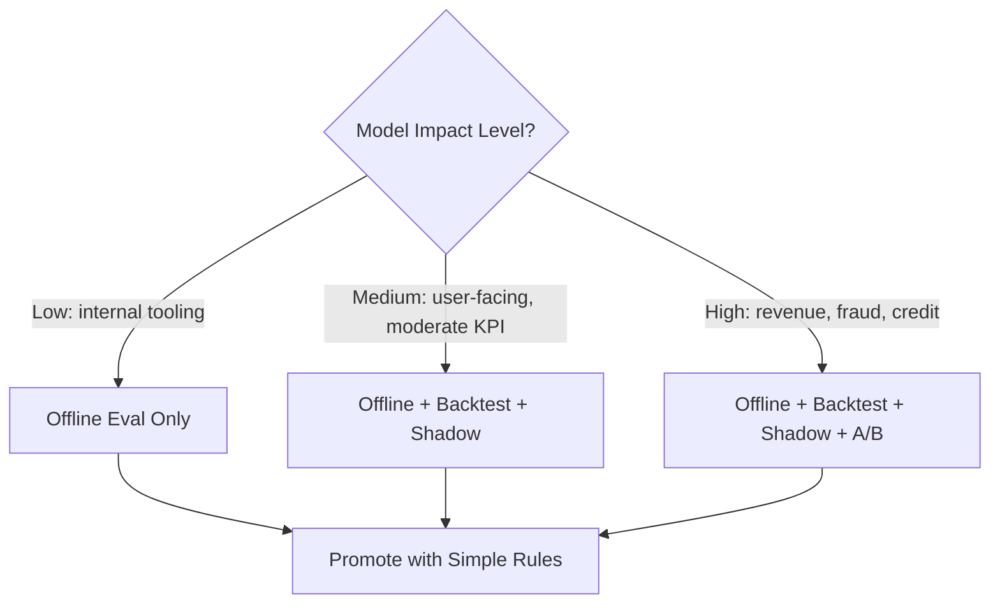
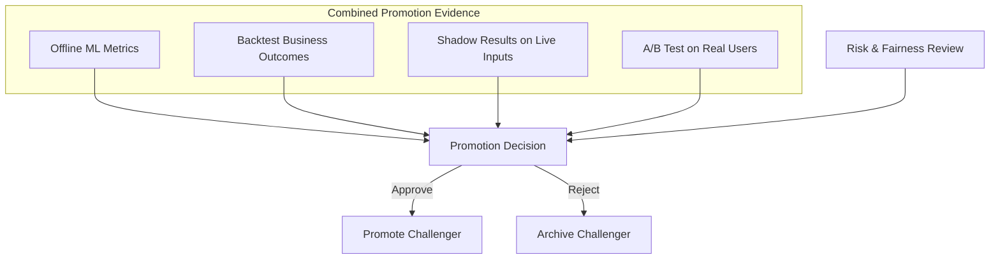

# Choosing Evaluation Methods and Connecting Them to Promotion

## Matching Safety Gear to Model Impact

Not every model change warrants the full evaluation stack. The art of MLOps is selecting the **right depth of validation** for each change's risk profile — then connecting that evidence to a governed promotion decision.

---

## Decision Framework: Which Technique When?



| Technique | Cost | Risk to Users | When to Use |
|-----------|------|--------------|-------------|
| **Backtest** | Cheap, fast | None | Early exploration; narrowing many candidates; low-risk internal models |
| **Shadow testing** | Medium (2× compute) | None | Medium-to-high impact; validate on live inputs before user exposure |
| **A/B test** | High (traffic, time) | Partial (test group) | High-impact decisions; need proof of business metric improvement |
| **Full rollout** | Deployment cost | All users | After combined evidence justifies promotion |

---

## The Layered Evaluation Pattern

A common production pattern progresses through increasing fidelity:

```
Backtest → Shadow → A/B Test → Full Rollout
```

You do not always need all three stages — but thinking in **levels** ensures you pick appropriate safety gear:

| Stage Transition | Gate Question |
|-----------------|---------------|
| Offline → Backtest | Does candidate beat champion on historical replay? |
| Backtest → Shadow | Are there fewer than 3 promising candidates remaining? |
| Shadow → A/B | Do shadow logs show sane predictions with no segment failures? |
| A/B → Full rollout | Is primary metric improvement statistically significant with guardrails intact? |

**Low-impact example**: An internal log-classification model retrains monthly. Offline AUC comparison against champion suffices — no shadow or A/B needed.

**High-impact example**: A credit approval model with direct financial exposure requires backtest → shadow → A/B before full promotion.

---

## Connecting Evaluation to the Promotion Pipeline

The evaluate stage in the retraining pipeline is **not a single metric run on a test set**. For important models, it aggregates evidence:



### Promotion Decision Inputs

1. **Offline metrics** — AUC, RMSE, F1 on held-out validation set
2. **Backtest results** — simulated fraud catch rate, revenue, profit
3. **Shadow testing** — prediction sanity, segment analysis under live input distributions
4. **A/B test** (where justified) — real user business outcomes
5. **Risk and fairness considerations** — segment-level performance, regulatory constraints

The decision to promote a challenger over the champion should be based on **combined evidence**, not any single metric in isolation.

---

## Promotion Rules Tied to Evaluation Layers

| Model Tier | Minimum Evidence Required | Approval |
|-----------|--------------------------|----------|
| Tier 1 (internal) | Offline metrics beat champion by $\delta$ | Automated |
| Tier 2 (user-facing) | Offline + backtest + shadow pass | Team lead approval |
| Tier 3 (financial/regulated) | All layers + A/B significance + fairness review | Governance board approval |

---

## Real-World Example: Dynamic Pricing Model

An e-commerce dynamic pricing model affects revenue directly:

1. **Backtest** on 6 months of historical pricing data → challenger estimates +5% revenue
2. **Shadow** for 1 week → no anomalous price distributions; latency acceptable
3. **A/B test** on 15% of product catalogue for 2 weeks → revenue +4.1% (significant); guardrail: no increase in customer complaints
4. **Promotion** with champion archived; rollback tested

Skipping A/B would mean deploying on backtest evidence alone — which cannot capture competitive dynamics and customer price sensitivity in real time.

---

## Common Pitfalls / Exam Traps

- **Using A/B tests for every tiny model tweak** — wasteful; reserve for high-impact changes.
- **Promoting on offline metrics alone for high-impact models** — misses user behaviour and business proof.
- **Running shadow indefinitely without progressing** — shadow validates predictions, not business impact.
- **Treating evaluation stages as independent** — promotion should synthesise all available evidence.
- **Ignoring risk tier when choosing evaluation depth** — one-size-fits-all wastes resources or creates risk.

---

## Quick Revision Summary

- Match evaluation depth to model impact: backtest (cheap) → shadow (live inputs) → A/B (real users).
- Common pattern: backtest → shadow → A/B → full rollout; not all stages always required.
- Promotion decisions synthesise offline metrics, backtest, shadow, A/B, and risk/fairness evidence.
- High-impact models require combined evidence; low-impact models may need offline comparison only.
- Evaluation is layered — each stage filters candidates before the next, more expensive stage.
- Predefined promotion rules per model tier remove ad hoc, emotion-driven decisions.
