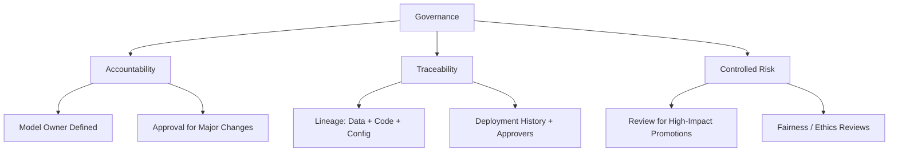
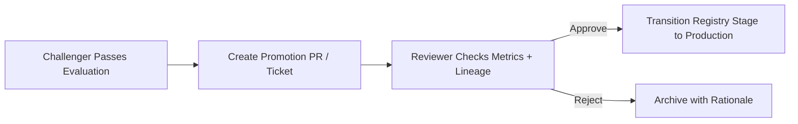

# Governance and Safety: Why Approvals Matter

## The Problem Without Governance

As models and teams scale, ad-hoc deployment practices create systemic risk:

- **Silent model changes** in production — no one knows a new model went live
- **No clear owner** when something breaks at 2 AM
- **Unanswerable questions** during incidents: *Who approved this? Which model was live last Tuesday?*

**Governance is not about slowing everything down** — it is about **accountability**, **traceability**, and **controlled risk** so that big changes receive proper review, especially in regulated or high-impact domains.

---

## Three Pillars of ML Governance

| Pillar | Definition | Production Mechanism |
|--------|-----------|---------------------|
| **Accountability** | Known owner for each model; clear approvers for major changes | Model owner field in registry; PR-based promotion |
| **Traceability** | Reconstruct what happened and why | Lineage tracking; audit logs; registry history |
| **Controlled risk** | Big changes get proper review | Staging gates; approval workflows; fairness reviews |

---

## Approval and Change Management

For each important model, define:

1. **Model owner** (person or team) — responsible for model quality and incident response
2. **Approvers for major changes** — promotions to production, architectural changes, feature set modifications
3. **Fairness/ethics reviewers** — where regulated or high-impact (credit, hiring, healthcare)

### How Approvals Work in Practice

| Mechanism | What It Contains |
|-----------|-----------------|
| **Pull request** | Summary of new model, metrics comparison, config diff |
| **Change ticket** | Links to registry entry, experiment results, A/B outcomes |
| **Approval record** | Named approver, timestamp, decision rationale |

**Key principle**: Promoting a model is **not an invisible push to main**. It is a visible, reviewable change with an explicit "yes" from the right people.

---

## Why Governance Is Non-Negotiable

| Domain | Consequence of Missing Governance |
|--------|----------------------------------|
| **Financial services** | Regulatory fines; inability to explain model decisions |
| **Healthcare** | Patient harm; audit failure |
| **Hiring / HR** | Discrimination lawsuits; reputational damage |
| **E-commerce** | Revenue loss from untested model deployments |

Even in lower-stakes domains, governance enables **faster iteration** — teams experiment more when they trust the deployment and rollback process.

---

## Organisational Roles in Governed MLOps

| Role | Responsibility |
|------|---------------|
| **Data science team** | Model training, evaluation, candidate generation |
| **ML engineering team** | Pipeline infrastructure, deployment, rollback mechanisms |
| **Business stakeholders** | Define success metrics, approve promotion for high-impact models |
| **Compliance / fairness** | Review segment metrics, feature usage, regulatory alignment |

Clear accountability prevents the "everyone thought someone else approved it" failure mode.

---

## Real-World Example: Credit Model Promotion

A fintech promotes a new credit risk model:

1. Data science trains challenger v3 on Q2 data; evaluation script shows RMSE improvement and +8% expected profit
2. Promotion PR created with: metric comparison table, config diff, data snapshot reference, shadow test results
3. ML engineering reviewer verifies: pipeline reproducibility, rollback tested, serving config uses registry stage (not hardcoded path)
4. Business stakeholder approves based on profit improvement
5. Compliance reviewer confirms: no prohibited features used; segment fairness within tolerance
6. Registry stage transitioned to `Production`; deployment logged with all approver names and timestamps

If fraud rates spike the next day, the audit trail answers exactly who approved what and when.

---

## Common Pitfalls / Exam Traps

- **"Governance slows us down"** — untested deployments cause incidents that slow teams far more than review gates.
- **No model owner assigned** — incidents have no responsible party for response.
- **Promoting via direct file upload** — bypasses registry, lineage, and approval trail.
- **Approvals without documented metrics** — "LGTM" on a PR without evidence is not governance.
- **Treating governance as compliance-only** — it also enables faster, safer iteration through trust in the process.

---

## Quick Revision Summary

- Governance provides accountability (owners, approvers), traceability (lineage, audit trail), and controlled risk.
- Model promotion must be a visible, reviewable change — PR, ticket, or formal approval workflow.
- Three pillars: who owns it, can we reconstruct what happened, do big changes get proper review.
- Organisational roles: data science (train/evaluate), ML engineering (deploy/rollback), business (metrics), compliance (fairness).
- Governance enables faster iteration by building trust in deployment safety.
- Non-negotiable in regulated and high-impact domains (finance, healthcare, hiring).
