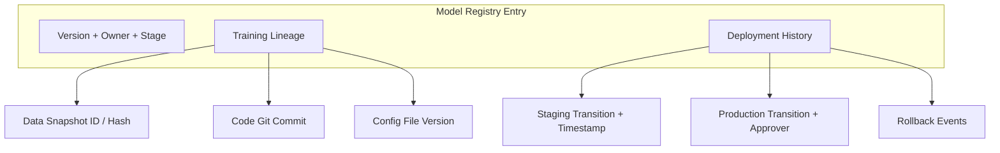
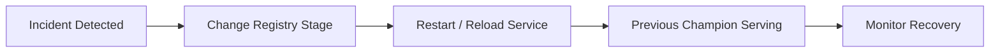

# Traceability, Audit Trails, and Rollback Mechanisms

## Reconstructing History and Recovering Fast

Governance requires two operational capabilities: **looking backward** (what model was live, trained on what data, approved by whom) and **acting forward** (rolling back to the last known-good model in seconds, not hours).

---

## The Audit Trail: What to Record for Every Production Model

| Audit Field | Content | Used For |
|-------------|---------|----------|
| **Version & stage** | v7, Production | Identify current live model |
| **Owner** | Team / individual | Incident response contact |
| **Training lineage** | Data snapshot, code commit, config | Reproduce or explain model behaviour |
| **Evaluation summary** | Metrics at promotion time | Justify why this model was chosen |
| **Deployment history** | Stage transitions with timestamps and approvers | Timeline reconstruction |
| **Rollback history** | When and why rollback occurred | Post-incident analysis |

---

## Training Lineage in Detail

**Lineage** answers: *"Exactly which ingredients produced this model?"*

$$\text{Model v7} = f(\text{Data Snapshot D3},\ \text{Code Commit abc123},\ \text{Config train\_v2.yaml})$$

Without lineage, root cause analysis after a performance drop is guesswork:

- Did the data change?
- Did someone modify the training script?
- Was a different config accidentally used?

With lineage, you compare registry entries: *"v7 used Q2 data; v6 used Q1 data — the performance drop correlates with the data window change."*

---

## External Audits and Compliance

Regulated industries require demonstrating:

1. **Which data** a model was trained on
2. **How it behaved** over time (monitoring history)
3. **Who was responsible** for each change (approver trail)

A model registry with full lineage transforms compliance from a manual scramble into a query:

> *"Show all models trained on data containing feature X after date Y, with approver names."*

---

## Rollback: Assume Something Will Go Wrong

Even with careful offline evaluation, shadow testing, and A/B tests, **production surprises happen**. Rollback design assumes failure is inevitable and optimises recovery speed.

### Rollback Principles

| Principle | Implementation |
|-----------|---------------|
| **Keep previous version available** | Never overwrite or delete champion; archive, don't destroy |
| **Version pinning** | Config specifies `model_version: 7`, not `model_version: latest` |
| **Simple rollback action** | Change version flag or registry stage — no code redeployment |
| **Test rollback regularly** | Include in deployment playbook; verify traffic routes to previous model |

### Registry-Driven Rollback Pattern

1. Detect problem with v2 in production (fraud spike, customer complaints)
2. In model registry: transition v1 (archived) back to `Production` stage
3. Move v2 to `Staging` or `Archived`
4. Restart serving application (loads model by registry stage tag)
5. Service reports v1 loaded — rollback complete in under 60 seconds

**No emergency code deployment. No Docker rebuild. No panicking debug sessions.**

---

## Version Pinning vs "Latest"

| Approach | Risk |
|----------|------|
| `model_version: latest` | Unpredictable — next registry update silently changes production model |
| `model_stage: Production` | Controlled — only deliberate stage transitions change live model |
| `model_version: 7` (explicit pin) | Maximum control — rollback = change pin to 6 |

Production services should load models from the **registry by stage or explicit version** — never from hardcoded file paths or "latest" tags without governance.

---

## Real-World Example: E-Commerce Black Friday

A recommendation model deployed before Black Friday caused a 15% conversion drop within hours. Recovery steps:

1. On-call engineer checks registry — v4 (previous champion) is archived, not deleted
2. Registry: v4 → Production, v5 → Staging
3. Serving service restarted — loads v4 by production stage tag
4. Conversion rate recovers within minutes
5. Post-incident: audit trail shows v5 was promoted 6 hours earlier with approver name; investigation begins on v5's training data

Without rollback infrastructure, the team would have been troubleshooting in production during peak sales.

---

## Common Pitfalls / Exam Traps

- **Deleting old model versions** — eliminates rollback capability entirely.
- **Using "latest" in production config** — silent, untraceable model changes.
- **Rollback procedure on paper only** — untested rollbacks fail under incident pressure.
- **Hardcoded model file paths in serving code** — rollback requires code change and redeployment.
- **Missing approver in deployment history** — compliance failure and unclear accountability.

---

## Quick Revision Summary

- Audit trail: registry entry with version, owner, stage, training lineage, deployment history, approvers.
- Lineage links model to data snapshot, code commit, and config — essential for root cause analysis.
- Rollback: keep previous version, pin version/stage in config, test rollback in deployment playbook.
- Registry-driven rollback: change stage, restart service — no code or image rebuild needed.
- Assume production failures will happen; optimise for recovery speed, not just prevention.
- Full traceability supports external audits and compliance in regulated domains.
