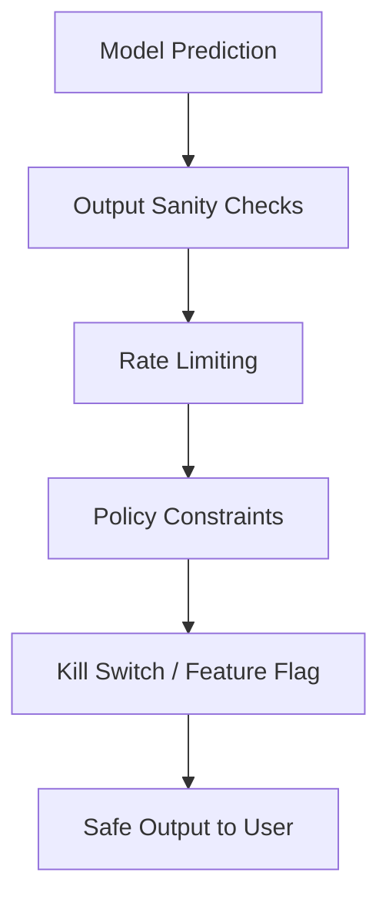
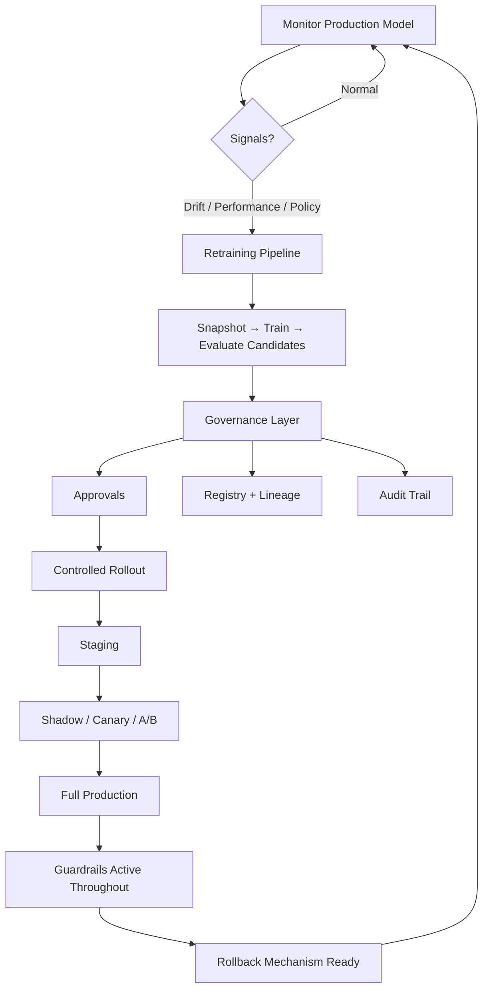

# Guardrails and the Governed Promotion Workflow

## Defence in Depth: When Models Misbehave

Even well-evaluated models can fail in production — due to edge cases, adversarial inputs, upstream data corruption, or unforeseen interactions. **Guardrails** are hard limits and safety checks that contain damage when model behaviour deviates from expectations.

**Mindset**: Don't rely on the model always behaving. Add rails so that when it doesn't, the system stays within safe bounds.

---

## Common Guardrails



| Guardrail | Purpose | Example |
|-----------|---------|---------|
| **Output sanity checks** | Reject impossible predictions | Probabilities outside $[0,1]$; credit scores below 0 or above 1000 |
| **Rate limiting** | Prevent traffic spikes from overwhelming model or downstream systems | Max 1000 predictions/sec per client |
| **Kill switches / feature flags** | Instantly disable a risky model or feature | Flip config flag to route all traffic to fallback rule |
| **Policy constraints** | Technical enforcement of regulatory rules | Block use of protected attributes (age, race) in feature vector |
| **Input validation** | Reject malformed or out-of-schema requests | Schema check before inference; return 400, not garbage prediction |
| **Fallback models / rules** | Default behaviour when model fails | Simple heuristic if model service is down or output fails sanity check |

---

## Guardrail Design Principles

1. **Fail safe, not silent** — invalid predictions should trigger alerts and fallbacks, not pass through
2. **Independent of model** — guardrails run outside the model; they work even if the model is compromised
3. **Testable** — include guardrail failure scenarios in deployment playbook
4. **Observable** — log every guardrail trigger for monitoring and post-incident analysis

---

## The Full Governed Lifecycle

Combining monitoring, retraining, evaluation, governance, guardrails, and rollback into one picture:



### Stage-by-Stage Governance Overlay

| Lifecycle Stage | Governance Mechanism |
|----------------|---------------------|
| Monitor | Alert thresholds, SLO definitions, ownership |
| Trigger retrain | Investigation checklist; human approval for high-impact |
| Train & evaluate | Experiment tracking; champion comparison; promotion rules |
| Approve & register | PR/ticket workflow; lineage recording |
| Rollout | Staging → shadow/canary → production gates |
| Operate | Guardrails, kill switches, rollback tested and ready |

---

## Kill Switches in Practice

A kill switch is a **config-driven circuit breaker**:

```yaml
# serving_config.yaml
model:
  enabled: true          # Set to false to disable ML predictions instantly
  fallback: "rule_based_v1"
  stage: "Production"
```

When fraud rates spike unexpectedly:

1. On-call sets `model.enabled: false`
2. Service routes all decisions to rule-based fallback
3. Investigation proceeds without user exposure to failing model
4. After fix or rollback, re-enable ML predictions

This is faster and safer than debugging a live model under traffic.

---

## Real-World Example: Credit Scoring Guardrails

A credit risk service enforces:

- **Input validation**: Reject applications with missing required fields (no imputation at inference)
- **Output sanity**: Scores must be in $[300, 850]$; probabilities in $[0, 1]$
- **Policy constraint**: Protected attributes stripped before feature vector reaches model
- **Rate limiting**: 500 requests/sec max to prevent cascade failure
- **Kill switch**: Compliance team can disable model via feature flag during audit
- **Fallback**: Conservative rule-based approval if model service unavailable

When a data pipeline bug sends null features, input validation catches it before the model produces nonsense scores — the incident is contained, not amplified.

---

## From "We Trained a Model" to "We Operate a Model Safely"

The governed lifecycle transforms ML from a research deliverable into an **operational capability**:

| Research Mindset | Operational Mindset |
|-----------------|---------------------|
| Train best model on available data | Continuously refresh with governed pipeline |
| Deploy and move on | Monitor, detect, retrain, promote in loop |
| Evaluate on test set | Layered evaluation: offline → backtest → shadow → A/B |
| Hope it works in production | Guardrails, rollback, kill switches |
| Individual data scientist owns outcome | Clear roles: DS, ML eng, business, compliance |

---

## Common Pitfalls / Exam Traps

- **No output sanity checks** — garbage predictions reach users silently.
- **Guardrails only in documentation, not code** — policy constraints must be technically enforced.
- **Kill switch never tested** — fails when needed most.
- **Guardrails inside the model** — if model is compromised, embedded checks fail too; keep guardrails external.
- **Skipping guardrails for "simple" models** — all production models need minimum safety rails.

---

## Quick Revision Summary

- Guardrails: output sanity checks, rate limiting, kill switches, policy constraints, input validation, fallbacks.
- Mindset: assume models will misbehave; contain damage with external safety rails.
- Full governed lifecycle: monitor → retrain → evaluate → approve → controlled rollout → guardrails → rollback → monitor.
- Kill switches enable instant model disable via config flag without code deployment.
- Policy constraints must be technically enforced, not just documented.
- Governed MLOps transforms ML from research project to reliable, auditable operational capability.
