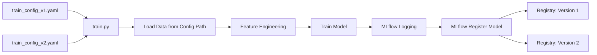
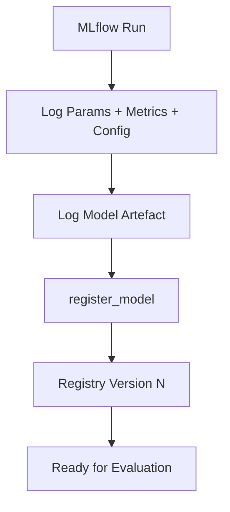

# Config-Driven Retraining Pipeline: Training Script and MLflow Integration

## Putting Theory into Practice

A production retraining pipeline is **config-driven**: training scripts are generic; behaviour is controlled entirely by configuration files. This pattern makes retraining repeatable, auditable, and safe — the same script produces different model versions by swapping configs, not code.

---

## Pipeline Architecture



---

## Step 1: Define the Data Window via Configuration

Training data selection is controlled by config, not hardcoded paths:

```yaml
# train_config_v1.yaml — initial production model
data:
  path: "data/training_v1.parquet"
  description: "Q1 2025 labelled credit applications"

# train_config_v2.yaml — retraining on newer data
data:
  path: "data/training_v2.parquet"
  description: "Q2 2025 labelled credit applications"
```

| Config Change | Effect |
|--------------|--------|
| Different `data.path` | Retrain on newer snapshot |
| Different hyperparameters | New candidate with same data |
| Different model type | Architecture experiment |

**Why separate config files?** Each file is a permanent record of which data powered which training run — critical for audit and reproducibility.

---

## Step 2: Generic Training Script

The training script (`train.py`) is designed to be:

- **Generic** — no hardcoded paths, hyperparameters, or model types
- **Config-controlled** — all behaviour driven by the YAML/JSON passed as argument
- **Integrated with experiment tracking** — logs everything to MLflow

Typical execution:

```bash
python train.py --config configs/train_config_v1.yaml
python train.py --config configs/train_config_v2.yaml
```

### What the Training Script Logs to MLflow

| Logged Item | Purpose |
|-------------|---------|
| Model parameters | Hyperparameters for reproducibility |
| Training metrics | RMSE, AUC, loss curves |
| Config file (as artefact) | Exact config used for this run |
| Model artefact | Serialized model file |
| Tags | Data version, experiment name |

---

## Step 3: MLflow Model Registration

The critical final step in training is **registering the model** in the MLflow Model Registry:

```python
# Conceptual flow inside train.py
mlflow.log_params(params)
mlflow.log_metrics(metrics)
mlflow.log_artifact("train_config_v2.yaml")
mlflow.sklearn.log_model(model, "model")

# Register as official version candidate
mlflow.register_model(
    model_uri=f"runs:/{run_id}/model",
    name="credit_risk_model"
)
```

This creates an **official version candidate** in the registry — not just an experiment run, but a versioned artefact ready for evaluation and promotion.



---

## Simulating Scheduled Retraining

To simulate a scheduled retraining job:

1. Run `train.py` with `train_config_v1.yaml` → creates **Version 1** (initial champion)
2. Time passes; new data arrives
3. Run `train.py` with `train_config_v2.yaml` → creates **Version 2** (challenger candidate)

Both runs use identical code, different configs. MLflow UI shows both versions with full lineage: parameters, metrics, config artefacts, and training timestamps.

---

## MLflow UI: Inspecting Runs

The MLflow UI provides:

- **Experiments tab** — all training runs with metrics comparison
- **Models tab** — registered versions with stages (None, Staging, Production, Archived)
- **Run detail** — parameters, metrics, logged artefacts (including config file)
- **Model comparison** — head-to-head metric charts across versions

This visibility is the foundation for champion/challenger evaluation in the next pipeline stage.

---

## Repository Structure Pattern

```
module-6/
├── configs/
│   ├── train_config_v1.yaml
│   ├── train_config_v2.yaml
│   └── eval_config.yaml
├── data/
│   ├── training_v1.parquet
│   └── training_v2.parquet
├── scripts/
│   ├── train.py
│   └── evaluate_and_promote.py
├── service/
│   └── app.py
├── requirements.txt
└── README.md
```

Config-driven layout separates **what changes** (data, hyperparameters) from **what stays stable** (training logic, evaluation logic, serving code).

---

## Real-World Mapping

In a fintech company processing thousands of loan applications per hour:

- **Quarterly scheduled retrain**: ops team updates config data path to latest quarter → runs pipeline → new registry version
- **Event-driven retrain**: drift alert triggers same pipeline with updated config → human approves before evaluation
- **Audit question**: *"What data trained model v5?"* → open MLflow, find v5 run, download logged config artefact

---

## Common Pitfalls / Exam Traps

- **Hardcoding data paths in train.py** — breaks config-driven pattern and auditability.
- **Logging model without registering** — experiment runs are not promotion-ready candidates.
- **Not logging config as artefact** — cannot verify which settings produced which model.
- **Different training scripts for retrain vs initial train** — should be one generic script, multiple configs.
- **Skipping MLflow tracking URI setup** — runs not persisted; registry empty after restart.

---

## Quick Revision Summary

- Retraining pipeline is config-driven: same `train.py`, different config files for data/hyperparameters.
- Config files record which data powered which run — essential for audit and reproducibility.
- MLflow logs params, metrics, config artefact, and model; `register_model` creates official registry version.
- Simulating scheduled retrain: run pipeline with v1 config (champion), then v2 config (challenger).
- MLflow UI shows runs, registered versions, and enables head-to-head comparison.
- Separate what changes (config) from what stays stable (training/evaluation/serving code).
