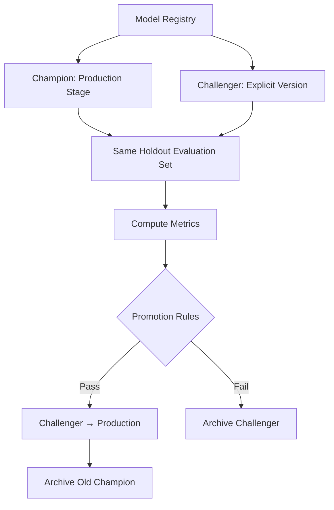
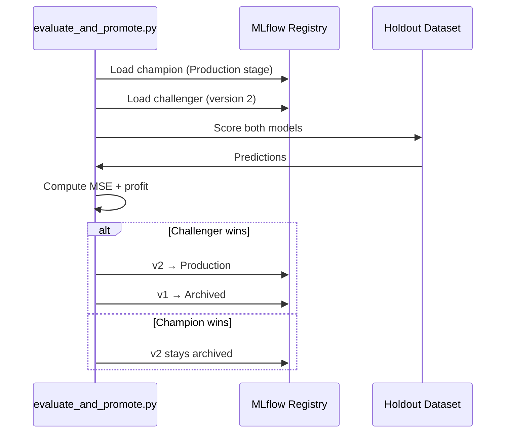

# Champion vs Challenger Evaluation and Automated Promotion

## The Evaluation Gate in the Retraining Pipeline

After training produces registry versions, the pipeline must answer one question with evidence: **Is the challenger actually better than the production champion?** The evaluation-and-promote stage loads both models, computes statistical and business metrics on the same holdout data, and applies predefined promotion rules.

---

## Champion vs Challenger Framework



| Role | How Loaded | Registry Stage |
|------|-----------|---------------|
| **Champion** | Lookup by `Production` stage tag | `Production` |
| **Challenger** | Explicit version number (e.g., v2) | `None` or `Staging` |

Loading the champion by stage tag (not hardcoded version) is a **robust pattern** — the serving layer and evaluation layer always agree on what "production" means.

---

## The Evaluation Script Pattern

### Step 1: Load Models from Registry

```python
# Conceptual pattern
champion = load_model(model_name="credit_risk_model", stage="Production")
challenger = load_model(model_name="credit_risk_model", version=2)
```

### Step 2: Evaluate on Same Unseen Data

Both models run on the **identical holdout evaluation dataset** — never seen during training of either model.

Metrics computed:

| Category | Metric | Purpose |
|----------|--------|---------|
| Statistical | MSE, RMSE, AUC, F1 | Predictive quality comparison |
| Business | Expected profit | Financial impact of model decisions |

### Business Metric Example: Expected Profit

$$\text{Profit} = \sum_i \text{payoff}(\hat{y}_i, y_i)$$

For credit risk, each prediction maps to a financial outcome:

- Correct approval of creditworthy applicant → $+P$ profit
- Incorrect approval of risky applicant → $-L$ loss
- Incorrect rejection of good applicant → $-C$ opportunity cost

Tying model performance to business KPIs is a hallmark of mature MLOps — statistical accuracy alone is insufficient for promotion decisions.

---

## Promotion Logic

Promotion rules are **predefined and automated**:

```python
# Conceptual promotion rule
promote = (
    challenger_mse < champion_mse
    and challenger_profit > champion_profit
)
```

| Condition | Rationale |
|-----------|-----------|
| Statistical metric improves | Model predicts better |
| Business metric improves | Better predictions translate to financial gain |
| Both must pass | Prevents promoting on statistical gain with business loss |

If the challenger passes, the script:

1. Transitions challenger to `Production` stage in registry
2. Archives the old champion

If the challenger fails, it remains archived with evaluation results logged for audit.

### Tolerance Thresholds

With small datasets or noisy models, challengers and champions may perform very similarly. Production systems add a **minimum improvement margin**:

$$\text{promote if: } \text{metric}_{\text{challenger}} > \text{metric}_{\text{champion}} + \delta$$

This prevents promoting on statistically insignificant differences. In learning environments with tiny datasets, tolerance thresholds are adjusted for pedagogical clarity — the pattern remains the same.

---

## Setting Initial State: Champion in Production

Before running evaluation, manually set the initial champion:

1. Open MLflow UI → Models tab → select Version 1
2. Transition stage to `Production`
3. Version 1 is now the champion baseline

Then run evaluation comparing production champion against challenger v2:

```bash
python evaluate_and_promote.py --config configs/eval_config.yaml
```

---

## Execution Flow



---

## Production vs Lab Simplifications

| Aspect | Lab | Production |
|--------|-----|------------|
| Dataset size | Small (for learning) | Thousands+ of data points |
| Metric differences | Tiny (tolerance needed) | Statistically significant |
| Pre-promotion validation | Offline eval only | Shadow + A/B testing |
| Promotion mechanism | Same MLflow registry pattern | Same MLflow registry pattern |

The **code and workflow pattern** is production-ready; only data scale and evaluation depth differ.

---

## Real-World Significance

At a fintech processing thousands of loan applications per hour:

- A false negative (approving risky loan) costs tens of thousands of dollars
- A false positive (rejecting good customer) loses revenue and damages brand
- Automated promotion removes emotions and politics — the decision is based on agreed rules, not Slack debates

---

## Common Pitfalls / Exam Traps

- **Evaluating on different datasets** — invalidates head-to-head comparison.
- **Promoting on MSE alone without business metric** — statistically better but financially worse.
- **No tolerance threshold** — promotes on noise-level improvements.
- **Hardcoding champion version** — breaks when production model changes; use stage tag.
- **Manual promotion without logged evaluation** — no audit trail for why model was promoted.

---

## Quick Revision Summary

- Champion loaded by Production stage; challenger by explicit version number.
- Both evaluated on same unseen holdout data with statistical (MSE) and business (profit) metrics.
- Promotion rule: challenger must beat champion on both metric types (with optional tolerance $\delta$).
- Automated promotion: challenger → Production, old champion → Archived.
- Pattern is production-ready; labs simplify data size and skip shadow/A/B stages.
- Business metrics tie model decisions to financial outcomes — essential for high-impact models.
