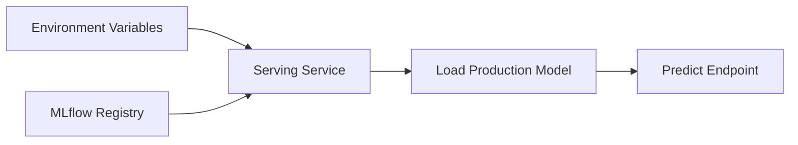
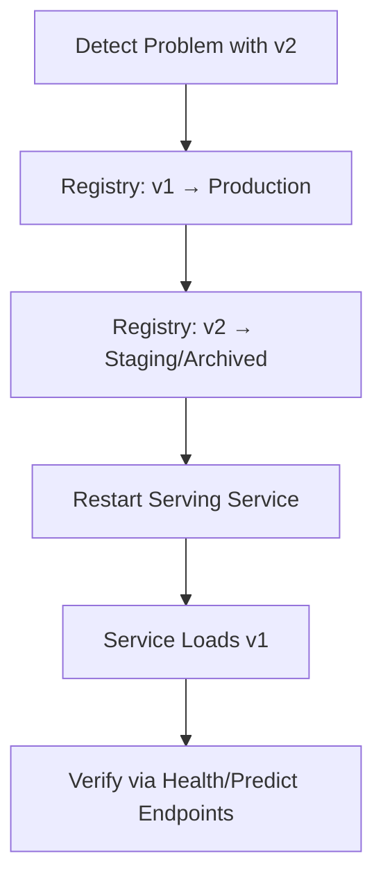
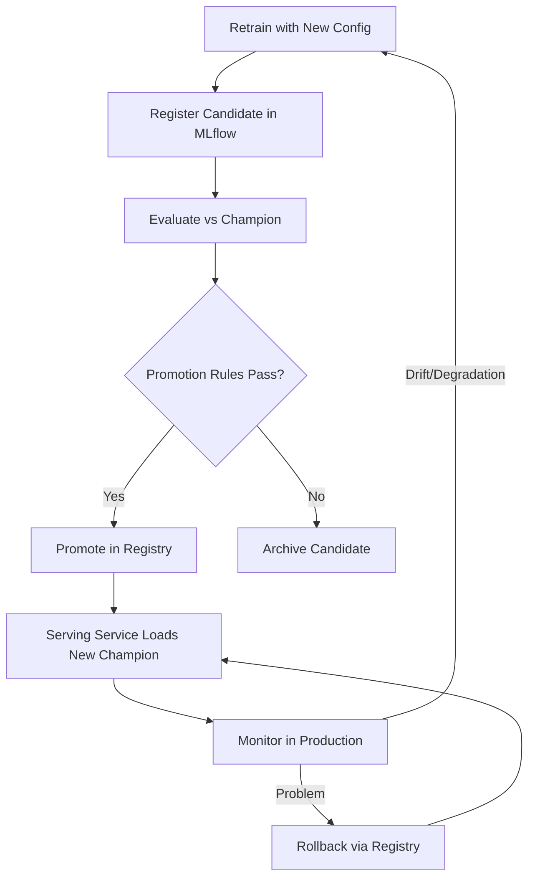

# Registry-Driven Serving, Promotion Updates, and Rollback

## Closing the Loop: From Registry to Production Service

Promoting a model in the registry is only half the deployment story. The **serving service** must load the newly promoted model — and when problems arise, roll back to the previous champion **without code changes or image rebuilds**.

---

## Registry-Driven Model Loading

**Anti-pattern**: Hardcoded model file path in serving code.

```python
# BAD — hardcoded path
model = pickle.load("models/credit_risk_v2.pkl")
```

**Production pattern**: Load model from registry by name and stage.

```python
# GOOD — registry-driven
def load_model_from_registry(model_name, model_stage):
    model_uri = f"models:/{model_name}/{model_stage}"
    return mlflow.pyfunc.load_model(model_uri)

model = load_model_from_registry(
    model_name=os.getenv("MODEL_NAME", "credit_risk_model"),
    model_stage=os.getenv("MODEL_STAGE", "Production")
)
```



| Environment Variable | Default | Effect |
|---------------------|---------|--------|
| `MODEL_NAME` | `credit_risk_model` | Which registered model to load |
| `MODEL_STAGE` | `Production` | Which stage (Production, Staging) |
| `MLFLOW_TRACKING_URI` | local URI | Where to find registry |

**Flexibility without code changes**:

- Load staging model → set `MODEL_STAGE=Staging`
- Load specific version → use version URI instead of stage
- Rollback → change registry stage, restart service

---

## Validating the Serving Service

After promotion (v2 → Production), start the service and verify:

1. Startup logs show: `Loaded model version 2, stage: Production`
2. Health endpoint reports `model_version: 2`
3. Prediction endpoint returns predictions with correct version metadata

```bash
# Start service with registry connection
MLFLOW_TRACKING_URI=http://localhost:5000 \
MODEL_NAME=credit_risk_model \
MODEL_STAGE=Production \
uvicorn service.app:app --host 0.0.0.0 --port 8000
```

The service automatically picks up whichever model holds the `Production` stage tag in the registry.

---

## Rollback: The Safety Net

### Scenario

v2 is in production. Fraud rates spike. Customer complaints increase. Investigation confirms v2 is the cause. Recovery needed in **under 60 seconds**.

### Rollback Steps



1. Open MLflow registry
2. Transition v1 (currently Archived/Staging) → `Production`
3. Transition v2 → `Staging` or `Archived`
4. Restart serving application (same command, no code change)
5. Startup logs confirm: `Loaded model version 1, stage: Production`
6. Predict endpoint reports `model_version: 1`

**No emergency code deployment. No Docker rebuild. No debugging under fire.**

---

## Why Registry-Driven Deployment Matters

| Capability | Hardcoded Path | Registry-Driven |
|-----------|---------------|-----------------|
| Promote new model | Change code, rebuild, redeploy | Update registry stage, restart |
| Rollback | Revert code, rebuild, redeploy | Flip registry stage, restart |
| Audit trail | Git history only | Registry history with approvers |
| Staging test | Separate code branch | Set `MODEL_STAGE=Staging` |
| Time to rollback | Minutes to hours | Seconds to minutes |

---

## End-to-End MLOps Loop

The complete operational loop demonstrated:



1. **Retrain** — config-driven pipeline on newer data
2. **Register** — MLflow creates versioned candidate
3. **Evaluate** — champion vs challenger on holdout + business metrics
4. **Promote** — automated registry stage transition
5. **Serve** — FastAPI loads model by production stage tag
6. **Monitor** — drift, performance, KPIs in production
7. **Rollback** — registry stage flip + service restart if needed

---

## Real-World Business Impact

### Fintech Credit Risk

A credit model preprocessing thousands of applications per hour:

- Every prediction has direct financial impact
- Retrained model promises +8% profitability
- Champion/challenger framework provides systematic, auditable deployment — not "cross fingers and hope"
- Rollback in under 60 seconds if post-deployment metrics degrade

### E-Commerce Black Friday

Major e-commerce company deployed new recommendation model before Black Friday. Within hours: 15% conversion drop. With registry-driven rollback (similar architecture), they reverted in **minutes**, preventing millions in lost revenue. Without this infrastructure, they would have been troubleshooting in production on the biggest sales day of the year.

---

## Organisational Benefits

| Benefit | Mechanism |
|---------|-----------|
| **Clear accountability** | DS owns training/eval; ML eng owns infra/deploy; business defines metrics |
| **Faster iteration** | Confidence in deploy/rollback enables more experimentation |
| **Business resilience** | ML becomes reliable revenue-generating asset, not research project |
| **Transparent process** | Version-controlled, tracked, auditable — no mystery models |

---

## Common Pitfalls / Exam Traps

- **Hardcoded model paths in serving code** — rollback requires code change and redeployment.
- **Not restarting service after registry change** — service caches old model in memory.
- **Using "latest" instead of stage tag** — unpredictable model loading.
- **Deleting archived versions** — eliminates rollback target.
- **Untested rollback procedure** — fails under incident pressure when needed most.

---

## Quick Revision Summary

- Serving service loads model from MLflow registry by name + stage (via environment variables).
- No hardcoded paths — promote and rollback by changing registry stage, not code.
- Rollback: v1 → Production, v2 → Staging, restart service — under 60 seconds.
- End-to-end loop: retrain → register → evaluate → promote → serve → monitor → rollback/retrain.
- Registry-driven deployment separates model lifecycle from application code lifecycle.
- This architecture is what separates companies that dabble in ML from those that scale it.
