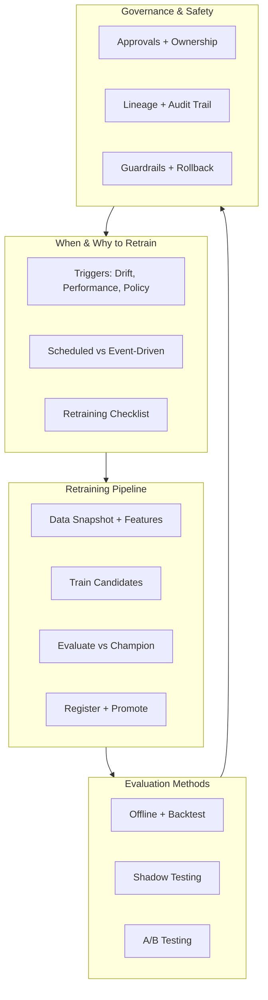

# Module Summary: Retraining, Evaluation, and Governed Model Promotion

## Module Overview

This module completes the operational ML lifecycle by connecting **monitoring signals** (Week 5) to **controlled model refresh** — when to retrain, how to retrain safely, how to evaluate candidates, and how to promote or roll back with full governance.



---

## Topic 1: When and Why to Retrain

### The Retraining Loop

Static models degrade as the world changes. Production ML is a **continuous loop**: deploy → monitor → detect → investigate → retrain → evaluate → redeploy.

### Three Major Triggers

| Trigger | Signals | First Step |
|---------|---------|-----------|
| Data drift & quality | PSI spikes, new categories, missing-value spikes | Investigate: business change or pipeline bug? |
| Performance degradation | Lower AUC/RMSE, KPI decline on fresh labels | Rule out evaluation changes and external causes |
| Policy & product | Regulation, fairness review, major product launch | Align with intent, not just metric chasing |

### Scheduled vs Event-Driven vs Hybrid

| Pattern | Mechanism | Best For |
|---------|-----------|----------|
| Scheduled | Calendar (weekly/monthly/quarterly) | Stable data, reliable labels |
| Event-driven | Drift threshold, SLO breach, policy change | Dynamic, high-stakes environments |
| Hybrid | Baseline schedule + event triggers | Most production systems |

Retraining is powerful but not free — rushed retrains can produce worse models.

### The Retraining Checklist

Before triggering retraining, confirm all four:

1. **Real persistent change** in data, performance, or policy?
2. **Cheaper fix ruled out** — threshold tweak, rule addition, data pipeline repair?
3. **Sufficient fresh labelled data** to learn something genuinely better?
4. **Pipeline ready** to train, evaluate, and compare against champion in a controlled way?

If all four are yes → retraining is sensible. If any is no → investigate further or fix the underlying issue first.

---

## Topic 2: Retraining and Promotion Pipeline

### Five Pipeline Stages

| Stage | Action | Key Output |
|-------|--------|------------|
| 1. Data & features | Snapshot with time window, production feature logic | Dataset + metadata (hashes, sources) |
| 2. Train candidates | Multiple configs/architectures, MLflow logging | Registered version candidates |
| 3. Evaluate | Champion vs challenger on holdout + business metrics | Promotion decision |
| 4. Register | Model registry entry with full lineage | Versioned, auditable artefact |
| 5. Promote | Staging → shadow/canary → production | Live model with rollback ready |

### Config-Driven Design

- Same `train.py` script, different config files for data paths and hyperparameters
- Config logged as MLflow artefact for reproducibility
- `mlflow.register_model()` creates official registry versions

### Champion vs Challenger Promotion Rules

- Challenger must beat champion on primary metric by minimum $\delta$
- Must not degrade business KPIs or fairness metrics
- Automated promotion: challenger → Production, old champion → Archived
- Business metrics (expected profit) alongside statistical metrics (MSE, AUC)

---

## Topic 3: Evaluation Methods

### Layered Evaluation Progression

```
Offline Eval → Backtest → Shadow Testing → A/B Test → Full Rollout
```

| Method | User Risk | Best For |
|--------|-----------|----------|
| Offline eval | None | Early candidate filtering |
| Backtest | None | Fraud, credit, recommendations (historical replay) |
| Shadow (dark launch) | None | Medium-high impact; live inputs, no user change |
| A/B test | Partial | High-impact; proof of business metric improvement |

Promotion decisions synthesise **combined evidence** from all applicable layers plus risk and fairness review — not any single metric alone.

---

## Topic 4: Governance, Safety, and Guardrails

### Three Governance Pillars

| Pillar | Mechanism |
|--------|-----------|
| Accountability | Model owner, named approvers, PR/ticket workflow |
| Traceability | Registry lineage: data snapshot, code commit, config, deployment history |
| Controlled risk | Staging gates, fairness reviews, tested rollback |

### Guardrails

- Output sanity checks (valid probability ranges, score bounds)
- Rate limiting, kill switches, policy constraints
- Input validation and fallback rules
- External to model — work even when model misbehaves

### Rollback

- Keep previous versions in registry (never delete)
- Version/stage pinning in serving config (not "latest")
- Rollback = registry stage change + service restart (< 60 seconds)
- Test rollback in deployment playbook

---

## Hands-On Lab Patterns

| Component | Pattern |
|-----------|---------|
| Training | Config-driven `train.py` + MLflow logging + `register_model` |
| Evaluation | `evaluate_and_promote.py` loads champion by stage, challenger by version |
| Promotion | Automated if statistical + business metrics pass |
| Serving | FastAPI loads from registry by `MODEL_NAME` + `MODEL_STAGE` env vars |
| Rollback | Flip registry stages, restart service — no code change |

---

## Key Comparisons

| Concept | Wrong Approach | Right Approach |
|---------|---------------|---------------|
| Retraining trigger | Every drift alert → retrain | Investigate first, then decide |
| Model deployment | Hardcoded file path | Registry-driven by stage/version |
| Evaluation | Single offline metric | Layered: offline + backtest + shadow + A/B |
| Promotion | Gut feeling / Slack decision | Predefined rules + combined evidence |
| Failure recovery | Emergency code deploy | Registry rollback in seconds |
| Model lifecycle | Train once, deploy forever | Continuous loop with governance |

---

## Common Pitfalls / Exam Traps

- **Drift alert = automatic retrain** — investigation always comes first.
- **Offline AUC alone justifies promotion** — high-impact models need layered evaluation.
- **Deleting old model versions** — eliminates rollback capability.
- **"Latest" in production config** — causes silent, untraceable model changes.
- **No business metrics in promotion rules** — statistically better can be financially worse.
- **Governance as bureaucracy** — it enables faster, safer iteration through trust.
- **Retraining without champion comparison** — may deploy a worse model.
- **Untested rollback** — fails under incident pressure.

---

## Quick Revision Summary

- Retraining is a continuous loop triggered by drift, performance degradation, or policy changes — after investigation.
- Four-gate checklist before retraining: persistent change, alternatives ruled out, fresh data, pipeline ready.
- Pipeline: snapshot → train candidates → evaluate vs champion → register → promote through staging/canary.
- Config-driven, MLflow-integrated training makes retraining repeatable and auditable.
- Evaluation layers: offline → backtest → shadow → A/B; match depth to model impact.
- Promotion requires combined evidence: statistical metrics, business KPIs, fairness, risk review.
- Governance: accountability (owners/approvers), traceability (lineage/audit), controlled risk (guardrails/rollback).
- Registry-driven serving enables promotion and rollback without code changes — under 60 seconds.
- Champion/challenger with automated promotion rules removes emotion from model selection.
- MLOps transforms ML from research project into reliable, revenue-generating operational capability.
