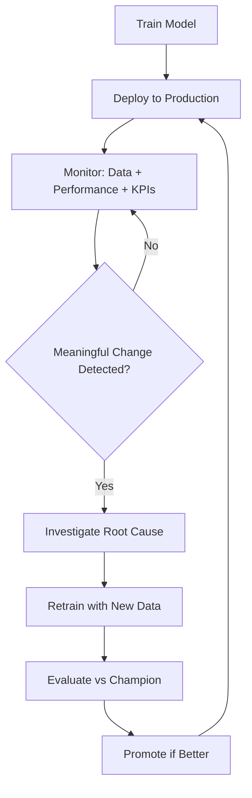

# Static Models and the Retraining Loop

## The Problem with "Train Once, Deploy Forever"

A **static model** is trained on a fixed dataset, deployed to production, and left unchanged. This approach works in stable, low-stakes environments — but fails in most real-world ML systems where data, users, and business context evolve continuously.

**Intuition**: A static model is a photograph of the world at training time. Production is a live video. Over time, the photograph becomes increasingly inaccurate.

---

## The ML Lifecycle as a Closed Loop

In a mature MLOps practice, model engineering follows a repeating cycle rather than a linear path:

| Phase | What Happens | Failure Mode if Skipped |
|-------|-------------|------------------------|
| Deploy | Model serves predictions | N/A — starting point |
| Monitor | Track drift, metrics, KPIs | Silent degradation |
| Detect | Alerts on meaningful change | Problems discovered by users |
| Retrain | New model on recent data | Model becomes structurally misaligned |
| Redeploy | Safe promotion with rollback | Stuck on stale model |

---

## What Counts as "Meaningful Change"?

Not every fluctuation warrants retraining. **Meaningful change** means a sustained shift that investigation confirms is real — not noise, not a temporary spike, not a logging bug.

Examples of meaningful change:

- Persistent feature distribution shift on important inputs (confirmed via PSI, KS tests)
- Sustained drop in accuracy, AUC, or RMSE on fresh labelled data
- Business KPIs (conversion, fraud loss, churn) moving in the wrong direction after ruling out external causes
- Structural product or policy changes (new pricing, new markets, regulatory constraints)

---

## Static Model Failure Modes

### 1. Data Drift Without Adaptation

A recommendation model trained on pre-holiday shopping patterns serves predictions during a new product launch. Feature distributions shift; the model still returns HTTP 200 — but click-through rate drops 15%.

### 2. Concept Drift / Adversarial Adaptation

Fraudsters adapt tactics faster than quarterly retraining cycles. A static fraud model's precision erodes while latency dashboards stay green.

### 3. Structural Misalignment

A company expands to three new countries. Performance metrics haven't fully collapsed, but the model was never designed for those segments. Retraining aligns the model with new product intent, not just metric chasing.

---

## Retraining vs Other Fixes

Before entering the retraining loop, consider cheaper alternatives:

| Symptom | Possible Non-Retrain Fix |
|---------|-------------------------|
| Slight accuracy drop at one threshold | Retune classification threshold |
| Spike in missing values | Fix upstream data pipeline |
| New category in one feature | Add fallback rule or imputation strategy |
| Seasonal pattern | Wait and monitor; may self-correct |

Retraining is appropriate when the model's learned decision boundary is **structurally wrong** for the current data regime.

---

## Common Pitfalls / Exam Traps

- **"The model still runs, so it's fine"** — uptime does not equal prediction quality.
- **Treating retraining as a one-time Version 2.0 project** — it is an ongoing operational loop.
- **Reacting to every metric blip** — distinguish noise from persistent, investigated change.
- **Ignoring the investigate step** — deploying a retrained model on buggy data amplifies the problem.
- **No rollback plan** — every redeployment should assume the new model might be worse.

---

## Quick Revision Summary

- Static models degrade silently as the world changes; monitoring exposes this, retraining addresses it.
- The production lifecycle is a loop: deploy → monitor → detect → investigate → retrain → evaluate → redeploy.
- "Meaningful change" requires persistence and investigation — not every alert triggers retraining.
- Cheaper fixes (thresholds, rules, pipeline repairs) should be ruled out first.
- Real failures include data drift, adversarial adaptation, and structural product misalignment.
- Retraining aligns the model with the current data regime and business intent.
