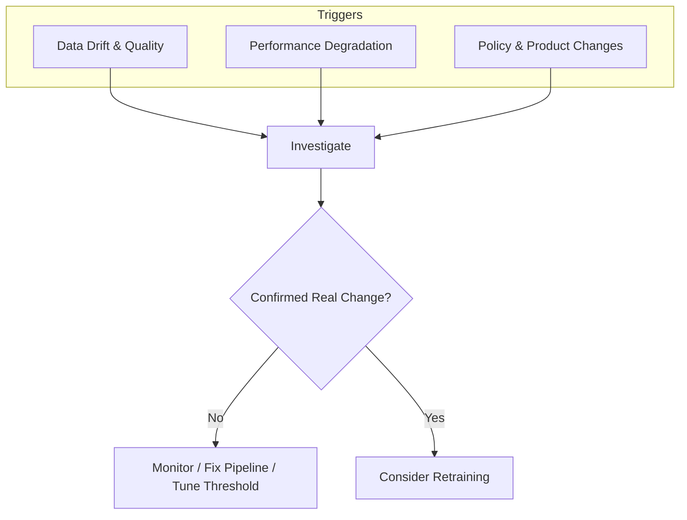

# Retraining Triggers: Drift, Performance, and Policy

## Why Triggers Matter

Retraining is expensive and risky. A rushed retrain can produce a **worse** model than the current champion. Triggers define **when** to enter the retraining loop — they are hypotheses that must be investigated, not automatic commands.

---

## Trigger 1: Data Drift and Quality Changes

**Intuition**: If the inputs the model sees in production differ systematically from training data, predictions become unreliable — even before accuracy metrics move.

| Signal | Example | First Response |
|--------|---------|----------------|
| High drift scores on key features | Income distribution shifted after economic event | Investigate: business change or pipeline bug? |
| New segments/categories never seen in training | New product tier, new country code | Check if model handles unknowns gracefully |
| Persistent data quality issues | Missing-value rate jumped from 2% to 18% | Fix pipeline before retraining |

**Critical distinction**: Drift is a **warning sign**, not an automatic "retrain now" button.

Investigation questions:

1. Is this a legitimate business change (new customer segment, seasonal shift)?
2. Is it a data pipeline bug (broken ETL, schema mismatch)?
3. Is the model actually performing worse, or just seeing different inputs?

Once confirmed that the model operates in a **meaningfully different data regime**, retraining on newer representative data becomes a strong recommendation.

---

## Trigger 2: Performance Degradation on Fresh Labels

**Intuition**: Drift tells you inputs changed; performance metrics tell you **outputs got worse** — the strongest signal for retraining.

Observable signals:

- Lower accuracy, AUC (classification), or RMSE (regression) on recently labelled data
- Business KPIs moving wrong: conversion rate down, fraud losses up, churn increasing

Again, **investigate before retraining**:

| Check | Why It Matters |
|-------|---------------|
| Did evaluation logic change? | Apparent degradation may be a measurement artefact |
| Did business rules or pricing change? | KPI shifts may not be model-related |
| Are we comparing like-with-like? | Different time windows or segments invalidate comparison |

If external causes are ruled out and metrics are genuinely worse, the model needs either:

- **Threshold adjustment** (cheaper, faster), or
- **New training run** on more representative recent data (structural fix)

---

## Trigger 3: Policy and Product Decisions

Not all retrains originate from monitoring dashboards. Some come from deliberate organisational decisions:

| Scenario | Retraining Goal |
|----------|----------------|
| New regulation excludes certain features | Align model with legal constraints |
| Fairness review shows underserved group | Rebalance training data or change loss function |
| Major product change (pricing, funnel, new countries) | Structural realignment even if metrics haven't fully collapsed |

**Key insight**: These retrains align with **policy and product intent**, not just chasing slightly higher AUC.

---

## Investigation Before Action: A Decision Table

| Observation | Likely Cause | Action Before Retrain |
|-------------|-------------|----------------------|
| PSI spike on one feature | Pipeline bug or real shift | Trace ETL; compare raw vs processed |
| AUC drop on holdout | Concept drift or label delay | Verify label freshness and evaluation window |
| KPI drop after pricing change | Business change, not model | Separate model effect from pricing effect |
| New regulatory constraint | Policy trigger | Feature audit; retrain with compliant feature set |

---

## Real-World Example: E-Commerce Recommendations

A recommendation model shows stable offline AUC but rising bounce rates. Investigation reveals a new mobile UI changed how users interact with recommendations — offline metrics miss this behavioural shift. Policy trigger: product team launches a new category. Retraining incorporates new item embeddings and interaction patterns, aligning the model with current product structure rather than chasing a metric that no longer reflects user experience.

---

## Common Pitfalls / Exam Traps

- **"High PSI → retrain immediately"** — drift requires investigation; pipeline bugs mimic drift.
- **Retraining when threshold tuning suffices** — a 2% AUC drop may be fixed by moving a decision threshold.
- **Ignoring policy-driven retrains** — regulatory and fairness changes mandate retraining even when metrics look acceptable.
- **Using stale labels for performance checks** — delayed labels create false "stable performance" readings.
- **Conflating data drift with concept drift** — input shift ($P(X)$) vs relationship shift ($P(Y|X)$) require different responses.

---

## Quick Revision Summary

- Three major retraining triggers: data drift/quality, performance degradation, policy/product changes.
- All triggers require investigation before action — drift alerts are not automatic retrain commands.
- Performance degradation on fresh labels is the strongest signal, after ruling out evaluation and business changes.
- Policy retrains align with intent and compliance, not just metric optimisation.
- Cheaper alternatives (threshold tuning, pipeline fixes) should be considered first.
- Compare like-with-like when evaluating metric changes over time.
