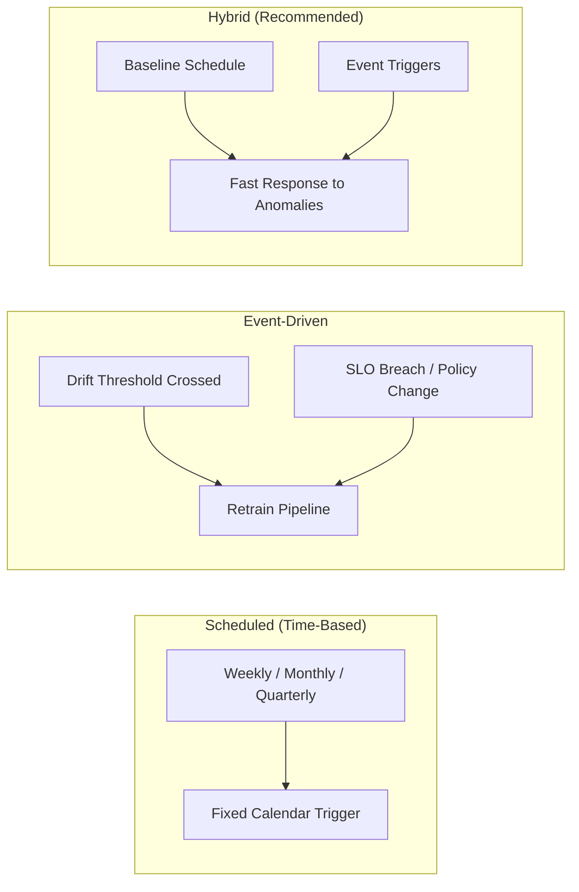
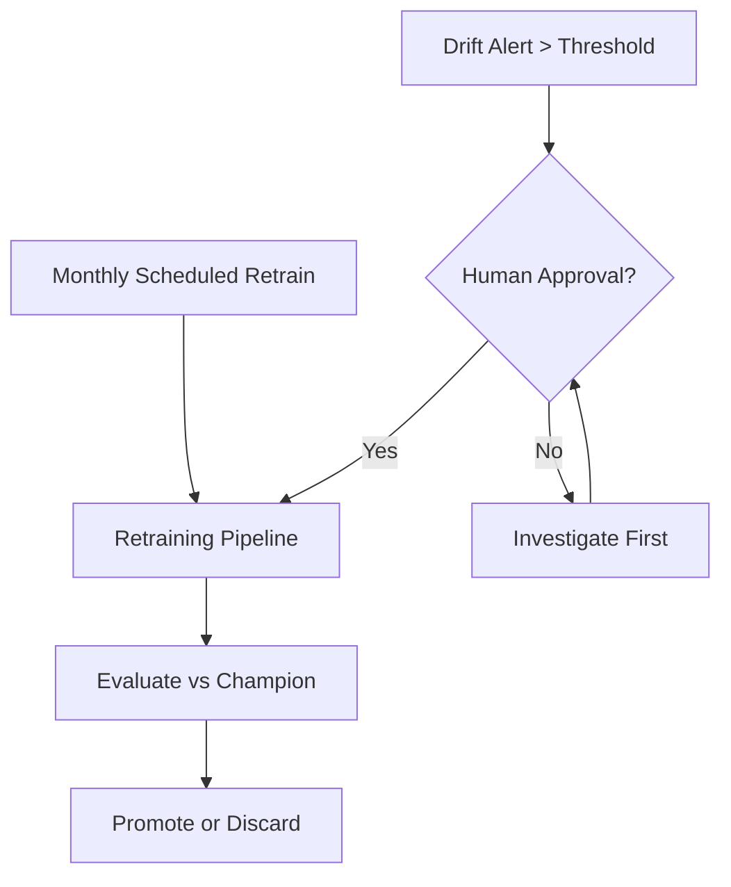

# Continuous Training: Scheduled vs Event-Driven Retraining

## What Is Continuous Training?

**Continuous training** (also called continuous learning or automated retraining) is the practice of periodically or reactively updating a production model with newer data — rather than treating training as a one-off research activity.

**Intuition**: Just as CI/CD continuously integrates and deploys code, continuous training continuously refreshes the model artefact that code serves.

---

## Two Core Patterns

| Pattern | Trigger | Best For | Risk |
|---------|---------|----------|------|
| **Scheduled** | Calendar (weekly, monthly, quarter) | Steady data flow, reliable labels, low volatility | Model may be stale between cycles |
| **Event-driven** | Drift alert, SLO breach, major product change | Dynamic environments, high-stakes models | Alert fatigue; false triggers |
| **Hybrid** | Schedule + events | Most production systems | Requires tuning both layers |

---

## Scheduled Retraining in Detail

**Mechanism**: A cron job, Airflow DAG, or pipeline scheduler runs training on a fixed interval using the latest $N$ weeks/months of labelled data.

**Advantages**:

- Simple to implement and reason about
- Prevents models from going stale during quiet monitoring periods
- Predictable compute cost and team workload

**When it works well**:

- Stable business with consistent data generation
- Labels arrive reliably within a known lag window
- Model architecture and features change infrequently

**Example**: A monthly churn model retrained on the last 90 days of labelled subscription data every first Monday of the month.

---

## Event-Driven Retraining in Detail

**Mechanism**: Monitoring systems emit signals that cross predefined thresholds, triggering the retraining pipeline (automatically or via human-approved ticket).

Common event triggers:

- Feature drift score exceeds threshold (e.g., PSI > 0.25 on critical features)
- Model accuracy or AUC drops below SLO for $K$ consecutive days
- Business KPI (fraud loss rate, conversion) breaches guardrail
- Major product launch, regulatory change, or fairness audit outcome

**Advantages**:

- Responds quickly to genuine anomalies
- Avoids unnecessary retrains during stable periods

**Risks**:

- Noisy alerts cause retrain churn (training many similar models)
- Rushed retrains on insufficient fresh data can degrade quality

---

## Hybrid Strategy (Production Best Practice

Most mature organisations combine both:

1. **Baseline schedule** — e.g., retrain every month regardless, ensuring the model never exceeds a maximum staleness age.
2. **Event triggers** — respond within hours/days when monitoring detects acute degradation.

---

## Cost and Risk of Retraining

Retraining is **not free**:

| Cost Type | Description |
|-----------|-------------|
| **Compute** | GPU/CPU hours for training multiple candidates |
| **Engineering time** | Pipeline maintenance, evaluation review, promotion decisions |
| **Opportunity cost** | A bad retrain deployed to production can cause financial harm |
| **Data labelling** | Fresh labels may require human annotation lag |

**A rushed retrain can produce a worse model** — especially if:

- Training data window is too short or unrepresentative
- Hyperparameter search is skipped under time pressure
- Evaluation against champion is bypassed

---

## Real-World Example: Fraud Detection

A fraud team runs **weekly scheduled retrains** on the last 4 weeks of labelled transactions (baseline freshness). Additionally, an **event trigger** fires when precision drops below 85% for 3 consecutive days on a rolling evaluation set — initiating an expedited retrain with human approval. During a known product launch (new payment method), a **manual policy trigger** overrides the schedule to retrain immediately with feature engineering updates.

---

## Common Pitfalls / Exam Traps

- **"Event-driven only" without baseline schedule** — models go stale during quiet periods with no alerts.
- **"Scheduled only" without event triggers** — acute degradation waits until next calendar cycle.
- **Automating retrain without automating evaluation** — producing candidates without champion comparison is dangerous.
- **Ignoring label lag** — scheduling retrains faster than labels arrive produces models trained on incomplete data.
- **Treating retraining frequency as a hyperparameter to maximise** — more frequent is not always better.

---

## Quick Revision Summary

- Continuous training keeps models fresh via scheduled, event-driven, or hybrid retraining patterns.
- Scheduled retraining is simple and prevents staleness; event-driven responds to acute signals.
- Hybrid (baseline schedule + event triggers) is the production best practice.
- Retraining has real costs: compute, engineering time, and risk of deploying a worse model.
- Event triggers should often include human approval for high-impact models.
- Match retraining frequency to label availability and business volatility.
