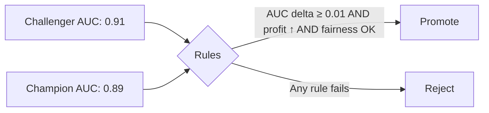

# Evaluating and Selecting the Right Model: Champion vs Challenger

## Where Retraining Meets Governance

Training candidate models is straightforward; **choosing which one replaces production** is where governance, risk management, and business alignment converge. Stage 3 of the retraining pipeline compares every challenger against the current **champion** using a rigorous, predefined evaluation protocol.

**Intuition**: Without explicit promotion rules, model selection becomes subjective — driven by whoever ran the notebook last, not by evidence.

---

## Evaluation Protocol

```mermaid
flowchart TD
    A[Load Champion] --> C[Same Evaluation Protocol]
    B[Load Challenger(s)] --> C
    C --> D[Held-Out Validation Set]
    D --> E[Multiple Time Slices]
    E --> F[Compute Metrics]
    F --> G{Promotion Rules Pass?}
    G -->|Yes| H[Register Winner]
    G -->|No| I[Archive & Document]
```

### What to Evaluate

| Metric Category | Examples | Why It Matters |
|----------------|----------|----------------|
| **Statistical ML metrics** | Accuracy, AUC, RMSE, F1 | Core predictive quality |
| **Business KPIs** | Expected profit, fraud loss, conversion rate | Ties model to dollars-and-cents impact |
| **Segment-level metrics** | Performance by demographic, region, product | Fairness and equity checks |
| **Multi-time-slice** | Metrics across rolling weekly windows | Detects instability over time |

Every candidate must be evaluated with the **same protocol** as the champion — same holdout set, same time slices, same metric definitions. Changing the evaluation between models invalidates comparison.

---

## Promotion Rules

Promotion rules are **predefined thresholds** agreed upon by data science, engineering, and business stakeholders — not decided ad hoc after seeing results.

Example rules:

1. Challenger must beat champion on primary metric (e.g., AUC) by at least $\delta$ (minimum improvement margin)
2. Challenger must **not degrade** any specified business KPI below a guardrail
3. Challenger must **not degrade** fairness metrics on protected segments beyond tolerance
4. Only candidates passing **all** rules proceed; others are logged and archived



**Why a minimum delta ($\delta$)?**: Tiny metric improvements within statistical noise do not justify deployment risk. A challenger with AUC 0.9001 vs champion 0.9000 should not auto-promote.

---

## Model Registry: First-Class Artefact

Once a winner is selected, it is registered as a versioned entry in a **model registry** (e.g., MLflow Model Registry):

| Registry Field | Content |
|---------------|---------|
| Model name & version | `credit_risk_model` v3 |
| Training data snapshot | Link to dataset version / hash |
| Code commit & config | Git SHA + config file artefact |
| Evaluation summary | All metrics from promotion evaluation |
| Tags | Environment (staging/production), owner, approval status |

Benefits:

- **Searchable catalogue** of all model versions
- **Audit trail** for compliance (who trained what, when, on which data)
- **Easy rollback** — previous versions remain available, not overwritten

---

## Champion vs Challenger Pattern

| Role | Definition | Registry Stage |
|------|-----------|---------------|
| **Champion** | Current production model serving live traffic | `Production` stage |
| **Challenger** | Newly trained candidate under evaluation | `None` or `Staging` stage |

Evaluation loads the champion by its production stage tag and the challenger by explicit version number. This pattern is robust: the serving layer always knows which model is "live."

---

## Business Metrics: Beyond Statistical Accuracy

A mature MLOps practice ties model performance to **financial outcomes**:

$$\text{Expected Profit} = \sum_i \left( \text{payoff}(\hat{y}_i, y_i) \right)$$

For credit risk:

- Correct approval of good loan → profit $+P$
- Incorrect approval of bad loan → loss $-L$
- Incorrect rejection of good customer → opportunity cost $-C$

A model with slightly lower RMSE but higher expected profit is the better business choice — promotion rules should reflect this.

---

## Real-World Example: Automated Promotion Logic

```python
# Conceptual promotion rule
promote = (
    challenger_rmse < champion_rmse
    and challenger_profit > champion_profit
)
```

If both conditions pass, the registry transitions the challenger to `Production` and archives the old champion. The decision is **automated, auditable, and emotion-free** — not debated in Slack.

In production with small datasets or noisy metrics, a **tolerance threshold** may be added to avoid promoting on statistically insignificant differences.

---

## Common Pitfalls / Exam Traps

- **Promoting on a single metric** — AUC improvement with profit degradation is a net loss.
- **Different evaluation sets for champion vs challenger** — invalidates head-to-head comparison.
- **No minimum improvement margin ($\delta$)** — promotes models within noise, adding deployment risk for no gain.
- **Overwriting production model without registry versioning** — eliminates rollback capability.
- **Ignoring segment-level fairness** — aggregate metrics can hide discrimination against subgroups.

---

## Quick Revision Summary

- Stage 3 compares challengers to champion on held-out data, multiple time slices, ML metrics, business KPIs, and segment fairness.
- Promotion rules are predefined: minimum metric delta, no KPI/fairness degradation.
- Failed candidates are logged and archived; only rule-passing models proceed.
- Model registry stores version, lineage (data, code, config), metrics, and environment tags.
- Champion/challenger pattern: production stage = champion; explicit version = challenger.
- Business metrics (expected profit) often matter more than pure statistical accuracy.
