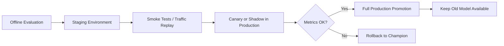
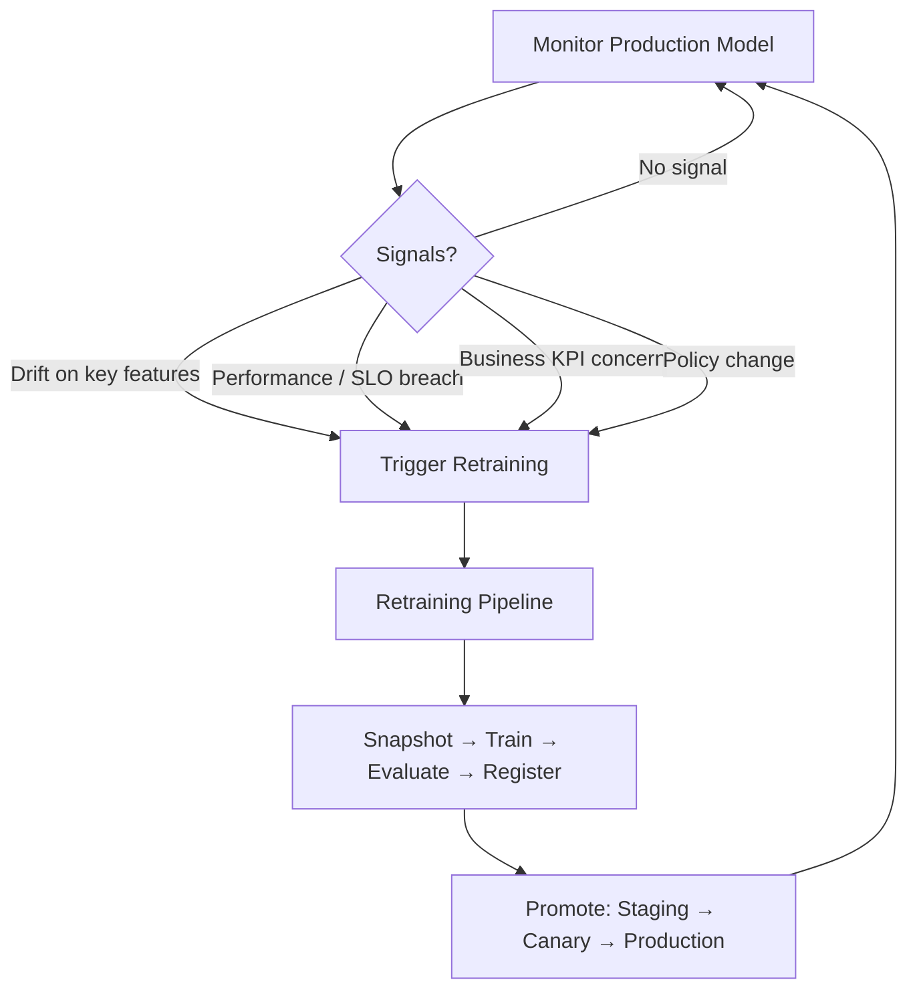

# Promotion, Deployment, and the Continuous Retraining Loop

## Stage 5: Getting a New Model Safely into Production

Selecting a winning candidate is not the finish line. **Promotion** is the controlled process of moving a validated model through staging, canary/shadow testing, and full production — while keeping the previous champion available for immediate rollback.

**Intuition**: Deploying directly from offline evaluation to 100% traffic is like merging code to main without CI — it works until it doesn't, and then recovery is painful.

---

## Promotion Stages

| Stage | Purpose | User Impact |
|-------|---------|-------------|
| **Staging** | Run smoke tests, replay recorded traffic | None — isolated environment |
| **Canary** | Route small % of live traffic to new model | Partial — subset of users see new model |
| **Shadow (dark launch)** | New model runs in parallel; only champion output served | None — predictions logged but not used |
| **Full production** | New model serves all traffic | All users |

**Critical rule**: Keep the old champion model available — never overwrite or delete it. Rollback depends on this.

---

## Monitoring During Promotion

Promotion-phase monitoring goes beyond "does the service start?":

- Does the new model behave as expected under **real traffic**?
- How do latency, error rates, and prediction distributions compare to the champion?
- Are business KPIs stable or improving during canary/shadow phase?

Shadow testing is especially valuable: both models see identical production inputs, but only the champion's output reaches users. Challenger predictions are logged for offline comparison — real inputs, zero user risk.

---

## The Closed Retraining Loop

Putting all stages together, continuous retraining forms a **closed loop**:

### Trigger Sources

| Signal Type | Example |
|-------------|---------|
| Repeated drift | PSI > threshold on 3+ critical features for 7 days |
| Performance breach | AUC below SLO for consecutive evaluation windows |
| Business KPI | Conversion rate drop after ruling out external causes |
| Policy | New regulation requiring feature exclusion |

Triggers may fire **automatically** (pipeline starts on alert) or via **human-approved ticket** (data scientist reviews investigation, approves retrain). Human judgement remains essential for risk and fairness decisions — the pipeline provides a repeatable, auditable path, not full autonomy.

---

## Human-in-the-Loop vs Automation

| Decision | Typical Automation Level |
|----------|-------------------------|
| Data snapshot creation | Fully automated |
| Candidate training | Fully automated |
| Offline evaluation vs champion | Automated with predefined rules |
| Promotion to staging | Automated |
| Promotion to production (high-impact) | Human approval required |
| Rollback on incident | Automated flag flip or human decision |

---

## Real-World Example: Black Friday Rollback

A major e-commerce company deployed a new recommendation model hours before Black Friday. Within hours, conversion rate dropped 15%. Because they had:

1. Previous model version preserved in registry
2. Version-pinned serving config (not "latest")
3. Tested rollback procedure

They reverted to the old model in **minutes**, preventing millions in lost revenue. Without this infrastructure, the team would have been debugging in production on the year's biggest sales day.

---

## Common Pitfalls / Exam Traps

- **Promoting directly from offline eval to 100% traffic** — skips real-world validation under live distributions.
- **Deleting the old champion after promotion** — eliminates rollback capability.
- **Monitoring only HTTP status during canary** — 200 OK does not mean correct predictions.
- **Fully automated production promotion for high-impact models** — human approval is a governance requirement in regulated domains.
- **Treating promotion as a one-way door** — every promotion must assume rollback may be needed within minutes.

---

## Quick Revision Summary

- Stage 5 promotes models through staging → canary/shadow → full production, keeping old champion for rollback.
- Shadow testing uses real inputs with zero user impact; canary exposes a subset of users.
- Continuous retraining is a closed loop: monitor → signal → pipeline → promote → monitor.
- Triggers may be automatic or human-approved; judgement matters for risk and fairness.
- Promotion-phase monitoring validates behaviour under real traffic, not just service health.
- Tested rollback turns incidents from crises into manageable events.
