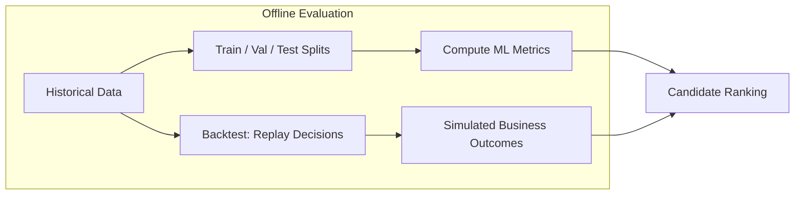
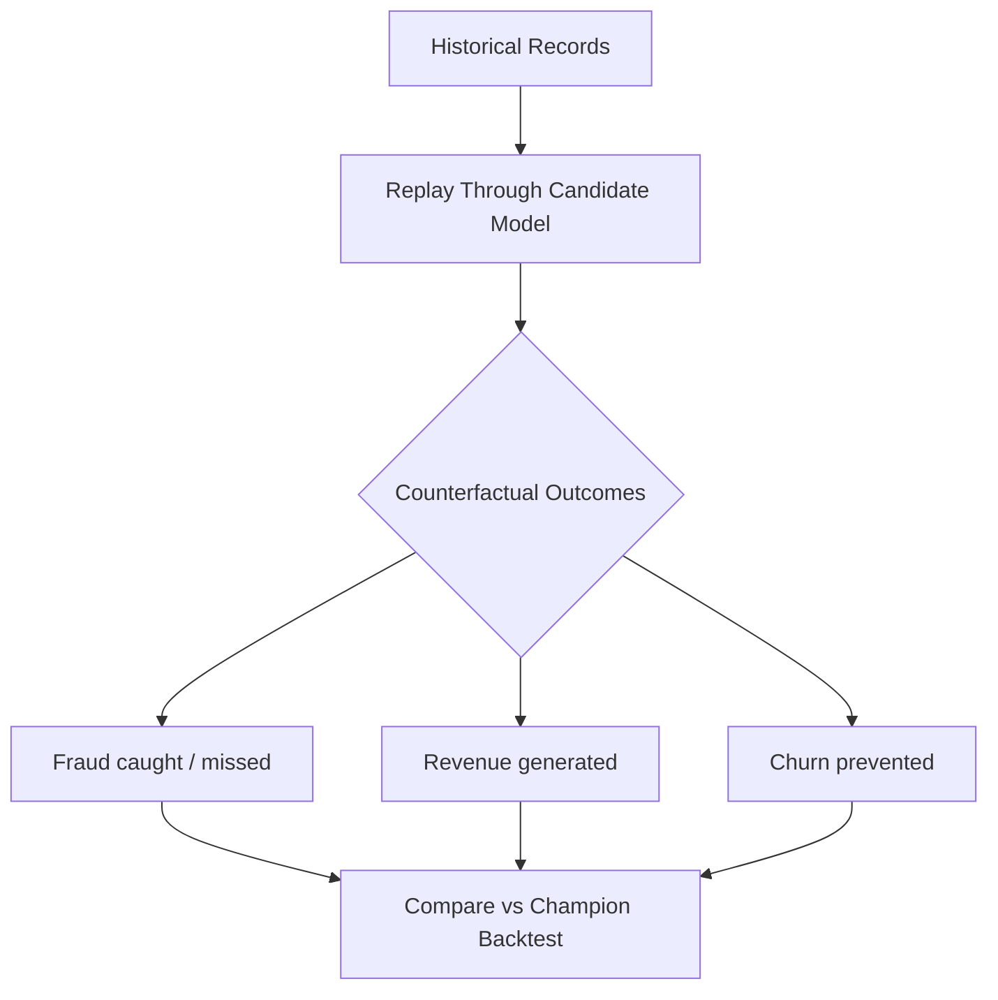

# Offline Evaluation and Backtesting

## The Challenge: Knowing a Model Is Better Before Full Rollout

Retraining produces candidate models — but **how do we know a challenger is truly better** before exposing users to it? Offline evaluation is the first layer of evidence: fast, cheap, and zero user risk — but with important limitations.

---

## Offline Evaluation Defined

**Offline evaluation** encompasses everything done **without touching live traffic**:

- Train/validation/test splits
- Cross-validation
- Time-based splits (train on past, test on future)
- Backtesting on historical data

| Advantage | Limitation |
|-----------|-----------|
| Fast and cheap | Assumes past resembles future |
| Try many candidates in parallel | Cannot capture user behaviour changes from new model |
| Zero risk to real users | Misses UX interactions and downstream side effects |
| Reproducible and auditable | Depends on quality of logged features and labels |

**Key principle**: Offline evaluation is **necessary but not sufficient** for high-impact models.

---

## Time-Based Splits: Why Random Splits Fail

For production models, **random train/test splits are often wrong** because data is temporal:

| Split Type | When to Use | Trap |
|-----------|-------------|------|
| Random | IID data, no temporal structure | Leaks future information into training |
| Time-based | Sequential data (logs, transactions) | Test set must be strictly after train set |
| Walk-forward | Rolling retrain evaluation | Simulates production refresh cycles |

Example: Train on January–September, validate on October, test on November–December. This mimics deploying a model trained on historical data and evaluating on "future" data the model hasn't seen.

---

## Backtesting: Simulating "What If?"

**Backtesting** replays historical data through a new candidate model and asks counterfactual questions:

> *If we had used this model last month, how many fraud cases would we have caught? How much revenue would we have made? How many users would have churned?*

### Where Backtesting Shines

- **Fraud detection** — count true positives / false negatives on historical labelled fraud
- **Recommendations** — estimate click-through on logged user-item interactions
- **Credit risk** — simulate profit/loss on historical loan outcomes

### Backtesting Caveats

| Caveat | Explanation |
|--------|-------------|
| **Logging quality** | Backtest is only as good as logged features and labels at decision time |
| **No behavioural feedback** | Users would have behaved differently if they had seen new decisions (e.g., different recommendations change future clicks) |
| **Selection bias in logs** | Historical data reflects old model's decisions, not uniform random exposure |

Backtests are an excellent **filter** before touching live traffic — they narrow candidates from many to a few promising ones.

---

## Offline Metrics vs Business Metrics

Offline evaluation should compute both:

| Type | Example | Purpose |
|------|---------|---------|
| Statistical | AUC, RMSE, F1 | Rank candidates by predictive quality |
| Business | Expected profit, fraud loss prevented | Rank candidates by financial impact |

A model with best AUC but lower expected profit should not auto-win — business metrics ground evaluation in real impact.

---

## Real-World Example: Fraud Model Backtest

A fraud team trains 5 candidate models on Q3 data. Each is backtested on Q4 historical transactions:

| Candidate | AUC | Fraud Caught ($) | False Declines ($) | Net Savings |
|-----------|-----|-----------------|-------------------|-------------|
| Champion | 0.91 | $2.1M | $400K | $1.7M |
| v2 | 0.93 | $2.4M | $380K | $2.02M |
| v3 | 0.92 | $2.3M | $520K | $1.78M |

Candidate v2 wins on both AUC and net savings → proceeds to shadow testing. Candidate v3 has higher AUC than champion but worse business outcome due to excess false declines → rejected despite statistical improvement.

---

## Common Pitfalls / Exam Traps

- **"Best offline AUC → deploy"** — offline metrics miss user behaviour feedback and business impact.
- **Random splits on temporal data** — inflates offline metrics via data leakage.
- **Backtesting without logged features at decision time** — reconstructing features post-hoc introduces train-serve skew.
- **Ignoring counterfactual bias** — logged data reflects old model's policy, not unbiased exposure.
- **Skipping backtest for "internal low-risk" models** — even internal models benefit from historical replay before promotion.

---

## Quick Revision Summary

- Offline evaluation: train/val/test splits, time-based splits, cross-validation — fast, cheap, zero user risk.
- Offline eval is necessary but not sufficient; it assumes the past looks like the future.
- Backtesting replays historical data through candidate models to simulate counterfactual business outcomes.
- Backtest quality depends on logged features, labels, and awareness of behavioural feedback limitations.
- Use time-based splits for sequential production data; random splits leak future information.
- Combine statistical metrics (AUC, RMSE) with business metrics (profit, fraud savings) for ranking.
