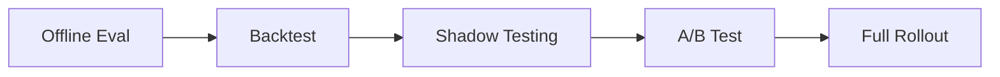
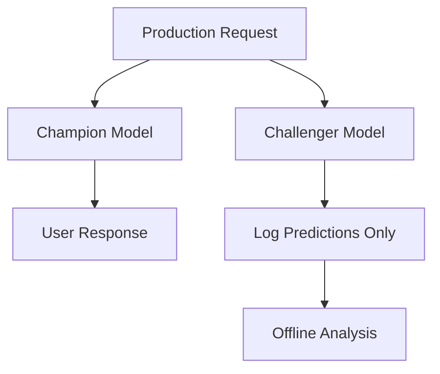

# Live Environment Validation: Shadow Testing and A/B Testing

## From Offline Evidence to Live Proof

Offline evaluation and backtesting filter candidates efficiently — but they cannot observe how users react to new model decisions. **Live environment validation** closes this gap using real production inputs (shadow testing) and real user outcomes (A/B testing).

---

## Evaluation Progression



Each layer adds fidelity and cost. Not every model needs all four — match the safety gear to the change's impact.

---

## Shadow Testing (Dark Launch)

**Mechanism**: Live traffic arrives as usual. Both the champion and challenger models receive the **same input**, but **only the champion's output** is served to the user. The challenger's predictions are logged for offline analysis.



### What to Analyse from Shadow Logs

- Do challenger predictions look **sane** (valid ranges, expected distributions)?
- How do metrics compare to champion on the same inputs?
- Any obvious **bias** or failure modes on specific segments?
- Latency and resource impact of running two models?

### Benefits and Tradeoffs

| Benefit | Tradeoff |
|---------|----------|
| Real production input distributions | Extra compute cost (2× inference) |
| Zero user risk | Increased log volume and storage |
| Detects train-serve skew | Privacy and data retention considerations |
| Validates model before any user sees it | Cannot measure user behavioural response |

Shadow testing is the standard de-risking step for **medium-to-high impact** models before any user-facing change.

---

## A/B Testing

**Mechanism**: A fraction of users/requests go to the champion; another fraction goes to the challenger. **Both outputs affect users**. Real business outcomes are measured.

```mermaid
flowchart TD
    T[Traffic] --> S{Split}
    S -->|80%| C[Champion]
    S -->|20%| H[Challenger]
    C --> M[Measure: Revenue, Clicks, Fraud, Churn]
    H --> M
    M --> D{Statistically Significant?}
    D -->|Challenger wins| Promote
    D -->|No difference / Champion wins| Keep Champion
```

### Requirements for Valid A/B Tests

| Requirement | Why |
|-------------|-----|
| **Sufficient traffic** | Underpowered tests produce inconclusive results |
| **Adequate duration** | Reach statistical significance; account for day-of-week effects |
| **Single primary metric** | Prevents p-hacking across many metrics |
| **Guardrail metrics** | Ensure challenger doesn't harm secondary KPIs (e.g., latency, fairness) |
| **No overlapping experiments** | Concurrent tests on same users interfere with each other |

### What A/B Tests Reveal That Shadow Cannot

- Actual user behaviour change (click-through, conversion, retention)
- Downstream system effects (inventory, pricing dynamics)
- Long-term engagement patterns

A/B tests are the **gold standard** for high-impact decisions — but heavyweight. Reserve them for changes where offline and shadow evidence already suggest improvement, and business proof is required.

---

## Comparison Table: Evaluation Methods

| Method | User Risk | Cost | Captures User Behaviour | Best For |
|--------|-----------|------|------------------------|----------|
| Offline eval | None | Low | No | Early candidate filtering |
| Backtest | None | Low | Partially (counterfactual) | Fraud, credit, recommendations |
| Shadow | None | Medium (2× compute) | No (same user experience) | Pre-promotion validation on live inputs |
| A/B test | Partial (test group) | High | Yes | High-impact promotion decisions |
| Full rollout | All users | Deployment cost | Yes | After sufficient evidence |

---

## Real-World Example: Recommendation Model

1. **Offline**: 10 candidates trained; top 3 selected by AUC on time-based holdout
2. **Backtest**: Top 3 replayed on last month's click logs; v7 wins on estimated revenue
3. **Shadow**: v7 runs alongside champion for 2 weeks; predictions logged; no distribution anomalies
4. **A/B test**: 10% traffic to v7 for 2 weeks; conversion rate +3.2% (statistically significant); guardrail latency unchanged
5. **Full rollout**: v7 promoted to production; champion archived for rollback

---

## Common Pitfalls / Exam Traps

- **Skipping shadow and going straight to A/B** — wastes traffic on models with obvious offline/shadow failures.
- **Underpowered A/B tests** — declaring winner on 2 days of data with 100 users is not statistically valid.
- **Multiple overlapping experiments** — interaction effects invalidate results.
- **No guardrail metrics in A/B** — primary metric improves but latency or fairness degrades.
- **Shadow testing forever without A/B** — shadow proves prediction quality, not user impact; high-impact models need behavioural proof.

---

## Quick Revision Summary

- Shadow testing: both models see same input; only champion output served; challenger logged for analysis.
- Shadow uses real production inputs with zero user risk; costs extra compute and logging.
- A/B testing splits traffic; measures real business outcomes (revenue, conversion, fraud, churn).
- A/B requires sufficient traffic, duration, a primary metric, guardrails, and no overlapping experiments.
- Typical progression: offline → backtest → shadow → A/B → full rollout.
- Match evaluation depth to model impact — not every change needs all four stages.
