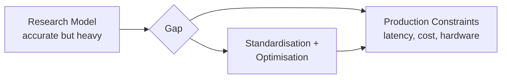
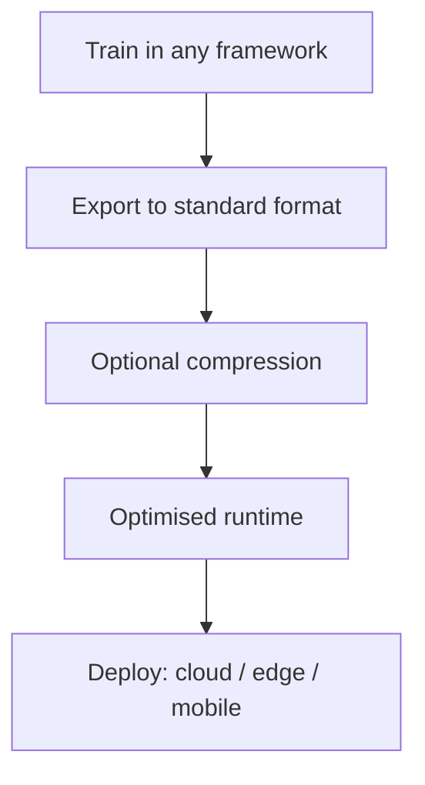

# Model Standardisation and Optimisation in Production

## The Problem After Deployment Basics

By the time a model reaches production, teams already know how to expose it as an API, containerise it, monitor it, and roll out new versions. The next bottleneck is rarely accuracy — it is **operational fit**:

- Can the model run **fast enough** to meet latency SLAs?
- Can it run **cheap enough** per prediction?
- Can it run on **all the hardware** the business cares about (cloud GPUs, CPUs, mobile, edge)?

Research-grade models often fail these checks even when their predictions are excellent.

---

## Research vs Production: Two Different Worlds

| Dimension | Research / Training | Production / Serving |
|-----------|---------------------|----------------------|
| Precision | FP32 weights, full precision | May need INT8/FP16 for speed |
| Hardware | Single powerful GPU | CPUs, shared GPUs, phones, IoT |
| Driver | Notebooks, ad-hoc scripts | Always-on services under load |
| Latency tolerance | 200 ms vs 2 s — often ignored | Hard P95/P99 targets |
| Cost model | One-off training spend | Cost **per prediction** at scale |

The gap between "model works in a notebook" and "model works in production" is closed by **model standardisation** and **optimisation**.

---

## Three Production Goals

### 1. Portability

Train in PyTorch, TensorFlow, JAX, or another framework — deploy on CPUs, GPUs, mobile, and edge hardware without rewriting the model for every target.

### 2. Latency and Throughput

- **Latency**: time per prediction; tail latencies (P95, P99) matter more than averages for user experience
- **Throughput**: predictions per second per instance; drives fleet size and cloud bill

### 3. Footprint

- On-disk model size
- RAM / VRAM at runtime
- Power draw on edge devices

---

## Three Tool Categories Preview

| Category | Examples | Primary target |
|----------|----------|----------------|
| **Standard model formats** | ONNX, TF Lite, OpenVINO IR | Portability |
| **Compression techniques** | Quantisation, pruning, knowledge distillation | Size, memory, speed |
| **Optimised runtimes** | ONNX Runtime, TensorRT, XLA | Hardware-efficient execution |

---

## Common Pitfalls / Exam Traps

- **Trap**: Assuming a high-accuracy model is production-ready — accuracy is necessary but not sufficient; latency, cost, and hardware compatibility are separate gates.
- **Trap**: Optimising before measuring — without baseline size and latency numbers, improvements cannot be quantified.
- **Trap**: Treating portability, speed, and footprint as independent — they interact (e.g. quantisation shrinks footprint *and* improves throughput).
- **Trap**: "One optimisation fixes everything" — standard formats, compression, and runtimes address different layers of the stack.

---

## Quick Revision Summary

- Production ML adds **speed, cost, and hardware** constraints on top of accuracy
- Research environments (FP32, single GPU, loose latency) differ sharply from serving environments
- Three goals: **portability**, **latency/throughput**, **footprint**
- Three levers: **standard formats**, **compression**, **optimised runtimes**
- The module systematically attacks the research-to-production gap
- Baseline measurement precedes any optimisation work
