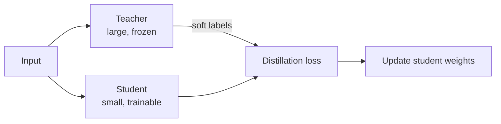

# Knowledge Distillation

## Beyond Shrinking: Learning from a Teacher

Quantisation and pruning reduce an **existing** model's precision or parameters. Knowledge distillation takes a different approach: design a **smaller student architecture** and train it to replicate the behaviour of a larger, accurate **teacher** model.

The result is often a student that is both **smaller/faster** and **more accurate** than a same-size model trained only on hard labels.

---

## The Setup

| Role | Model | Characteristics |
|------|-------|---------------|
| **Teacher** | Large, accurate, already trained | High capacity, slow inference |
| **Student** | Smaller, designed for constraints | Fewer parameters, fast inference |

The teacher remains frozen (or is updated slowly). The student is trained to match the teacher's outputs.

---

## Hard Labels vs Soft Labels

### Hard labels

Traditional training: student sees input $x$ and target class "cat" or "dog" — a one-hot distribution.

### Soft labels (the distillation insight)

The teacher outputs a **full probability distribution** over all classes, e.g.:

- Cat: 0.70
- Dog: 0.25
- Fox: 0.04
- Other: 0.01

This **dark knowledge** encodes similarity structure: the teacher "knows" cat is more like dog than like car. The student learns these inter-class relationships, not just the winning class.

**Distillation loss** typically combines:

- **Soft target loss**: match teacher's softened probability distribution (temperature-scaled softmax)
- **Hard target loss**: match ground-truth labels (standard cross-entropy)

$$\mathcal{L} = \alpha \cdot \mathcal{L}_{\text{soft}}(T(\mathbf{z}_s), T(\mathbf{z}_t)) + (1 - \alpha) \cdot \mathcal{L}_{\text{hard}}(y, \mathbf{z}_s)$$

where $T(\cdot)$ is the temperature-scaled softmax and $\mathbf{z}_s$, $\mathbf{z}_t$ are student and teacher logits.

---

## Why Distillation Works

| Factor | Explanation |
|--------|-------------|
| Richer training signal | Soft labels carry more information per sample than one-hot |
| Regularisation effect | Matching smooth distributions prevents overconfident student |
| Architecture freedom | Student can be designed for target hardware (depth, width) |
| Complements compression | Distilled student + quantisation stacks well |

---

## Typical Use Cases

- **Edge / mobile deployment**: BERT-large teacher → DistilBERT student
- **Real-time CV**: ResNet-152 teacher → MobileNet student
- **Latency-critical APIs**: Ensemble teacher → single compact student

**Real-world example**: A fraud-detection ensemble (slow, 200 ms) distilled into a single 30 ms student that retains 98% of the ensemble's AUC — deployable inline at payment checkout.

---

## Distillation vs Other Compression

| Technique | Changes architecture? | Requires teacher? | Training cost |
|-----------|----------------------|-------------------|---------------|
| Quantisation | No | No | Low (PTQ) to medium (QAT) |
| Pruning | Shape changes | No | Medium (fine-tune) |
| Distillation | Yes (new student) | Yes | High (full student training) |

Distillation is the right choice when willing to invest in training to design a **purpose-built small architecture** that inherits teacher knowledge.

---

## Common Pitfalls / Exam Traps

- **Trap**: Distilling from a weak teacher — student quality is bounded by teacher quality.
- **Trap**: Using only hard labels for the student — this forfeits the main benefit of distillation.
- **Trap**: Assuming distillation is always better than pruning/quantisation — it costs more training time; PTQ may suffice.
- **Trap**: Ignoring temperature tuning — too low collapses soft labels toward hard; too high washes out signal.

---

## Quick Revision Summary

- Distillation: train a **small student** to mimic a **large teacher**
- Soft labels carry inter-class similarity (dark knowledge) beyond hard one-hot targets
- Students can be smaller, faster, **and** more accurate than same-size models trained on hard labels alone
- Loss combines soft-target (teacher distribution) and hard-target (ground truth) terms
- Popular for edge/mobile: design student architecture for hardware constraints
- Highest training investment among compression techniques; pairs well with quantisation
