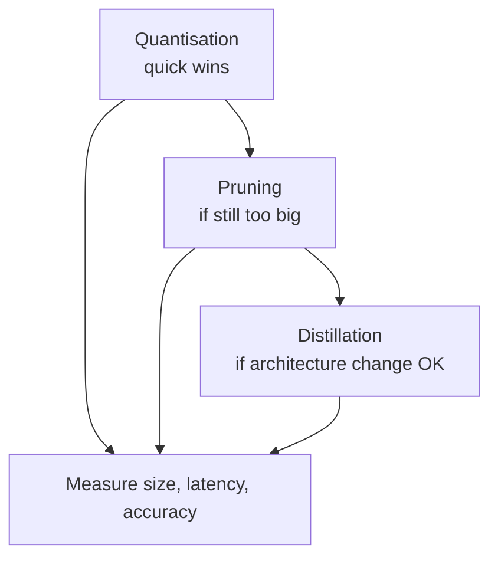

# Compression Trade-offs and the MLOps Pipeline

## Comparing the Three Compression Techniques

| Technique | Ease of application | Typical accuracy impact | Speed/size gain | Best first step? |
|-----------|--------------------|-----------------------|-----------------|------------------|
| **Quantisation** | High (especially PTQ) | Small at FP16; moderate at INT8 | Large (esp. INT8) | **Yes — often first** |
| **Pruning** | Medium | Moderate without fine-tune | Large if structured + fine-tuned | When model is overparameterised |
| **Distillation** | Low (requires retraining) | Can improve vs small baseline | Large (new architecture) | When architecture redesign is acceptable |

### Rough decision guide

- **Start with quantisation** — PTQ is easy and often yields big speed/memory gains for small accuracy drop
- **Add structured pruning** when the network is clearly larger than necessary
- **Use distillation** when willing to invest in training a tailored small architecture that mimics a strong teacher

---

## The Golden Rule: Measure Everything

No matter which technique is applied:

| Metric | Measure before | Measure after |
|--------|----------------|---------------|
| Model size (MB) | ✓ | ✓ |
| Average latency | ✓ | ✓ |
| P95 / P99 latency | ✓ | ✓ |
| Accuracy / key business metric | ✓ | ✓ |

**Do not guess.** Numbers determine whether the trade-off is acceptable for the specific use case.

---

## Where Compression Fits in the Pipeline

Compression is a **post-training** step in the broader MLOps optimisation pipeline:

| Stage | Tool category | Solves |
|-------|--------------|--------|
| Train | Framework (PyTorch, TF) | Accuracy |
| Compress | Quantisation, pruning, distillation | Size, memory, speed |
| Export | ONNX, TF Lite, OpenVINO | Portability |
| Runtime | ONNX Runtime, TensorRT, XLA | Hardware efficiency |

Compression is one tool in the MLOps toolbox — ensuring the model meets **latency, cost, and hardware** constraints.

---

## Combining Techniques

Techniques stack:

1. Distil a large teacher into a compact student
2. Prune remaining redundant channels
3. Apply INT8 quantisation
4. Export to ONNX
5. Run with ONNX Runtime (graph optimisations enabled) or TensorRT

Each step should be measured independently — one change at a time preserves causal attribution.

---

## Connection to Optimised Runtimes

Compression reduces what the model **is** (fewer bits, fewer parameters). Optimised runtimes improve how the model **runs** (kernel fusion, memory layout, hardware acceleration). Both are needed for peak production performance.

Next topic: ONNX Runtime, TensorRT, and XLA — engines that squeeze more performance from the hardware given a model graph.

---

## Common Pitfalls / Exam Traps

- **Trap**: Applying multiple techniques simultaneously without isolating effects — cannot attribute gains or regressions.
- **Trap**: Accepting accuracy drop without business context — 1% accuracy loss may be fatal for medical diagnosis but acceptable for recommendation ranking.
- **Trap**: Skipping export after compression — compressed PyTorch weights still require a portable format for non-PyTorch serving.
- **Trap**: "Quantisation is always enough" — large overparameterised models may need pruning or distillation first.

---

## Quick Revision Summary

- **Quantisation**: best first step; easy PTQ, big INT8 gains
- **Pruning**: for overparameterised models; structured > unstructured for HW
- **Distillation**: powerful but training-intensive; design student for constraints
- Always measure **size, latency, accuracy** before and after
- Pipeline: train → compress → export → optimised runtime → serve
- Techniques combine; change one variable at a time
- Compression + runtime optimisation address different layers of the stack
