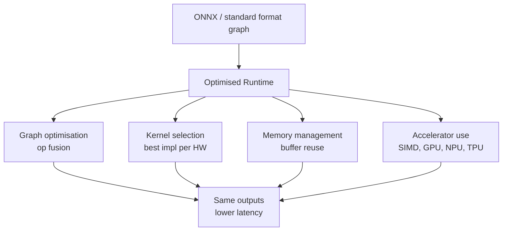
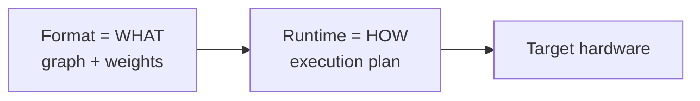

# Optimised Runtimes: Foundations

## The Core Question

Given a model exported to a standard format (e.g. ONNX), **how do we execute it as efficiently as possible on the available hardware?**

That is the job of an **optimised runtime** — an inference engine that takes a computation graph and produces fast, memory-efficient predictions without changing the model's mathematical output.

---

## What an Optimised Runtime Does

### 1. Graph Optimisation

Fuse sequences of operations into single kernels. Classic example:

$$\text{Conv} \rightarrow \text{BatchNorm} \rightarrow \text{ReLU}$$

becomes one fused convolution kernel — fewer memory round-trips, better cache locality.

### 2. Kernel Selection

For each operation, pick the fastest implementation for the target hardware (Intel MKL-DNN on CPU, cuDNN on NVIDIA GPU, etc.).

### 3. Memory Management

Reuse intermediate buffers instead of allocate/free per inference — reduces overhead especially at batch size 1.

### 4. Hardware Acceleration

Exploit vector instructions (AVX), GPUs, NPUs, TPUs where available.

---

## Goals (Unchanged Outputs, Better Performance)

| Objective | Runtime contribution |
|-----------|---------------------|
| Lower **latency** | Fused ops, tuned kernels |
| Higher **throughput** | Parallel execution, memory efficiency |
| Lower **memory** | Buffer reuse, in-place ops |
| Same **accuracy** | Optimisation is execution-level, not mathematical |

---

## Three Runtimes in Focus

| Runtime | Origin | Primary scope |
|---------|--------|---------------|
| **ONNX Runtime** | Microsoft / ONNX ecosystem | General-purpose, ONNX models, cross-platform |
| **TensorRT** | NVIDIA | NVIDIA GPU peak performance |
| **XLA** | Google | TensorFlow / JAX compilation to machine code |

---

## Key Trade-off Preview: Portability vs Peak Performance

| Approach | Portability | Peak performance |
|----------|-------------|------------------|
| ONNX + ONNX Runtime | High | Good, not always maximum |
| TensorRT (NVIDIA) | Low (GPU-specific) | Highest on NVIDIA |
| XLA (TF/JAX) | Medium (framework-bound) | High on TPU/GPU |

**Strategy**: start portable, measure, then adopt hardware-specific runtimes for latency-critical services.

---

## Key Trade-off Preview: Compile Time vs Runtime

Some runtimes (TensorRT, XLA) invest heavily **up front**:

- Graph compilation, kernel auto-tuning, engine building
- Deployment step takes longer
- Each inference request is faster once deployed

Others start quickly but may have higher per-request latency.

**Design question**: Is a larger one-time compile cost acceptable to save time on every inference?

**Answer is often yes** when:
- Model changes infrequently
- Traffic volume is high
- Tail latency SLAs are tight

---

## The Format–Runtime Separation

| Component | Role |
|-----------|------|
| **Model format** (ONNX) | Describes **what** the model is |
| **Runtime** (ONNX Runtime) | Decides **how** it runs on hardware |

---

## Common Pitfalls / Exam Traps

- **Trap**: Expecting runtime optimisation to fix a bad model — runtimes optimise execution, not accuracy.
- **Trap**: Ignoring compile-time cost in CI/CD — TensorRT engine builds can take minutes per model version.
- **Trap**: Assuming all runtimes speed up all models — small models on CPU may be faster in native PyTorch (see lab results).
- **Trap**: Conflating graph optimisation with quantisation — fusion is execution-level; quantisation changes numeric precision.

---

## Quick Revision Summary

- Optimised runtimes execute standard-format graphs with maximum hardware efficiency
- Four mechanisms: graph fusion, kernel selection, memory reuse, accelerator exploitation
- Outputs stay mathematically the same; latency, throughput, and memory improve
- Three focus runtimes: **ONNX Runtime**, **TensorRT**, **XLA**
- Trade-off 1: portability (ONNX Runtime) vs peak perf (TensorRT)
- Trade-off 2: compile-time investment vs per-request latency
- Format = what; runtime = how
