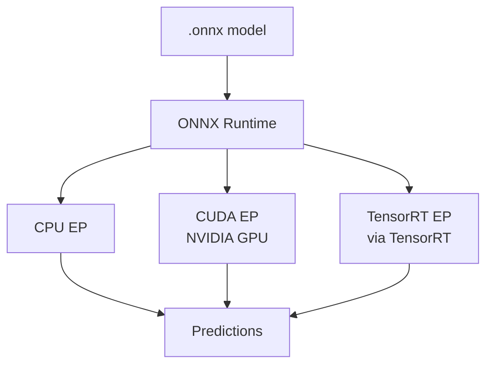
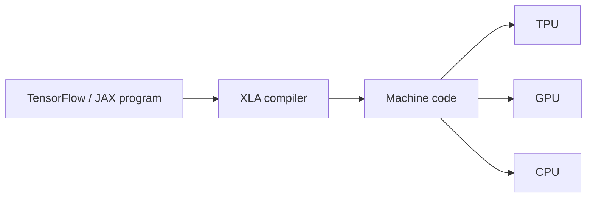

# ONNX Runtime, TensorRT, and XLA

## ONNX Runtime

ONNX Runtime (ORT) is a high-performance inference engine built specifically for **ONNX models**.

### Capabilities

| Feature | Detail |
|---------|--------|
| Hardware | CPU, GPU, and accelerators via **Execution Providers** |
| Execution Providers | `CPUExecutionProvider`, `CUDAExecutionProvider`, `TensorrtExecutionProvider`, others |
| Graph optimisations | Built-in fusion, constant folding, layout optimisation |
| APIs | Python, C, C++, C#, Java, JavaScript |



### When to use ONNX Runtime

- Organisation standardises on **ONNX** as the deployment format
- Need a **portable** runtime across Linux, Windows, cloud, edge
- Want one runtime with pluggable hardware backends
- Default choice for general-purpose production deployment

### Python inference pattern

```python
import onnxruntime as ort
session = ort.InferenceSession("model.onnx", providers=["CPUExecutionProvider"])
outputs = session.run(None, {"input": numpy_array})
```

---

## TensorRT

TensorRT is NVIDIA's dedicated **inference optimiser and runtime** for NVIDIA GPUs.

### Workflow

1. Import model (often from ONNX)
2. TensorRT performs heavy graph optimisation: layer fusion, precision calibration, kernel auto-tuning for the **specific GPU model**
3. Produces a **TensorRT Engine** (binary artefact optimised for that GPU)
4. Engine executes with very low latency


### Strengths

- Lowest latency and highest throughput on NVIDIA GPUs
- Native FP16 and INT8 quantised inference
- Kernel auto-tuned per GPU architecture (e.g. A100 vs T4)

### When to use TensorRT

- Production workloads run predominantly on **NVIDIA GPUs**
- Every millisecond of latency matters
- Willing to accept NVIDIA lock-in and engine build time

---

## XLA (Accelerated Linear Algebra)

XLA is a **compiler** used inside TensorFlow and JAX — not a standalone export format.

### How it works

Instead of interpreting the computation graph op-by-op, XLA:

1. Compiles the graph into **optimised machine code**
2. Fuses operations and chooses efficient memory layouts
3. Generates code for CPU, GPU, or **TPU**



### User experience

- No separate XLA model file to export
- Enable XLA or JIT compilation in TensorFlow/JAX code
- Framework uses XLA under the hood for speedup

### When to use XLA

- Training or inference in **TensorFlow or JAX**
- Deploying on **Google TPUs** or seeking TF/JAX graph compilation
- Willing to stay within the TF/JAX ecosystem

---

## Side-by-Side Comparison

| Dimension | ONNX Runtime | TensorRT | XLA |
|-----------|--------------|----------|-----|
| Input format | ONNX | ONNX, TF, others | TF/JAX graph (in-process) |
| Portability | High | NVIDIA only | TF/JAX bound |
| Peak GPU perf | Good | **Best** on NVIDIA | Good |
| TPU support | No | No | **Yes** |
| Standalone export | Yes (.onnx) | Yes (.engine) | No (compiled in-process) |
| Compile upfront | Moderate | **Heavy** | Moderate–heavy |
| Best default for | Cross-platform ONNX | NVIDIA GPU serving | TF/JAX on TPU |

---

## Common Pitfalls / Exam Traps

- **Trap**: Using TensorRT for CPU inference — TensorRT is GPU-only.
- **Trap**: Expecting XLA to work with PyTorch ONNX exports — XLA is TF/JAX internal.
- **Trap**: Shipping ONNX files to production without pinning ORT version — operator support varies across versions.
- **Trap**: Ignoring TensorRT engine specificity — an engine built for T4 may not run on A100 without rebuild.

---

## Quick Revision Summary

- **ONNX Runtime**: portable, ONNX-native, execution providers for CPU/GPU/TensorRT
- **TensorRT**: NVIDIA GPU peak performance; builds per-GPU engine; FP16/INT8
- **XLA**: TF/JAX compiler; fuses ops to machine code; CPU/GPU/TPU
- ORT = general-purpose default; TensorRT = NVIDIA latency champion; XLA = TF/JAX ecosystem
- TensorRT and XLA pay compile-time cost for runtime speed
- Model format describes *what*; runtime describes *how*
