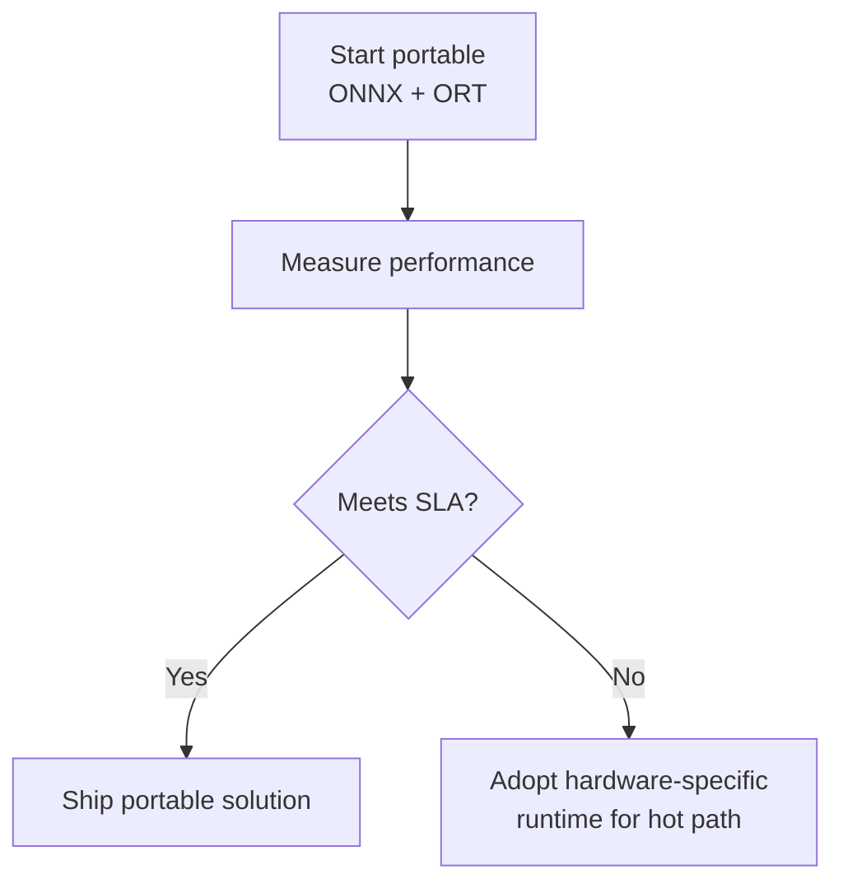
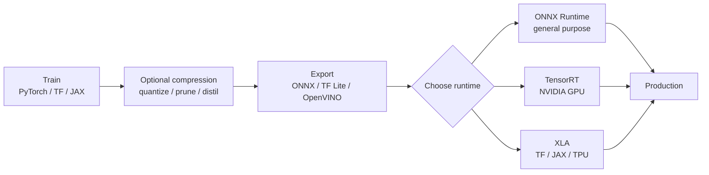

# Runtime Trade-offs and Deployment Fit

## Axis 1: Portability vs Hardware-Specific Optimisation

### Portable approach (ONNX + ONNX Runtime)

| Advantage | Limitation |
|-----------|------------|
| One model format across teams | May not reach absolute peak on every device |
| One runtime, multiple execution providers | Generic kernels vs hand-tuned vendor kernels |
| Simpler standardisation story | GPU speed may trail TensorRT |

### Hardware-specific approach (TensorRT, vendor runtimes)

| Advantage | Limitation |
|-----------|------------|
| Best possible latency/throughput on target device | More configuration and setup |
| Exploits vendor-specific features (Tensor Cores, etc.) | Less portable across hardware generations |
| Worth it for latency-critical paths | Multiple code paths per hardware target |

**Common strategy**: portable baseline → measure → selectively adopt TensorRT (or similar) for the most critical services where every millisecond counts.

---

## Axis 2: Compile Time vs Runtime Latency

| Runtime style | Upfront cost | Per-request cost | Best when |
|---------------|-------------|------------------|-----------|
| **Heavy compile** (TensorRT, XLA) | Minutes to build engine | Lowest latency | High traffic, infrequent model changes |
| **Light start** (framework native, vanilla ORT) | Seconds | Higher per-request | Rapid iteration, low traffic |

**Design question**: Accept a larger one-time compile cost to save time on every inference?

**Yes, when**:
- Model version changes infrequently (weekly/monthly, not hourly)
- Request volume is high (compile cost amortised)
- P99 latency SLA is tight

**No, when**:
- Rapid A/B testing of model variants
- Low-traffic internal tools
- CI/CD requires sub-minute deploy cycles

---

## Full Module 7 Production Flow

| Step | Output |
|------|--------|
| Train | High-accuracy model in framework-native format |
| Compress | Smaller, faster model (optional) |
| Export | Portable standard-format artefact |
| Runtime | Hardware-optimised execution |

---

## Decision Matrix

| Constraint | Recommended path |
|------------|------------------|
| Multi-framework org, cloud CPU+GPU | ONNX → ONNX Runtime |
| NVIDIA GPU, tightest latency | ONNX → TensorRT engine |
| TensorFlow/JAX on Google TPU | Enable XLA in framework |
| Android/iOS mobile | TF Lite |
| Intel-only server farm | ONNX → OpenVINO Runtime |
| Small CNN, CPU, batch=1 | May stay in PyTorch if already fast enough |

---

## The Format–Runtime Mental Model

> **Model format** = what the model is (graph + weights + metadata)
> **Runtime** = how the model executes on hardware

Changing the format enables portability. Changing the runtime enables hardware efficiency. Changing compression enables size and memory efficiency. All three are independent knobs.

---

## Common Pitfalls / Exam Traps

- **Trap**: Defaulting to TensorRT for all models — over-engineering if PyTorch or ORT already meets SLA on CPU.
- **Trap**: Ignoring engine rebuild in deployment pipeline — TensorRT engines are not portable across GPU models.
- **Trap**: Choosing portability then complaining about peak GPU perf — explicit trade-off; not a failure of ONNX.
- **Trap**: Skipping measurement after runtime swap — optimisation is empirical and context-dependent.

---

## Quick Revision Summary

- **Portable**: ONNX + ORT — one format, many platforms; may sacrifice peak perf
- **Hardware-specific**: TensorRT — best NVIDIA latency; less portable, more setup
- **Compile vs runtime**: TensorRT/XLA invest upfront for per-request savings
- Strategy: portable first → measure → hardware-specific for critical paths
- Full pipeline: train → compress → export → runtime
- Format = what; runtime = how; compression = how small/fast the model is
