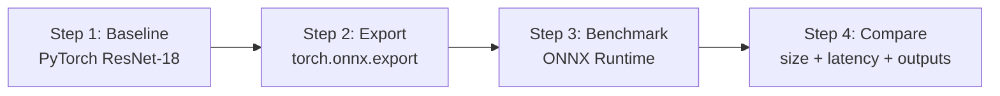

# Lab Overview: ONNX Export and Runtime Benchmarking

## Purpose

The hands-on lab closes the gap between theory and measurement. It takes a pre-trained convolutional neural network, establishes a rigorous baseline, exports to ONNX, runs inference with ONNX Runtime, and compares metrics — demonstrating that **the same logical model** can have a **different performance profile** depending on format and runtime.

---

## Lab Pipeline

| Step | Script | Key output |
|------|--------|------------|
| 1 | `baseline.py` | Model size, avg/P95 latency, `baseline_metrics.json` |
| 2 | `export_onnx.py` | Validated `.onnx` file, size comparison |
| 3 | `onnx_runtime_benchmark.py` | ORT latency, side-by-side table |

---

## What Gets Measured

| Metric | Why it matters |
|--------|----------------|
| **File size (MB)** | Disk, download, artefact storage |
| **Average latency** | Capacity planning |
| **P95 latency** | Tail SLA, worst-case UX |
| **Output correctness** | Ensure export is lossless |
| **Parameter count** | Model complexity reference |

---

## Model Choice: ResNet-18

- Well-known CNN architecture from `torchvision`
- ~11 million parameters — realistic but small enough for fast demos
- `model.eval()` + CPU for consistent baseline
- Alternative: Hugging Face vision/transformer models (more complex, same workflow)

---

## Fair Comparison Principles

To isolate the effect of the runtime:

| Held constant | Changed |
|---------------|---------|
| Model architecture | Inference engine |
| Weights (same checkpoint) | PyTorch → ONNX Runtime |
| Input tensor shape | |
| Hardware (CPU) | |
| Warm-up + 100-run timing loop | |
| Batch size (typically 1) | |

This is an **apples-to-apples** comparison: only the execution engine differs.

---

## Expected Learning Outcomes

1. **Baseline discipline** — optimisation without measurement is guesswork
2. **Export mechanics** — `torch.onnx.export`, input/output names, dynamic axes
3. **ONNX validation** — `onnx.checker.check_model`
4. **Runtime session** — `ort.InferenceSession`, execution providers, numpy inputs
5. **Surprising results** — ONNX Runtime is not always faster (context-dependent)

---

## Extensions (Beyond Vanilla Lab)

After the baseline comparison, further experiments:

- Enable ORT graph optimisations (`GraphOptimizationLevel.ORT_ENABLE_ALL`)
- INT8 quantisation (2–4× CPU speedup possible)
- Increase batch size
- GPU execution provider (`CUDAExecutionProvider`)
- PyTorch alternatives: `torch.compile`, TorchScript

---

## Common Pitfalls / Exam Traps

- **Trap**: Skipping warm-up runs — first inference includes allocation overhead, skewing latency.
- **Trap**: Comparing GPU PyTorch baseline against CPU ORT — hardware must match.
- **Trap**: Expecting ONNX export to shrink file size — FP32 weights dominate; sizes are nearly identical.
- **Trap**: Declaring ONNX Runtime "slow" from one benchmark — small CNN + CPU + batch=1 is a favourable case for native PyTorch.

---

## Quick Revision Summary

- Lab: baseline PyTorch → export ONNX → benchmark ORT → compare
- Measure size, avg latency, P95 latency, and output correctness
- ResNet-18 on CPU is the reference configuration
- Fair comparison: same model, weights, input, hardware; only runtime changes
- Export is typically lossless and size-neutral for FP32
- Results teach that optimisation is empirical and context-dependent
