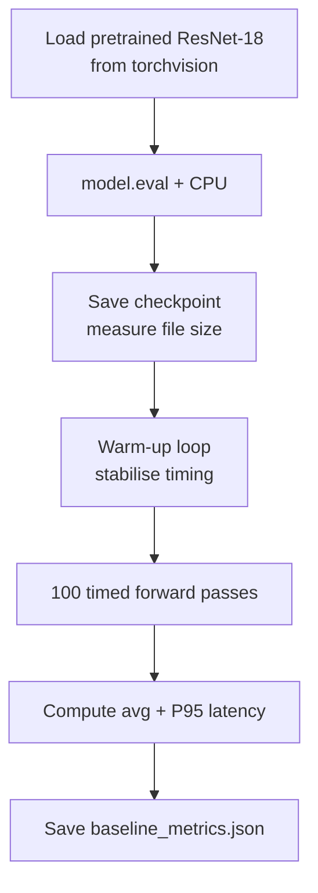

# Establishing a Baseline: Model Size and Latency

## Why Baselines Come First

Before claiming any optimisation worked, engineers need a **reference point**. Baseline metrics answer: "How big is the model? How fast is inference out of the box?" Without this, statements like "we made it faster" are unverifiable.

**Optimisation without measurement is guesswork.**

---

## Two Key Baseline Metrics

### 1. Model Size on Disk

- Save the model checkpoint (e.g. `resnet18_baseline.pt`)
- Measure file size in megabytes via `os.path.getsize`
- Establishes whether format changes (ONNX, quantised) actually reduce storage

### 2. Inference Latency on CPU

- Run forward passes on a **standard CPU** for reproducibility
- Report **average** and **P95** latency
- P95 = latency value below which 95% of requests fall — better tail-SLA proxy than average alone

---

## Baseline Script Workflow



### Code pattern (conceptual)

```python
model = torchvision.models.resnet18(weights=ResNet18_Weights.DEFAULT)
model.eval()
model.to("cpu")

dummy_input = torch.randn(1, 3, 224, 224)

# Warm-up (exclude allocation / library init overhead)
for _ in range(10):
    model(dummy_input)

# Timed runs
latencies = []
for _ in range(100):
    start = time.perf_counter()
    model(dummy_input)
    latencies.append(time.perf_counter() - start)
```

---

## Why Warm-up Matters

The first few inference runs are often slower due to:

- Memory allocation for intermediate tensors
- CPU library initialisation (MKL, oneDNN)
- Lazy kernel compilation

Warm-up ensures measurements reflect **steady-state** performance, not cold-start artefacts.

---

## Persistent Baseline Record

Save metrics to JSON (e.g. `baseline_metrics.json`):

```json
{
  "checkpoint_size_mb": 44.67,
  "total_parameters": 11689512,
  "avg_latency_ms": 8.0,
  "p95_latency_ms": 9.0
}
```

Downstream scripts load this file for automated before/after comparison tables.

---

## PyTorch as a Strong Baseline

PyTorch is a general-purpose framework (training, debugging, experimentation, inference). For **small, well-known CNNs on CPU**, its native backend is highly optimised:

- Uses tuned libraries: **MKL**, **oneDNN**
- Decades of CPU kernel optimisation for standard architectures

This sets up an important lesson: ONNX Runtime is laser-focused on inference, but **does not automatically beat PyTorch** in every configuration.

---

## ONNX Runtime vs PyTorch (Conceptual)

| Aspect | PyTorch | ONNX Runtime |
|--------|---------|--------------|
| Primary goal | Full ML lifecycle | Inference only |
| Graph optimisation | Runtime-level | Dedicated fusion passes |
| Input type | `torch.Tensor` | `numpy.ndarray` |
| Portability | PyTorch required | Any ORT-supported platform |

For LLM serving at scale, specialised engines (e.g. vLLM) dominate — but for general CNN/ONNX deployment, ORT is the standard tool.

---

## The "Free Performance" Hypothesis

The lab tests whether switching to ONNX Runtime yields speedup **without**:

- Retraining
- Accuracy sacrifice
- Architecture change

If ORT is faster → free performance. If not → valuable data about when native PyTorch is already sufficient.

---

## Common Pitfalls / Exam Traps

- **Trap**: Timing without `model.eval()` — dropout and batch norm behave differently in train mode.
- **Trap**: Using GPU for baseline but CPU for ORT comparison — invalid apples-to-oranges test.
- **Trap**: Single-run timing — high variance; use 100+ runs with warm-up.
- **Trap**: Ignoring P95 — average can look fine while tail latency violates SLA.

---

## Quick Revision Summary

- Baseline = disk size + avg/P95 latency before any optimisation
- ResNet-18 on CPU: realistic, well-known reference architecture
- Warm-up loop essential for steady-state measurements
- Save metrics to JSON for automated downstream comparison
- PyTorch CPU backend is highly optimised for standard small CNNs
- ONNX Runtime targets inference but is not universally faster
- "How much faster?" requires a measured reference point
