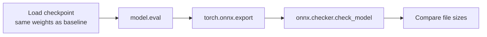
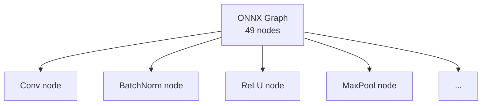

# Exporting a CNN to ONNX Format

## Purpose of ONNX Export

Export transforms a framework-native checkpoint into a **portable, standard representation** loadable by ONNX Runtime, TensorRT, OpenVINO, and other ONNX-compatible tools. The export step is about **interoperability and optimisation potential** — not necessarily immediate size or speed gains.

---

## Export Workflow



### Core export call

```python
torch.onnx.export(
    model,
    dummy_input,           # example input for graph tracing
    "resnet18.onnx",
    input_names=["input"],
    output_names=["output"],
    dynamic_axes={
        "input": {0: "batch_size"},
        "output": {0: "batch_size"},
    },
)
```

---

## Key Export Parameters

| Parameter | Role |
|-----------|------|
| `model` | Network in eval mode with trained weights |
| `dummy_input` | Representative tensor for graph tracing |
| `input_names` / `output_names` | Public API names used by all runtimes |
| `dynamic_axes` | Allow variable batch size at inference time |
| `opset_version` | ONNX operator set version (compatibility) |

### Dynamic axes

Declaring batch dimension as dynamic means the ONNX model accepts batch sizes 1, 8, 32, etc. at inference — critical for both real-time (batch=1) and batch scoring (batch=32+) without re-exporting.

---

## Validation: `onnx.checker.check_model`

Static analysis of the exported graph:

- Verifies well-formed protobuf structure
- Checks operator compatibility
- Reports node count (e.g. ResNet-18 ≈ 49 nodes)

Each **node** = one graph operation (Conv, BatchNorm, ReLU, MaxPool, Gemm, etc.).



---

## File Size: Why ONNX ≈ PyTorch Checkpoint

Typical observation:

| Artefact | Size |
|----------|------|
| PyTorch `.pt` | ~44.67 MB |
| ONNX `.onnx` | ~44.50 MB |

**Why nearly identical?** Both files store the same millions of FP32 weight values. Format change affects serialisation overhead, not the bulk of parameters.

**What did we gain?** Optimisation potential — the ONNX file is an intermediate representation any compatible compiler/runtime can optimise:

| PyTorch `.pt` | ONNX `.onnx` |
|---------------|--------------|
| Compiled/run only by PyTorch | ONNX Runtime, TensorRT, OpenVINO, ... |
| Framework-locked | Portable contract |

Analogy: `.pt` is source code for one compiler; `.onnx` is LLVM IR for many compilers.

---

## Lossless Export

Vanilla FP32 export is **lossless**:

- No quantisation
- No pruning
- No distillation
- Numerically identical outputs on the same input (within floating-point semantics)

This means runtime optimisation can be explored **without touching model accuracy** — train once, validate accuracy, then optimise deployment.

---

## Tooling Evolution Note

PyTorch is migrating from TorchScript-based export toward **`torch.export`** (Dynamo-based). Production codebases may still use `torch.onnx.export`; both produce valid ONNX for standard architectures. Watch deprecation warnings but do not block on migration for learning exercises.

---

## Post-Export Checklist

| Check | Action |
|-------|--------|
| Graph valid? | `onnx.checker.check_model` |
| Node count reasonable? | Compare to architecture expectation |
| Size as expected? | Dominated by FP32 weights |
| I/O names correct? | Match runtime `session.run` keys |
| Dynamic batch? | Verify `dynamic_axes` if needed |

---

## Common Pitfalls / Exam Traps

- **Trap**: Exporting in train mode — batch norm and dropout produce wrong graph.
- **Trap**: Wrong dummy input shape — graph traced for incorrect dimensions.
- **Trap**: Expecting smaller file after export — compression (quantisation) is a separate step.
- **Trap**: Skipping validation — malformed graphs fail at runtime with opaque errors.
- **Trap**: Hard-coded batch size — omitting `dynamic_axes` forces batch=1 forever.

---

## Quick Revision Summary

- `torch.onnx.export` traces graph with dummy input; names define runtime API
- `dynamic_axes` enables variable batch size at inference
- `onnx.checker.check_model` validates graph structure and node count
- FP32 export is size-neutral and lossless — same weights, different container
- Gain is portability and multi-runtime optimisation potential, not immediate speed
- ResNet-18 ≈ 49 ONNX nodes; ~11M parameters
- Next step: benchmark with ONNX Runtime using identical methodology
