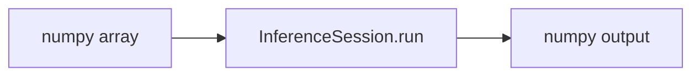
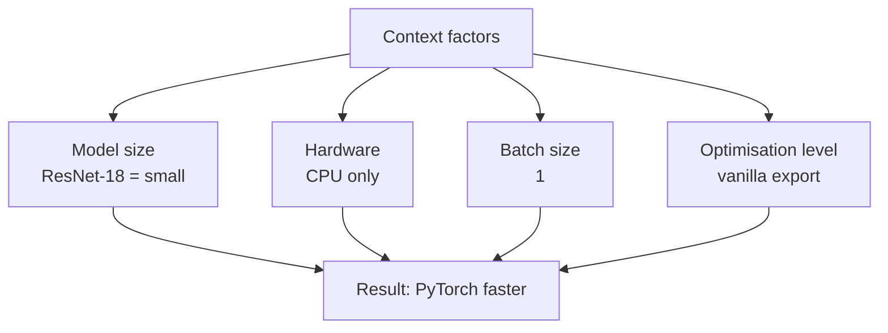

# ONNX Runtime Benchmarking and Interpreting Results

## The Final Comparison

Load the exported `.onnx` model with ONNX Runtime, run the **identical** latency benchmark (warm-up + 100 timed runs), load saved baseline metrics, and print a side-by-side comparison table.

---

## ONNX Runtime Session Setup

```python
import onnxruntime as ort
import numpy as np

session = ort.InferenceSession(
    "resnet18.onnx",
    providers=["CPUExecutionProvider"],  # match PyTorch CPU baseline
)

dummy_input = np.random.randn(1, 3, 224, 224).astype(np.float32)

# Warm-up
for _ in range(10):
    session.run(None, {"input": dummy_input})

# Timed runs
latencies = []
for _ in range(100):
    start = time.perf_counter()
    session.run(None, {"input": dummy_input})
    latencies.append(time.perf_counter() - start)
```

### Key differences from PyTorch

| PyTorch | ONNX Runtime |
|---------|--------------|
| `torch.Tensor` input | `numpy.ndarray` input |
| `model(tensor)` | `session.run(None, {name: array})` |
| Implicit I/O | Explicit `input_names` from export |



---

## Example Result: ORT Slower Than PyTorch

A representative CPU benchmark on ResNet-18, batch size 1, vanilla export:

| Metric | PyTorch | ONNX Runtime |
|--------|---------|--------------|
| Avg latency | ~8 ms | ~17 ms |
| P95 latency | ~9 ms | ~21 ms |

**This is the opposite of the naive expectation** — and it is a valuable result, not a failure.

---

## Why Optimisation Is Context-Dependent



### Factor 1: Model size

ResNet-18 has ~11M parameters and only ~49 graph operations. PyTorch's CPU backend (MKL, oneDNN) has been tuned for decades on exactly these standard CNN architectures. Overhead dominates for tiny graphs.

### Factor 2: Hardware

ONNX Runtime's biggest wins often come from **GPU acceleration** (CUDA EP), NPUs, or **INT8 quantisation** — not vanilla CPU with a small model.

### Factor 3: Batch size

Batch size = 1 (real-time scoring) amortises none of the session setup overhead. Larger batches give ORT more opportunity for memory access optimisation and parallelisation.

### Factor 4: Optimisation level not enabled

Vanilla export + default ORT settings = "safe mode." Unleashed potential requires:

- `sess_options.graph_optimization_level = ort.GraphOptimizationLevel.ORT_ENABLE_ALL`
- INT8 quantisation (2–4× CPU speedup possible)
- ORT performance tuning for specific CPU architecture

---

## What This Result Teaches

| Lesson | Detail |
|--------|--------|
| **Profiling is essential** | Never assume a tool is faster without measuring |
| **PyTorch is excellent** for small CNN + CPU + prototyping | Do not over-engineer if already fast enough |
| **ORT shines** for large models, GPU, cross-platform, quantisation | Transformers, vision transformers, production ORT tuning |
| **Optimisation is empirical** | Techniques that work in one scenario may fail in another |
| **One change at a time** | Scientific approach separates good engineers from tool-throwing |

---

## Next Steps If Production Needs More Speed

### Staying with ONNX Runtime

1. Enable graph optimisations (`ORT_ENABLE_ALL`)
2. Quantise to INT8
3. Increase batch size if use case allows
4. Use CUDA or TensorRT execution provider on GPU

### Alternatives

| Option | When |
|--------|------|
| `torch.compile` / TorchScript | Stay in PyTorch, CPU/GPU compile |
| TensorRT | NVIDIA GPU production |
| Stay on PyTorch | Already meets SLA on CPU |

---

## Valid Conclusion

> For ResNet-18, CPU-only, batch size 1, vanilla ONNX export: **PyTorch is faster.**

This is a perfectly valid, useful, data-driven conclusion. The methodology — baseline → one change → measure — is the real deliverable.

---

## Common Pitfalls / Exam Traps

- **Trap**: "ONNX Runtime is always faster" — disproven by this exact experiment; context matters.
- **Trap**: Benchmarking without matching execution provider to baseline hardware.
- **Trap**: Drawing conclusions from a single configuration — large transformers on GPU tell a different story.
- **Trap**: Abandoning ORT after one slow result — graph optimisations and INT8 quantisation were not applied.
- **Trap**: Forgetting that portability value exists independent of latency (cross-platform deployment).

---

## Quick Revision Summary

- ORT inference: `InferenceSession` + `session.run` with numpy arrays and named inputs
- Match CPU provider to PyTorch CPU baseline for fair comparison
- ResNet-18 + CPU + batch=1 + vanilla ORT can be **slower** than PyTorch
- Reasons: small model, CPU-only, batch=1, no graph optimisations enabled
- ORT wins on large models, GPU, quantisation, cross-platform production
- Optimisation is empirical: baseline → change → measure → decide
- A negative result is valuable data, not a failed experiment
