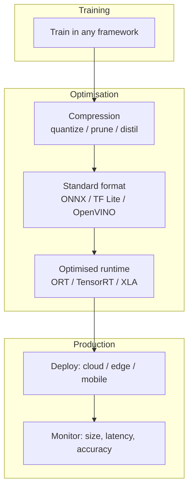

# Module 7 Summary: Standardisation and Optimisation

## North Star

A model is only truly useful in production when it is simultaneously:

1. **Accurate enough** for the business task
2. **Fast enough** to meet latency SLAs (especially P95/P99)
3. **Cheap enough** to run at the required scale

Model **standardisation** and **optimisation** are the engineering disciplines that bridge high-accuracy research models and these three production requirements.

---

## The Complete Stack

---

## Three Production Goals → Three Tool Categories

| Goal | Pain | Primary tools |
|------|------|---------------|
| **Portability** | Framework/hardware mismatch | ONNX, TF Lite, OpenVINO IR |
| **Latency / throughput** | SLA misses, high infra cost | Optimised runtimes, quantisation |
| **Footprint** | Disk, RAM, power limits | Quantisation, pruning, distillation |

---

## Standard Formats: When to Use Which

| Format | Best for |
|--------|----------|
| **ONNX** | Cross-framework, cloud/server, general default |
| **TF Lite** | TensorFlow → mobile/Android/iOS/IoT |
| **OpenVINO** | Intel CPU/iGPU server deployments |

**Key insight**: Format = portable contract between training and serving. Export alone is typically lossless; gains come from runtime + compression.

---

## Compression Techniques

| Technique | Mechanism | First step? |
|-----------|-----------|-------------|
| **Quantisation** | Fewer bits (FP32→INT8) | **Often yes** (PTQ) |
| **Pruning** | Remove low-importance weights/channels | When overparameterised |
| **Distillation** | Small student mimics large teacher | When redesign is acceptable |

**Golden rule**: measure size, latency, and accuracy before and after every change.

---

## Optimised Runtimes

| Runtime | Scope | Peak performance |
|---------|-------|------------------|
| **ONNX Runtime** | Cross-platform ONNX | Good (portable default) |
| **TensorRT** | NVIDIA GPU | Best on NVIDIA |
| **XLA** | TensorFlow/JAX | Strong on TPU/GPU |

**Two trade-offs**:
- Portability (ONNX Runtime) vs peak hardware perf (TensorRT)
- Compile-time investment vs per-request latency savings

---

## Lab Lessons (Empirical Optimisation)

| Finding | Implication |
|---------|-------------|
| Baseline metrics are mandatory | "Faster" requires a reference |
| ONNX export ≈ same file size | Weights dominate; compression shrinks |
| ORT not always faster than PyTorch | Small CNN + CPU + batch=1 favours PyTorch |
| Negative results are valuable | Context-dependent optimisation is real engineering |
| Next levers: graph opt, INT8, GPU EP | Vanilla export leaves performance on the table |

---

## End-to-End Production Checklist

- [ ] Define SLA: P95 latency, throughput, cost-per-prediction
- [ ] Measure baseline: size, avg/P95 latency, accuracy
- [ ] Choose format for target hardware (ONNX / TF Lite / OpenVINO)
- [ ] Apply compression if footprint or speed insufficient (quantize first)
- [ ] Select runtime (portable first, hardware-specific if needed)
- [ ] Re-measure after each change (one variable at a time)
- [ ] Validate accuracy on representative data before production rollout

---

## Common Pitfalls / Exam Traps

- **Trap**: Treating accuracy as the only deployment gate — latency, cost, and hardware are independent constraints.
- **Trap**: Assuming ONNX Runtime always beats native framework inference — optimisation is context-dependent.
- **Trap**: Skipping compression because format was exported — export solves portability, not size.
- **Trap**: Choosing TensorRT for portability — it is NVIDIA-specific; ONNX Runtime is the portable default.
- **Trap**: Applying multiple optimisations without isolated measurement — cannot attribute cause and effect.

---

## Quick Revision Summary

- North star: accurate + fast + cheap at production scale
- Three goals: portability, latency/throughput, footprint
- Three levers: standard formats, compression, optimised runtimes
- ONNX = cross-platform default; TF Lite = mobile; OpenVINO = Intel
- Quantise first; prune if overparameterised; distil for architecture redesign
- ORT = portable; TensorRT = NVIDIA peak; XLA = TF/JAX/TPU
- Always baseline → change → measure; optimisation is empirical
- Format = what; runtime = how; compression = how small/fast
