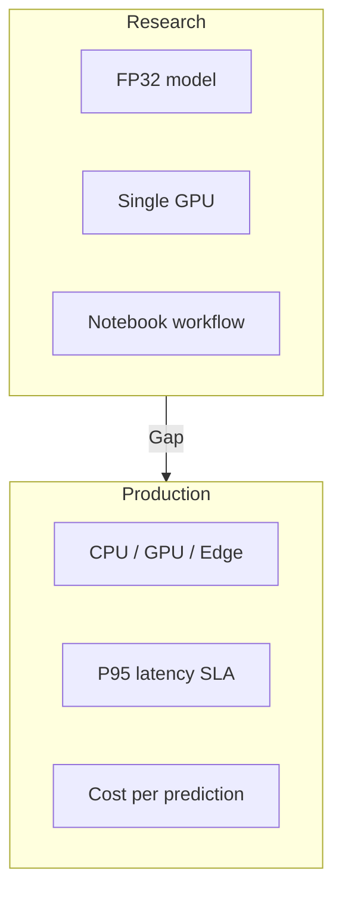
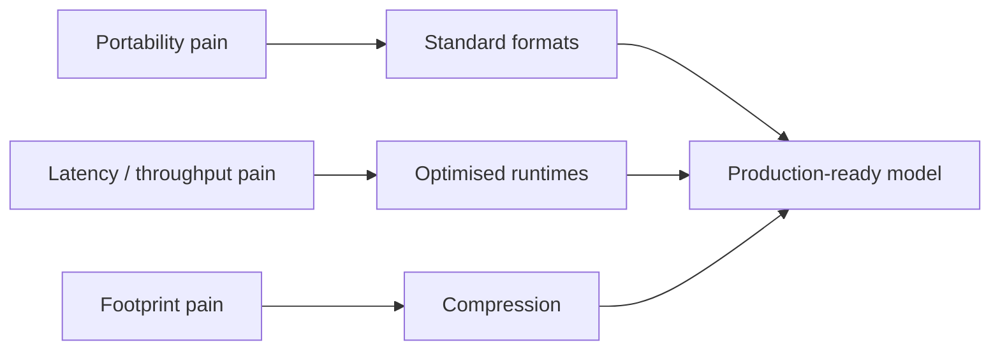

# The Research–Production Deployment Gap

## Why "Accurate" Is Not Enough

A model can achieve state-of-the-art validation accuracy and still be undeployable. Production teams routinely face a familiar situation: the model is impressive on paper, but it is **too big**, **too slow**, or **too awkward** to integrate into the serving stack.

Model standardisation and optimisation exist to close the gap between how models are built in research and what production environments demand.

---

## The Two Environments Side by Side

### Research / Training Environment

- Large **FP32** models on a single powerful GPU
- Driven by notebooks or simple training scripts
- Latency rarely scrutinised — 200 ms vs 2 s per forward pass may be acceptable
- Success metric: accuracy, loss curves, benchmark scores

### Production Environment

- Mixed hardware: **CPU-only** nodes, **shared GPUs**, **edge devices**, **phones**
- Hard **P95/P99 latency** SLAs under real traffic
- Strict **cost-per-prediction** budgets
- Success metric: accuracy *within SLA* at acceptable cost

---

## Three Buckets of Production Pain

### Bucket 1: Portability

Training may happen in PyTorch, TensorFlow, or another stack, but deployment must reach CPUs, GPUs, mobile, and edge hardware. If every environment expects a different native format and runtime, integration becomes fragile glue code and subtle conversion bugs.

### Bucket 2: Latency and Throughput

| Metric | Definition | Why it hurts |
|--------|------------|--------------|
| **Latency** | Time per prediction | Bad UX, downstream timeouts |
| **P95 / P99 latency** | Tail of latency distribution | Worst-case user experience |
| **Throughput** | Requests/sec per instance | Determines fleet size and cost |

Under-provisioned throughput forces spinning up many machines; missed tail latency breaks SLAs even when averages look fine.

### Bucket 3: Footprint

- **Disk size** of the model artefact
- **RAM / VRAM** consumed at inference
- **Power draw** on phones and IoT devices

Large footprints slow cold starts, complicate caching and replication, and exclude edge targets entirely.

---

## The Systematic Response

The rest of the module attacks these three pain points in order:

1. **Standard model formats** → portability
2. **Compression techniques** → footprint and speed
3. **Optimised runtimes** → latency and throughput on target hardware

---

## Real-World Example

A ResNet-class image classifier trained in PyTorch at ~45 MB FP32 may score 92% top-1 accuracy. In production:

- Mobile app cannot ship 45 MB + PyTorch runtime
- CPU-only microservice misses 50 ms P95 target
- GPU sharing with other services causes queueing

Same accuracy, three separate blockers — each maps to one of the three buckets.

---

## Common Pitfalls / Exam Traps

- **Trap**: Focusing only on average latency — P95/P99 tail latency is what breaks SLAs and user trust.
- **Trap**: Assuming GPU training environment equals serving environment — many production workloads run CPU-only or on constrained edge hardware.
- **Trap**: Conflating portability with performance — a portable format does not automatically mean faster inference.
- **Trap**: Ignoring cost-per-prediction — at billions of inferences, a 2× latency difference can double infrastructure spend.

---

## Quick Revision Summary

- Production constraints: P95/P99 latency, throughput, cost-per-prediction, diverse hardware
- Research uses FP32, single GPU, loose latency tolerance
- Three pain buckets: **portability**, **latency/throughput**, **footprint**
- Accurate models often fail on size, speed, or deployability
- Standardisation + optimisation close the research–production gap
- Footprint affects disk, memory, power, and edge feasibility
