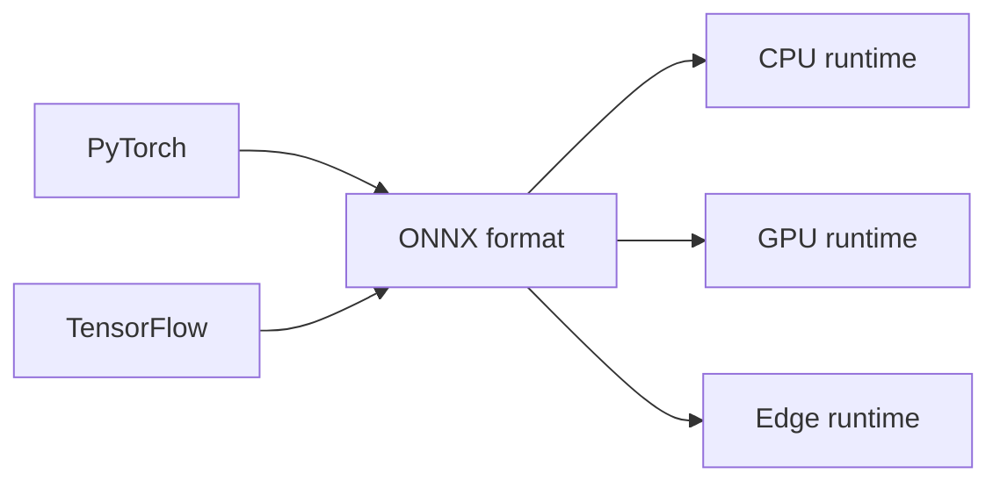
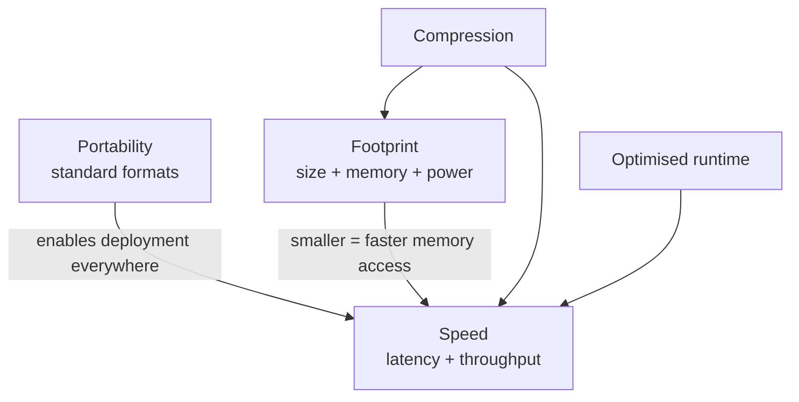

# Production Optimisation Goals: Portability, Speed, and Footprint

## The Three-Objectives Framework

Every model optimisation decision in production maps to one or more of three objectives. Understanding them separately — and how they interact — is the foundation for choosing formats, compression techniques, and runtimes.

---

## Objective 1: Portability

**Intuition**: Training and deployment are often done by different teams with different toolchains. Portability means the training team can use any framework while the deployment team can run the model on CPUs, GPUs, or edge devices without rewriting it.

**Without portability**:
- Custom conversion scripts per framework–hardware pair
- Fragile handoffs between teams
- Subtle numerical bugs at export boundaries

**Primary tool**: **Standard model formats** (ONNX, TF Lite, OpenVINO IR) — a common language between training and serving.

| Property | Benefit |
|----------|---------|
| Framework-agnostic graph | One export, many runtimes |
| Shared inspection tools | Graph analysis, validation |
| Reduced glue code | Fewer bespoke converters |

---

## Objective 2: Latency and Throughput

### Latency

Time for a single prediction. Averages are useful for capacity planning; **P95 and P99** tail latencies determine worst-case user experience and downstream timeout risk.

### Throughput

Predictions per second a single instance handles. Higher throughput means fewer servers for the same traffic — direct cost savings.

**Key insight**: Two models with **identical accuracy** can differ by 3–5× in inference latency. The slower one may require 3–5× more hardware for the same SLA.

| Goal | Target |
|------|--------|
| Keep P95 within SLA | User-facing responsiveness |
| Increase throughput | Lower infra cost per request |

**Primary tools**: Optimised runtimes (ONNX Runtime, TensorRT, XLA), compression (quantisation especially).

---

## Objective 3: Footprint

Footprint spans three dimensions:

| Dimension | What it affects |
|-----------|-----------------|
| **Disk size** | Download time, artefact storage, mobile app size |
| **Memory / VRAM** | Concurrent requests, batch size limits, OOM risk |
| **Power** | Battery life on phones and IoT |

Smaller, efficient models:
- Start faster (cold start)
- Cache and replicate more easily
- Run on hardware where large models cannot fit

At millions or billions of predictions, footprint directly translates to **infrastructure cost** and **deployment feasibility**.

**Primary tools**: Quantisation, pruning, knowledge distillation.

---

## How the Three Objectives Relate

| Objective | Main lever | Secondary benefit |
|-----------|-----------|-------------------|
| Portability | Standard format | Simpler MLOps pipeline |
| Speed | Runtime + quantisation | Lower cost |
| Footprint | Pruning + distillation | Edge deployment |

---

## Common Pitfalls / Exam Traps

- **Trap**: Optimising latency without measuring P95/P99 — average latency can hide severe tail problems.
- **Trap**: Assuming portability implies speed — ONNX export improves deployability; speed gains require runtime optimisation and/or compression.
- **Trap**: Ignoring throughput when latency looks acceptable — a model meeting 50 ms P95 but handling only 10 req/s may still be uneconomical.
- **Trap**: Treating footprint as disk-only — runtime RAM/VRAM often limits batch size and concurrency before disk size does.

---

## Quick Revision Summary

- **Portability**: train in any framework, deploy on any hardware via standard formats
- **Latency**: per-prediction time; P95/P99 tails matter most for SLAs
- **Throughput**: req/s per instance; drives server count and cost
- **Footprint**: disk, memory/VRAM, and power — especially critical for edge
- Identical-accuracy models can differ 3–5× in inference cost
- Standard formats, compression, and runtimes map to these three goals
