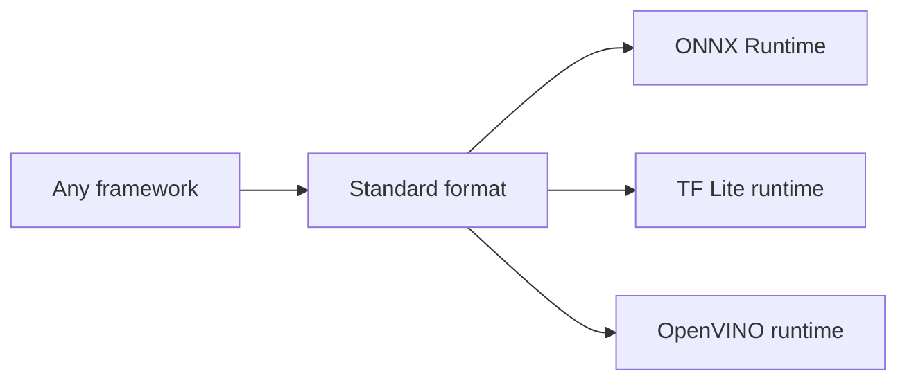
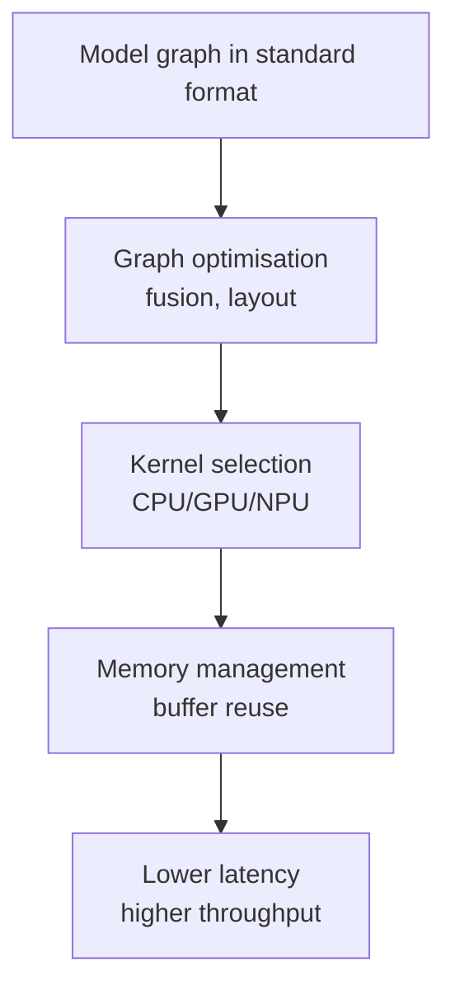
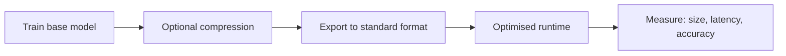

# Three Levers for Production Model Optimisation

## Overview

Closing the research–production gap requires coordinated use of three engineering levers. Each targets different constraints; together they form the standard MLOps optimisation pipeline.

---

## Lever 1: Standard Model Formats

**Purpose**: Portability — train once, deploy widely.

| Format | Ecosystem | Best for |
|--------|-----------|----------|
| **ONNX** | Cross-framework | Cloud servers, general CPU/GPU |
| **TF Lite** | TensorFlow | Mobile, Android, iOS, IoT |
| **OpenVINO** | Intel | Intel CPUs, integrated GPUs, accelerators |

**Mechanism**: Export the computation graph + weights + metadata into a framework-neutral representation. Runtimes and tools consume the standard format without caring about the original training stack.

---

## Lever 2: Compression Techniques

**Purpose**: Reduce size, memory, and inference time while keeping accuracy acceptable.

| Technique | What it does | Primary gain |
|-----------|--------------|--------------|
| **Quantisation** | Fewer bits for weights/activations (FP32 → FP16 → INT8) | Size, memory bandwidth, speed |
| **Pruning** | Remove low-importance weights or channels | Smaller dense or sparse networks |
| **Knowledge distillation** | Small student mimics large teacher | Architecture tailored to constraints |

These directly attack **footprint** and often improve **throughput**.

---

## Lever 3: Optimised Runtimes

**Purpose**: Execute the model graph as efficiently as possible on target hardware.

| Runtime | Scope | Strength |
|---------|-------|----------|
| **ONNX Runtime** | General-purpose, ONNX models | Cross-platform, execution providers |
| **TensorRT** | NVIDIA GPUs | Peak GPU latency/throughput |
| **XLA** | TensorFlow / JAX | Compiled machine code for CPU/GPU/TPU |

**Mechanism**: Graph optimisation (operator fusion), kernel auto-tuning, memory buffer reuse, hardware accelerator exploitation.

---

## End-to-End Production Flow

### Lab Workflow (Concrete Application)

1. Start with a pre-trained CNN (e.g. ResNet-18, MobileNet)
2. Measure **baseline**: file size, average latency, P95 latency, accuracy sanity check
3. Export to **ONNX**
4. Run inference with **ONNX Runtime**
5. Compare before/after metrics

**Key takeaway**: Same underlying model — different format and runtime — produces a **different performance profile**. Export alone may not shrink size; runtime optimisation unlocks speed.

---

## Module Roadmap

| Topic | Focus |
|-------|-------|
| Topic 2 | Standard formats: ONNX, TF Lite, OpenVINO — when to use each |
| Topic 3 | Compression: quantisation, pruning, distillation |
| Topic 4 | Runtimes: ONNX Runtime, TensorRT, XLA — portability vs peak performance |

---

## Common Pitfalls / Exam Traps

- **Trap**: Using only one lever — format export without runtime tuning or compression often yields minimal gains.
- **Trap**: Expecting compression to fix portability — quantisation shrinks the model but does not replace the need for a deployable format.
- **Trap**: Choosing TensorRT for portability — TensorRT is NVIDIA-specific; ONNX Runtime is the portable default.
- **Trap**: Skipping the before/after measurement loop — optimisation without baselines is guesswork.

---

## Quick Revision Summary

- Three levers: **standard formats**, **compression**, **optimised runtimes**
- Formats → portability; compression → size/speed; runtimes → hardware-efficient execution
- ONNX = cross-platform default; TF Lite = mobile; OpenVINO = Intel-first
- Quantisation, pruning, distillation shrink models with accuracy trade-offs
- ONNX Runtime, TensorRT, XLA optimise graph execution on target hardware
- Always measure size, latency, and accuracy before and after changes
