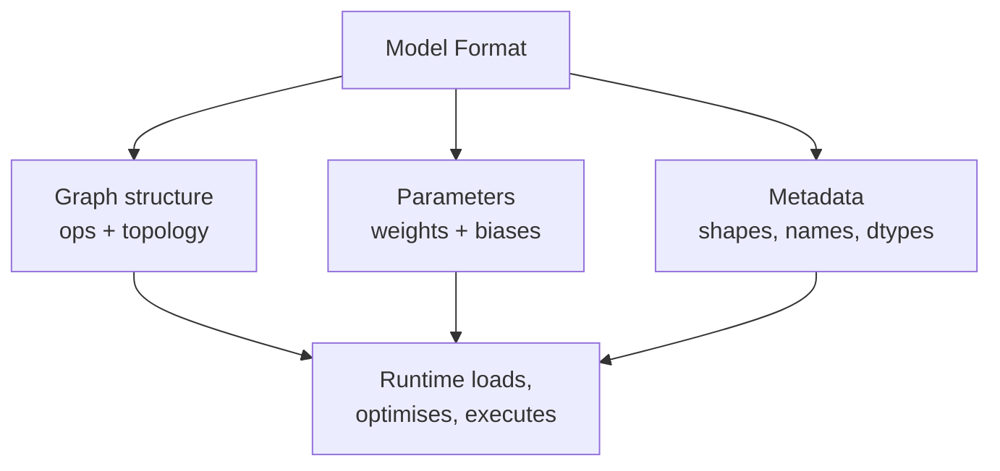
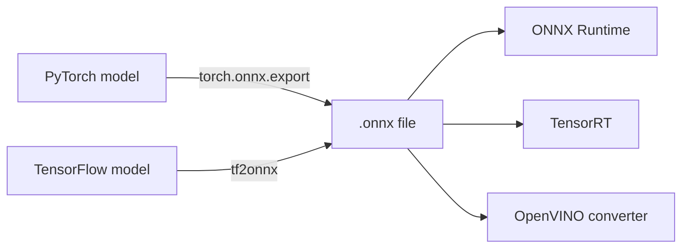

# Standard Model Formats: Foundations and ONNX

## Train Once, Deploy Widely

The guiding principle of production model engineering is **decoupling training from serving**. Training teams should use the framework that fits their workflow; deployment teams should run models on whatever hardware the product requires — without constant rewrites.

Standard model formats are the bridge.

---

## Why Framework-Native Formats Fall Short

Each ML framework stores and executes models in its own way:

| Framework | Native artefact | Native runtime |
|-----------|----------------|----------------|
| PyTorch | `.pt` / `.pth` checkpoint | PyTorch |
| TensorFlow | SavedModel, `.h5` (Keras) | TensorFlow |
| JAX | Checkpoints + Python | JAX / XLA |

Problems when staying framework-native across environments:

- Different artefact formats per team
- Custom conversion glue for every hardware target
- No shared tooling for graph inspection and optimisation
- Fragile handoffs with subtle numerical drift

---

## What Is a Model Format?

Conceptually, a model format is a **serialised blueprint plus parameters**:

1. **Computation graph** — which layers and operations, in what order
2. **Parameters** — weight tensors, bias vectors, constants
3. **Metadata** — input/output shapes, dtypes, operation attributes

Once expressed in a standard format, tools can load, analyse, optimise, and run the model **without knowing** whether it originated in PyTorch, TensorFlow, or elsewhere.

---

## ONNX: Open Neural Network Exchange

ONNX is an **open standard** for representing neural network (and some classical ML) models.

### Key properties

- **Cross-framework export**: PyTorch, TensorFlow, scikit-learn (via converters), and more
- **Cross-runtime execution**: ONNX Runtime, TensorRT (via import), OpenVINO (as source), others
- **General-purpose serving**: Cloud servers, CPU/GPU deployments, multi-team organisations

### Typical workflow

### When ONNX shines

- Multiple teams train in different frameworks
- Organisation wants one standard deployment path
- Cloud/server deployments on mixed CPU/GPU infrastructure
- Practical default for production systems needing interoperability

### File contents

An `.onnx` file is a protobuf-serialised graph. For a CNN like ResNet-18, expect on the order of **tens of graph nodes** (convolutions, batch norm, ReLU, pooling, etc.) and **millions of FP32 weight values**. File size is dominated by weights — export to ONNX typically does **not** dramatically shrink the artefact compared to a PyTorch checkpoint.

---

## Comparison Preview: Three Standard Formats

| Format | Portability | Primary target | Ecosystem lock-in |
|--------|-------------|----------------|-------------------|
| **ONNX** | Highest (cross-framework) | Cloud / server | Low |
| **TF Lite** | TensorFlow-centric | Mobile / edge | TensorFlow |
| **OpenVINO IR** | Intel-centric | Intel CPU/GPU servers | Intel hardware |

---

## Common Pitfalls / Exam Traps

- **Trap**: Confusing model format with runtime — ONNX is the *representation*; ONNX Runtime is the *engine* that executes it.
- **Trap**: Expecting ONNX export to reduce file size — weights are still FP32; size reduction comes from compression (quantisation), not format change.
- **Trap**: Assuming all ops export cleanly — exotic custom layers may fail ONNX export or require rewriting.
- **Trap**: Skipping `onnx.checker` validation — malformed graphs cause cryptic runtime errors later.

---

## Quick Revision Summary

- Model format = graph + parameters + metadata (blueprint + numbers)
- Framework-native formats create portability pain across teams and hardware
- ONNX is the open, cross-framework, cross-runtime standard
- Export enables interoperability; compression and runtime tuning deliver speed/size gains
- ONNX is the practical default for cloud/server, multi-framework organisations
- Format change alone is typically lossless and size-neutral for FP32 weights
