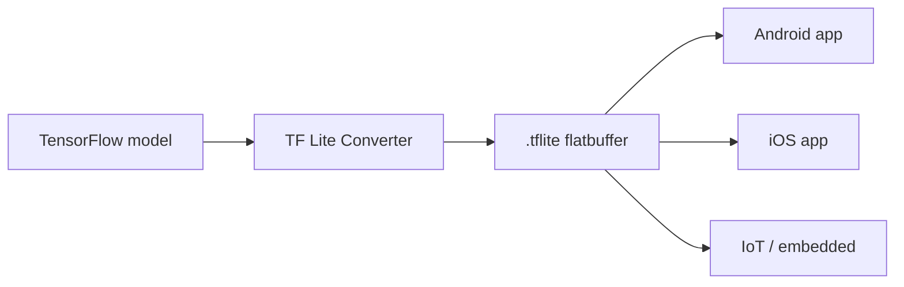
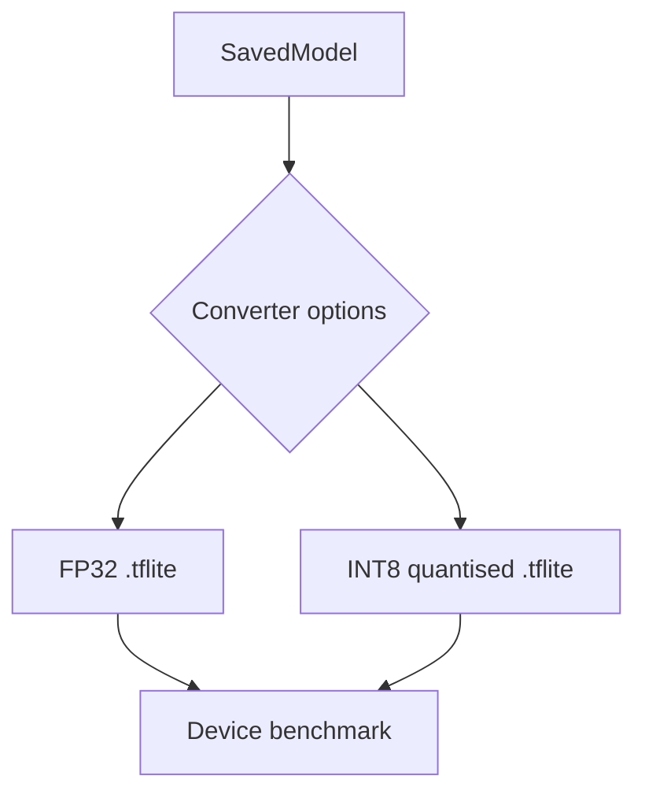

# TensorFlow Lite: Mobile and Edge Deployment

## Purpose

TensorFlow Lite (TF Lite) is both a **model format** (`.tflite` files) and a **runtime** engineered specifically for **mobile and embedded** devices. Where ONNX targets general-purpose cross-platform serving, TF Lite optimises for constrained environments: small binary footprint, mobile CPU/NPU kernels, and quantised INT8 inference.

---

## Design Goals

| Goal | How TF Lite achieves it |
|------|--------------------------|
| Small runtime binary | Minimal interpreter, no full TensorFlow stack |
| Fast on mobile hardware | Optimised kernels for ARM CPUs and NPUs |
| Low memory | INT8 quantisation support, flatbuffer format |
| On-device inference | Android, iOS, Raspberry Pi, microcontrollers |

---

## When to Choose TF Lite

**Ideal conditions**:
- Training stack is **TensorFlow** (or model convertible to TF)
- Deployment targets are **phones, tablets, IoT, edge hardware**
- App size and battery life are constraints
- Offline / on-device inference is required (privacy, latency)

**Real-world examples**:
- On-device image classification in a camera app
- Gesture recognition on a wearable
- Voice keyword spotting on a microcontroller

---

## TF Lite vs ONNX

| Dimension | TF Lite | ONNX |
|-----------|---------|------|
| Primary target | Mobile / embedded | Cloud / server / general |
| Framework origin | TensorFlow ecosystem | Cross-framework |
| Runtime size | Very small | Larger (ONNX Runtime) |
| Quantisation | First-class INT8 | Supported via ORT |
| Best for Android/iOS | Native choice | Possible but less idiomatic |

---

## Quantisation Integration

TF Lite is designed to work seamlessly with **INT8 quantised** models:

- Post-training quantisation via the TF Lite Converter
- Quantisation-aware training in TensorFlow for better INT8 accuracy
- Mobile CPUs and NPUs execute INT8 arithmetic faster than FP32

A quantised `.tflite` model can be **4× smaller** than its FP32 counterpart with modest accuracy loss — critical for app store size limits and RAM budgets.

---

## Conversion Pipeline

1. Train or obtain a TensorFlow SavedModel
2. Run **TF Lite Converter** with optional quantisation flags
3. Deploy `.tflite` with TF Lite interpreter in the mobile app
4. Benchmark on target device (not desktop — mobile performance differs radically)

---

## Common Pitfalls / Exam Traps

- **Trap**: Using TF Lite for cloud server deployment — it is mobile-first; ONNX Runtime or TensorRT are better server choices.
- **Trap**: Benchmarking TF Lite on desktop CPU — mobile ARM performance and NPU availability differ completely.
- **Trap**: Assuming TF Lite works with PyTorch-native models without conversion — must pass through ONNX or TensorFlow first.
- **Trap**: Ignoring quantisation calibration data — PTQ quality depends on a representative calibration set.

---

## Quick Revision Summary

- TF Lite = format + runtime for **mobile and embedded** deployment
- Optimised for small binary, mobile CPU/NPU kernels, INT8 inference
- Natural choice when training in TensorFlow and deploying to Android/iOS/IoT
- INT8 quantisation is a first-class workflow, often yielding ~4× size reduction
- Not a replacement for ONNX in cloud/server multi-framework environments
- Always benchmark on the **target device**, not a development machine
