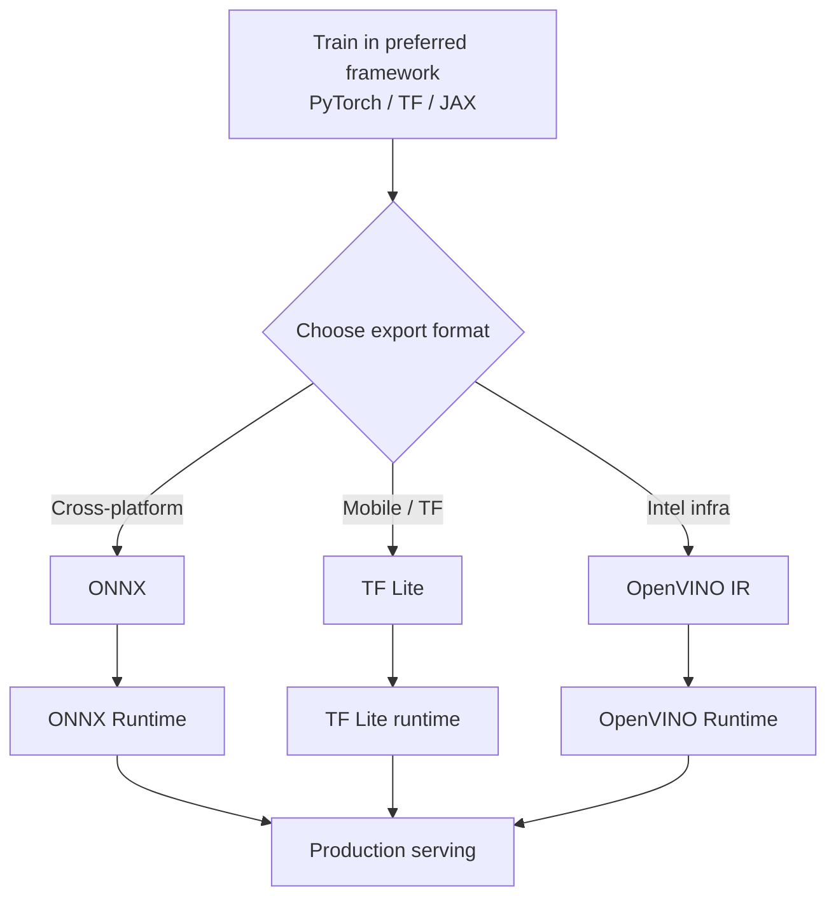

# OpenVINO and the Standard Format Pipeline

## OpenVINO: Intel-First Optimisation

OpenVINO (Open Visual Inference and Neural Network Optimization) is an Intel toolkit for optimising and deploying models on **Intel hardware**: CPUs, integrated GPUs, VPUs, and other Intel accelerators.

Unlike ONNX (vendor-neutral) or TF Lite (mobile-first), OpenVINO targets organisations whose inference infrastructure is predominantly **Intel-based servers** without dedicated NVIDIA GPUs.

---

## Typical OpenVINO Flow

1. Start from ONNX or TensorFlow model
2. Convert to **OpenVINO Intermediate Representation (IR)** via Model Optimizer
3. Run with **OpenVINO Runtime** on Intel machines

---

## When OpenVINO Shines

| Scenario | Why OpenVINO |
|----------|--------------|
| Intel-only data centre | Deep CPU kernel optimisation (AVX-512, AMX) |
| No NVIDIA GPU budget | Strong CPU inference without GPU capex |
| Edge with Intel hardware | Intel NUC, industrial PCs |
| Mixed ONNX source models | Single Intel runtime for all exports |

**Real-world example**: A retail chain running inference on Intel Xeon servers for shelf-monitoring CV models — OpenVINO can deliver GPU-competitive throughput on CPU via vectorised kernels and graph fusion.

---

## The Big-Picture Pipeline

All three standard formats fit into the same production pattern:

The standard format acts as a **contract** between the training world and the serving world. Once the contract is in place, optimisation work focuses on the serving side: compression, runtime tuning, hardware-specific kernels.

---

## Mental Map: When to Reach for Which

| Format | Reach for it when... |
|--------|---------------------|
| **ONNX** | Cross-framework teams, cloud servers, CPU+GPU, general default |
| **TF Lite** | TensorFlow training, Android/iOS/IoT deployment |
| **OpenVINO** | Intel-heavy infra, CPU performance without NVIDIA GPUs |

In a large organisation, **multiple formats coexist** — different products pick the best fit for their constraints. A cloud API may use ONNX + ONNX Runtime; a mobile app may use TF Lite; an on-prem Intel cluster may use OpenVINO.

---

## What Comes Next in the Optimisation Stack

Format selection solves **portability**. Further gains require:

1. **Compression** (Topic 3): quantisation, pruning, knowledge distillation
2. **Optimised runtimes** (Topic 4): ONNX Runtime, TensorRT, XLA

Lab workflow: export a pre-trained CNN (e.g. ResNet-18) to ONNX, run with ONNX Runtime, compare size and latency against the PyTorch baseline.

---

## Common Pitfalls / Exam Traps

- **Trap**: Choosing OpenVINO for NVIDIA GPU servers — TensorRT is the NVIDIA-specific optimiser; OpenVINO targets Intel.
- **Trap**: Assuming one format per organisation — multi-format strategies are normal at scale.
- **Trap**: Skipping the export contract — optimising in the training framework does not help deployment teams until the model is in a standard format.
- **Trap**: Confusing OpenVINO Model Optimizer with the runtime — conversion and execution are separate steps.

---

## Quick Revision Summary

- OpenVINO optimises for **Intel CPUs, iGPUs, and accelerators**
- Flow: ONNX/TF → Model Optimizer → IR → OpenVINO Runtime
- Best when infra is Intel-heavy and GPU budget is limited
- Standard format = contract between training and serving teams
- ONNX = general cross-platform; TF Lite = mobile; OpenVINO = Intel-first
- Format choice enables portability; compression + runtime deliver speed/size gains
