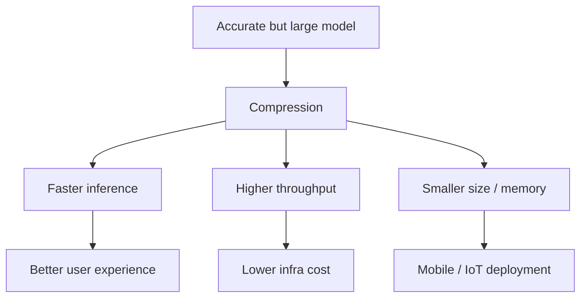

# Why Model Compression Matters in Production

## The Core Idea

A model that scores well on a benchmark is not automatically **practical** in production. Compression techniques take a good model and make it **affordable, fast, and deployable** on real hardware — often with only a small accuracy trade-off.

Compression is not about making bad models better; it is about making good models **fit production constraints**.

---

## What Compressed Models Deliver

| Benefit | Mechanism | Downstream effect |
|---------|-----------|-------------------|
| **Faster inference** | Fewer bits, fewer ops, smaller graphs | Lower latency |
| **Higher throughput** | Less memory bandwidth, faster arithmetic | More req/s per instance |
| **Smaller disk footprint** | INT8 weights, pruned parameters | Faster downloads, smaller apps |
| **Lower memory use** | Smaller tensors in RAM/VRAM | Larger batch sizes, more concurrency |
| **Edge feasibility** | Model fits phone/IoT RAM and storage | New deployment surfaces |

---

## Why Compression Follows Standard Formats

The typical production sequence:

1. Train a high-accuracy base model
2. **Compress** (quantisation, pruning, distillation)
3. Export to a **standard format** (ONNX, TF Lite)
4. Run on an **optimised runtime**

Compression attacks **footprint and speed**; standard formats attack **portability**; runtimes attack **hardware efficiency**. All three layers stack.

---

## Three Main Techniques (Preview)

| Technique | One-line summary |
|-----------|------------------|
| **Quantisation** | Store and compute with fewer bits (FP32 → FP16 → INT8) |
| **Pruning** | Remove weights or channels that contribute little |
| **Knowledge distillation** | Train a small student to mimic a large teacher |

Each will be covered in depth in subsequent notes.

---

## Real-World Motivation

### Cloud serving at scale

A 200 MB transformer served FP32 at 100 ms per request on 50 instances costs significantly more than an INT8-quantised 50 MB version at 30 ms on 15 instances — same business logic, 3× cost difference.

### Mobile deployment

A 90 MB FP32 model cannot ship in an app with a 50 MB budget. INT8 quantisation plus a MobileNet-style architecture makes on-device inference viable.

### Edge / IoT

Devices with 512 MB RAM cannot load a 2 GB model regardless of accuracy. Compression is the difference between deployable and impossible.

---

## Compression vs Accuracy: The Trade-off Mindset

Compression always involves a trade-off space:

- **X-axis**: model size, latency, memory
- **Y-axis**: accuracy, calibration quality

The engineering goal is finding the **Pareto-optimal point** acceptable for the use case — not maximising compression at any accuracy cost, and not preserving full precision when 0.5% accuracy buys 4× speed.

---

## Common Pitfalls / Exam Traps

- **Trap**: Compressing before establishing baseline metrics — without before/after size, latency, and accuracy numbers, trade-offs cannot be evaluated.
- **Trap**: Treating compression as a substitute for a better architecture — a poorly designed large model compressed may still underperform a well-designed small model (distillation addresses this).
- **Trap**: Assuming compression always helps latency on all hardware — unstructured pruning without sparse kernels may not speed up inference.
- **Trap**: Deploying compressed models without accuracy regression testing on a representative validation set.

---

## Quick Revision Summary

- Compression makes accurate models **practical** for production constraints
- Benefits: faster inference, higher throughput, smaller disk/memory, edge feasibility
- Three techniques: **quantisation**, **pruning**, **knowledge distillation**
- Compression stacks with standard formats and optimised runtimes
- Always measure size, latency, and accuracy before and after
- Trade-off is speed/size vs accuracy — find the acceptable Pareto point
