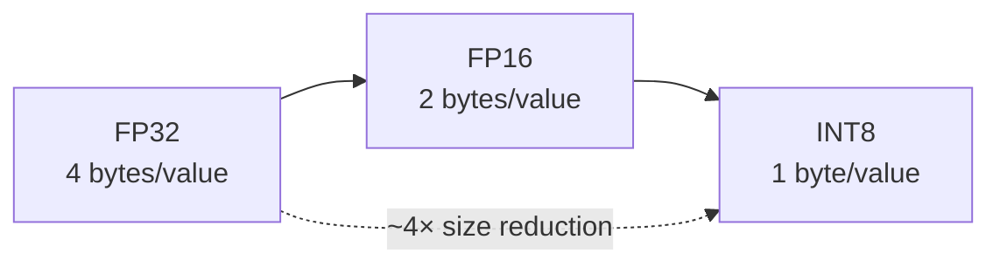

# Quantisation and Pruning

## Quantisation: Fewer Bits, Faster Math

### Intuition

Deep learning models are typically trained with **32-bit floating point** (FP32) weights and activations. Each FP32 value occupies 4 bytes. Quantisation reduces the bit width — storing and computing with FP16, BF16, or 8-bit integers (INT8) — which shrinks the model and accelerates arithmetic on hardware that supports low-precision ops.

**The catch**: quantisation approximates continuous values with discrete levels. Some accuracy loss is possible; the art is maximising speed/size gains while keeping accuracy within acceptable limits.

---

### Precision Ladder

| Precision | Bits | Size vs FP32 | Typical use |
|-----------|------|--------------|-------------|
| FP32 | 32 | 1× (baseline) | Training, high-accuracy serving |
| FP16 | 16 | ~2× smaller | GPU inference (TensorRT, mixed precision) |
| INT8 | 8 | ~4× smaller | CPU/mobile inference, edge |

**Why INT8 is faster**: CPUs and GPUs move less data across the memory bus and execute integer arithmetic in fewer cycles than FP32.

---

### Two Main Approaches

#### Post-Training Quantisation (PTQ)

1. Train normally in FP32
2. After training, quantise weights (and optionally activations)
3. Often uses a small **calibration dataset** to determine activation scale factors

| Pros | Cons |
|------|------|
| Easy to apply — no retraining | May lose more accuracy at INT8 |
| Fast to experiment | Aggressive low-bit PTQ can degrade badly |

#### Quantisation-Aware Training (QAT)

1. Simulate quantisation (rounding, clipping) **during** training
2. Model learns to be robust to low-precision effects

| Pros | Cons |
|------|------|
| Better accuracy at same bit width | Requires additional training effort |
| Supports aggressive INT8 | More complex training pipeline |

**Practical pattern**: try PTQ first; if accuracy is insufficient at the target bit width, invest in QAT.

---

## Pruning: Removing What Does Not Matter

### Intuition

Many neural networks are **overparameterised** — a significant fraction of weights contribute little to predictions. Pruning identifies and removes these low-importance connections, producing a smaller network.

### Unstructured Pruning

- Zeroes out **individual weights** based on an importance score (e.g. magnitude)
- Produces a **sparse** weight matrix (many zeros)
- **Requires special sparse kernels** to realise speed gains — standard dense hardware may not benefit

### Structured Pruning

- Removes entire **neurons, filters, or channels**
- Changes layer shapes → produces a smaller **dense** network
- Standard hardware runs dense pruned networks efficiently — no special sparse support needed

### Typical Pruning Workflow

1. Train full model to convergence
2. Prune weights/channels by a criterion (magnitude, gradient-based importance)
3. **Fine-tune** for additional epochs to recover lost accuracy
4. Evaluate size, latency, and accuracy

Structured pruning is generally preferred for production when hardware sparse support is unavailable.

---

## Quantisation vs Pruning

| Dimension | Quantisation | Pruning |
|-----------|--------------|---------|
| What changes | Bit width of values | Number of parameters |
| Retraining | Optional (PTQ) or required (QAT) | Fine-tune after prune |
| Hardware benefit | Immediate on INT8-capable HW | Structured: immediate; Unstructured: needs sparse kernels |
| Best when | Memory bandwidth bound | Model clearly overparameterised |

---

## Common Pitfalls / Exam Traps

- **Trap**: Assuming PTQ always preserves accuracy — INT8 PTQ on small calibration sets can fail on out-of-distribution inputs.
- **Trap**: Unstructured pruning without sparse runtime support — sparsity may not translate to speed.
- **Trap**: Pruning without fine-tuning — accuracy drop is often large until recovery fine-tuning.
- **Trap**: Confusing quantisation (fewer bits) with pruning (fewer parameters) — they are complementary, not interchangeable.

---

## Quick Revision Summary

- Quantisation: FP32 → FP16/INT8; ~4× size reduction at INT8; faster memory-bound inference
- **PTQ**: quantise after training; easy but may lose accuracy at INT8
- **QAT**: simulate quantisation during training; better INT8 accuracy
- **Unstructured pruning**: zero individual weights; needs sparse kernels for speed
- **Structured pruning**: remove channels; smaller dense net; standard HW friendly
- Pruning workflow: train → prune → fine-tune → measure
- Try PTQ first; escalate to QAT if accuracy insufficient
