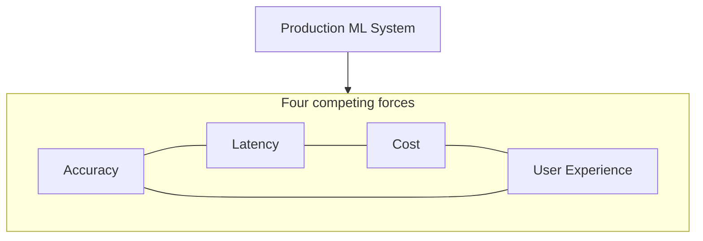

# Production ML as a Four-Way Trade-Off

## Why Accuracy Alone Is Not Enough

Model engineering through earlier modules covers improving models, scaling them, and monitoring them in production. Those skills are necessary but insufficient: a high-accuracy model that is slow, expensive, or frustrating to use can still fail as a product.

Production ML systems are pulled in **four directions simultaneously**:

| Dimension | What it measures | Typical tension |
|-----------|------------------|-----------------|
| **Accuracy** | How often the model is correct | Bigger models → higher latency and cost |
| **Latency** | Time from request to prediction | Lower latency → more hardware or simpler models |
| **Cost** | Memory, compute, cloud spend, engineering effort | Cheaper setup → slower or less accurate service |
| **User experience (UX)** | How the product *feels* — speed, reliability, trust | Visible outcome of the other three forces |

---

## The Core Mental Model

Think of a tug-of-war rope with the production system at the centre. Each force pulls in a different direction. **Maximising one dimension almost always degrades another.**

- A 3% accuracy gain from a deeper network may double response time and hurt conversion.
- A tiny fast model may meet latency targets but erode user trust through bad predictions.
- Aggressive cost cuts may leave the system jittery under load, damaging reviews and growth.

The engineering goal is not to "win" on one axis — it is to find an **acceptable balance** for the product and business.

---

## What This Module Covers

1. **Trade-off framing** — accuracy, latency, cost, and UX as interconnected forces
2. **Scaling patterns** — vertical scaling, horizontal scaling, autoscaling
3. **Cost optimisation** — spot/preemptible instances, serverless inference, batching
4. **Decision framework** — reading constraints and choosing model + infrastructure
5. **Hands-on compression** — quantisation, benchmarking, edge vs cloud deployment fit

---

## Common Pitfalls / Exam Traps

- **Trap**: Treating accuracy as the only success metric — offline leaderboard wins do not guarantee production success.
- **Trap**: Optimising one dimension in isolation without measuring the other three.
- **Trap**: Confusing average latency with tail latency (P95/P99) — UX is driven by worst-case responsiveness.
- **Trap**: Assuming "production-ready" means "deployed" — operational fit (speed, cost, reliability) is a separate gate.

---

## Quick Revision Summary

- Production ML is a **four-way tug-of-war**: accuracy, latency, cost, UX.
- You rarely maximise one force without affecting the others.
- UX is where accuracy, latency, cost, and reliability become visible to users.
- Model engineering means finding an **acceptable balance**, not a single optimal number.
- This module connects trade-offs to scaling, cost levers, decision frameworks, and compression workflows.
