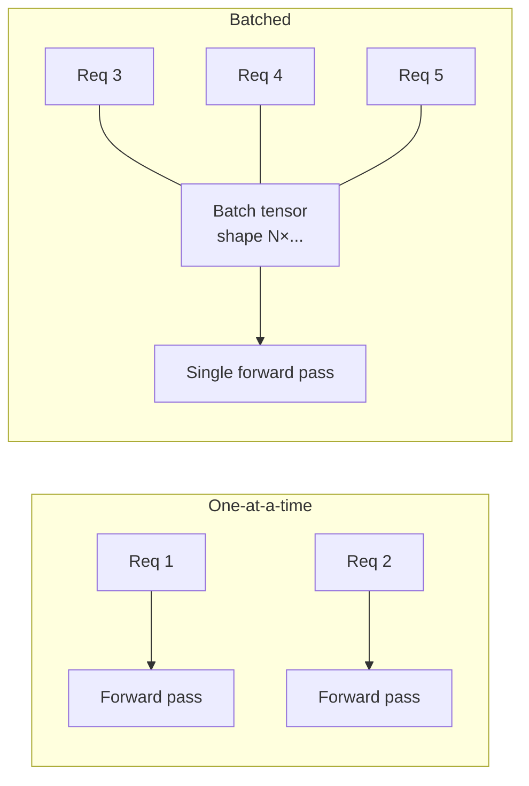
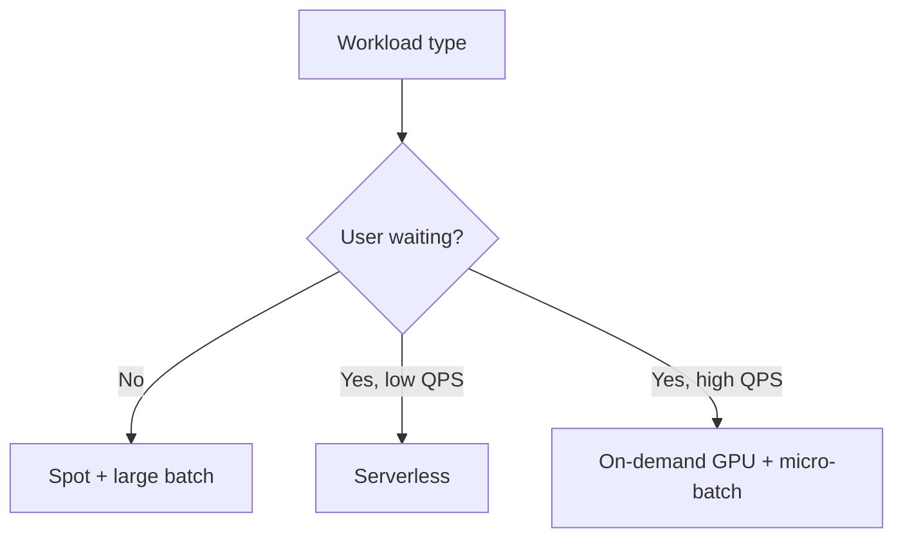

# Batching and Micro-Batching for Cost Efficiency

## The Core Idea

Instead of running the model **once per incoming request**, collect multiple requests and execute them as **one batch**.

Fixed costs of a forward pass (kernel launch, memory setup, framework overhead) are **amortised** across many inputs — improving hardware utilisation and reducing cost per request.

---

## Two Modes

| Mode | User waiting? | Latency tolerance | Typical use |
|------|---------------|-------------------|-------------|
| **Offline batch** | No | Hours acceptable | Nightly churn scoring, ETL pipelines |
| **Online micro-batching** | Yes — briefly | Milliseconds of queuing | High-QPS GPU APIs |

---

## Micro-Batching Mechanics

For online systems, incoming requests are held for a **very short window** (e.g. a few milliseconds) or until a **small batch size** is reached, then processed together as one tensor (e.g. shape $N \times C \times H \times W$ for image models).

### Tunable Parameters

| Parameter | Effect if increased | Effect if decreased |
|-----------|---------------------|---------------------|
| **Max batch size** | Better GPU utilisation; higher per-batch latency | Lower utilisation; faster individual batches |
| **Max wait time** | More requests batched; added queuing delay | Lower delay; smaller batches |

Tuning must keep **total latency within SLA** (especially P95).

---

## Pros and Cons

| Pros | Cons |
|------|------|
| Much better throughput per instance | Adds **queuing delay** — each request may wait ms before processing |
| Lower cost per request (especially on GPUs) | Requires tuning batch size and wait window |
| Fewer instances needed for same QPS | Variable batch sizes complicate latency prediction |
| Shared fixed overhead across inputs | Not suitable for strict sub-10 ms latency without careful design |

---

## Combining Cost Levers: Three Examples

### Example 1: Daily Offline Churn Scoring

- **Spot instances** + **large batches**
- No user waiting — optimise for cost and throughput
- Latency per row irrelevant; job completion time matters

### Example 2: Low-Traffic Internal Tool

- **Serverless inference**
- No idle capacity cost; platform handles scaling
- Cold starts acceptable for internal use

### Example 3: High-Traffic GPU API

- **On-demand GPU instances** for reliability
- **Micro-batching** for GPU efficiency
- **Spot instances** for non-critical overflow or offline jobs

The right combination depends on traffic shape, latency SLA, cost envelope, and UX requirements.

---

## Connection to Batch vs Online Inference

Micro-batching sits between pure online (batch size = 1) and pure offline batch (millions of rows). It trades a **controlled amount of latency** for **efficiency** — the same fundamental batch-vs-online trade-off from serving architecture, applied at millisecond scale.

---

## Common Pitfalls / Exam Traps

- **Trap**: Micro-batching without measuring P95 — average latency looks fine while tail blows SLA.
- **Trap**: Max batch size tuned for throughput alone — wait time pushes UX over threshold.
- **Trap**: Applying micro-batching to CPU-only tiny models — overhead savings may be negligible.
- **Trap**: Confusing offline batch (no SLA) with online micro-batch (strict SLA) — different tuning regimes.

---

## Quick Revision Summary

- Batching amortises forward-pass overhead across many inputs — lower cost per request, higher throughput.
- **Offline batch**: no user waiting — maximise batch size and use spot instances.
- **Micro-batching**: brief queuing window online — tune max batch size and max wait time against SLA.
- GPU APIs benefit most; tuning must protect P95 latency.
- Cost levers (spot, serverless, batching) are often **combined** based on workload shape.
