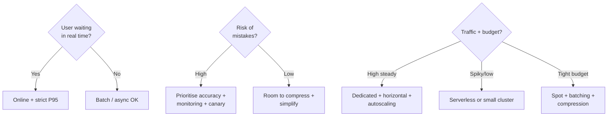

# Reading Constraints: A Decision Framework

## From Theory to Systematic Choices

Production ML systems live in a **four-dimensional space**: accuracy, latency, cost, and UX. You cannot maximise all four simultaneously — you choose a balance that fits product needs and business constraints.

This framework makes that choice **systematic**. The first step is **not** picking a scaling pattern or model format. The first step is **reading the constraints**.

---

## Step 1: Constraint Discovery

For every system, answer four question groups:

### Latency and UX Sensitivity

- Is a human **literally waiting** on the response (login, checkout, feed scroll)?
- Are there strict SLAs — e.g. P95 under 100–200 ms?

| Context | Inference mode | Latency priority |
|---------|----------------|------------------|
| User waiting in real time | **Online** request–response | Strict P95 targets (often 100–200 ms) |
| Monthly churn score, nightly backfill | **Batch / async** | Throughput and cost over per-row latency |

Tight UX constraints push toward: faster models, more replicas, better scaling, specialised hardware (GPU + micro-batching).

### Accuracy and Risk

| Risk tier | Examples | Design bias |
|-----------|----------|-------------|
| **High stakes** | Fraud on payments, medical decisions, safety/legal | High accuracy, strong monitoring, canary rollouts, explainability |
| **Medium stakes** | Pricing, ranking, promotions | Mistakes hurt revenue/trust but not life-critical |
| **Lower stakes** | Content recommendations, simple personalisation | Mistakes mostly annoying |

**Higher stakes → lean toward accuracy, monitoring, gradual rollout.**

### Cost Envelope

- What budget exists — per request or total monthly cap?
- Is the goal minimising **cost per prediction** or keeping bills within a fixed range?

With strict cost caps: spot for batch, batching/micro-batching, model compression.

With flexible budget: push harder on latency and reliability for key user flows.

### Traffic Pattern

| Pattern | Typical infrastructure |
|---------|------------------------|
| Constant, high volume | Dedicated cluster + autoscaling; stabilise P95 |
| Spiky or low volume | Serverless or small cluster scaling down aggressively |
| Batch-only | Spot instances + large batches |

---

## Constraint → Design Mapping

---

## What Constraints Drive

Constraints determine **all downstream choices**:

- Model size and compression level
- Online vs batch serving mode
- Scaling pattern (vertical, horizontal, autoscaling)
- Cost levers (spot, serverless, micro-batching)
- Hardware target (CPU, GPU, edge)

Skipping constraint analysis leads to mismatched architecture — e.g. serverless for a sub-50 ms payment fraud check, or FP32 on a phone with 11 MB budget.

---

## Common Pitfalls / Exam Traps

- **Trap**: Starting with infrastructure ("we'll use Kubernetes") before defining latency SLA and risk tier.
- **Trap**: Treating all ML products as online — batch workloads have entirely different optimisation targets.
- **Trap**: Ignoring risk tier — compression acceptable for recommendations may be unacceptable for medical diagnosis.
- **Trap**: Confusing cost envelope with cost per request — a startup and an enterprise may optimise differently at the same QPS.

---

## Quick Revision Summary

- First step in production design: **read constraints** — latency/UX, accuracy/risk, cost, traffic.
- Real-time user waiting → online with strict P95; no one waiting → batch/async OK.
- Higher mistake cost → accuracy, monitoring, canary deployment.
- Traffic shape and budget drive scaling pattern and cost lever selection.
- Constraints precede model format, compression, and infrastructure choices.
