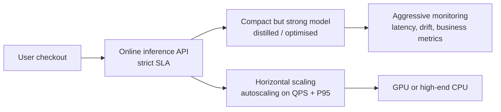
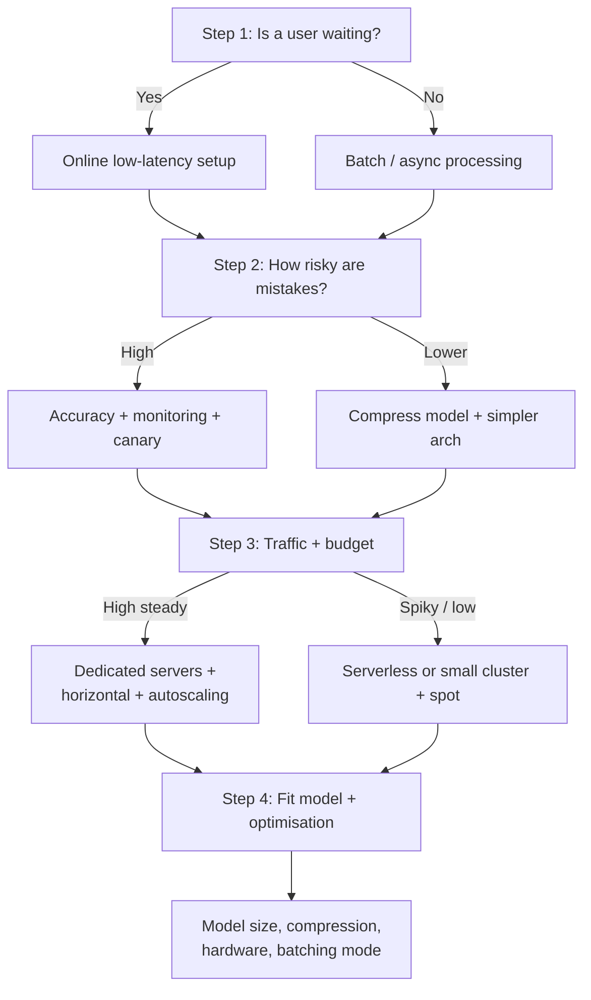

# Scenario-Based Deployment Decisions

## Three Workload Archetypes

Applying the constraint framework to concrete scenarios clarifies how trade-offs become architecture.

---

## Scenario 1: Payment Fraud Check

### Constraints

| Dimension | Requirement |
|-----------|-------------|
| Accuracy | Very high — mistakes lose money or block legitimate users |
| Latency | Low — user waits for payment to complete |
| Availability | High — system should rarely be down |
| Stakes | Very high |

### Likely Design

- Compact but strong model — possibly distilled from a larger teacher
- **Online inference** with strict SLA
- **Horizontal scaling + autoscaling** on latency and QPS
- GPU or high-end CPU instances
- Heavy monitoring: latency, error rates, model drift, business KPIs

**Willing to pay more** for infrastructure to protect accuracy, latency, and UX.

---

## Scenario 2: Monthly Churn Prediction

### Constraints

| Dimension | Requirement |
|-----------|-------------|
| Real-time user | None — no one waiting |
| Time window | Hours acceptable |
| Data volume | Very large |
| UX question | Does scoring finish in time for business to act? |

### Likely Design

- **Pure batch inference** over many rows at once
- **Spot / preemptible instances** for cost savings
- Heavier model acceptable — optimise **rows/second** and total job runtime, not per-user ms
- Latency per row matters less than **throughput and job completion**

| Fraud check | Churn prediction |
|-------------|------------------|
| Online, ms SLA | Batch, hours OK |
| On-demand core | Spot instances |
| Small fast model | Can use larger model |
| P95 latency critical | Throughput critical |

---

## Scenario 3: Mobile Camera App (On-Device Inference)

### Constraints

| Dimension | Requirement |
|-----------|-------------|
| Hardware | Phone / edge device |
| Latency | Low per frame |
| Resources | Limited memory, compute, battery |
| Model size | Must fit download and RAM budget |

### Likely Design

- **Quantised or pruned model** exported to TFLite, ONNX Mobile, or similar
- **Distilled student** mimicking cloud-trained teacher
- Focus metrics: model size (MB), power draw, latency per frame
- Cloud role: train teacher, generate student, aggregate analytics

Accuracy is balanced against **device constraints and end-user smoothness**.

---

## Four-Step Decision Flow

1. **User waiting?** → Yes: online low-latency; No: batch/async
2. **Mistake risk?** → High: accuracy + monitoring + canary; Lower: compression room
3. **Traffic + budget?** → High steady: dedicated + autoscaling; Spiky/low: serverless + spot
4. **Fit model**: size, compression, hardware (CPU/GPU/edge), batching mode

Not a perfect formula — a **structured reasoning path** for trade-offs.

---

## Common Pitfalls / Exam Traps

- **Trap**: Running churn scoring as online API — wastes money; batch + spot is appropriate.
- **Trap**: Deploying FP32 ResNet-18 to mobile without compression — size and battery fail.
- **Trap**: Using spot-only for fraud API — interruption violates availability requirements.
- **Trap**: Skipping Step 2 (risk) — compressing a high-stakes model without accuracy validation.

---

## Quick Revision Summary

- **Fraud check**: online, high accuracy, horizontal autoscaling, premium hardware, heavy monitoring.
- **Churn prediction**: batch, spot instances, throughput-focused, hours-not-ms SLA.
- **Mobile edge**: quantised/distilled model, size/battery/latency per frame, cloud for training.
- Four-step flow: user waiting → mistake risk → traffic/budget → model fit.
- Architecture follows constraints — not the reverse.
