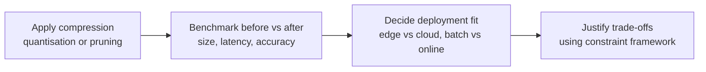

# From Theory to Practice: Compression Lab Workflow

## Connecting Module Concepts to Hands-On Work

The theoretical toolkit for production ML — four-way trade-offs, scaling patterns, cost levers, and decision frameworks — becomes concrete in a compression lab workflow.

---

## Lab Pipeline Overview

---

## What the Lab Exercises

### 1. Compression

Apply a technique such as **dynamic quantisation** or **pruning** to an existing model (e.g. a CNN exported to ONNX from prior standardisation work).

Goal: make the model **smaller and faster** for constrained environments (mobile, serverless memory limits).

### 2. Benchmarking

Measure **before and after**:

| Metric | Why it matters |
|--------|----------------|
| **File size (MB)** | Download size, storage, RAM footprint |
| **Inference latency** (avg + P95) | User experience, fleet sizing |
| **Accuracy** | Validate compression did not break the product |

### 3. Deployment Decision

Using benchmark data + constraint framework, decide:

- **Cloud vs edge** — where does each model variant belong?
- **Batch vs online** — serving mode fit
- **High stakes vs low stakes** — is accuracy drop acceptable?

---

## Frameworks Applied in the Lab

| Concept | Lab application |
|---------|-----------------|
| Four-way tug-of-war | Justify accuracy vs latency vs cost vs UX for each model variant |
| Scaling patterns | Reason about replica count for high-traffic CPU-optimised INT8 API |
| Cost levers | Spot for batch re-scoring; serverless for low-traffic tools |
| Constraint reading | Match model profile to fraud vs mobile vs batch scenarios |

---

## What Model Engineers Actually Do

Model engineers do not only build models. They **explain why a particular setup is the right trade-off for the product**:

- "We quantised to INT8 because P95 on CPU dropped 40% and size fits mobile — accuracy drop was 0.3 pp, acceptable for object recognition."
- "We kept FP32 for fraud because a 0.5 pp recall drop costs more than the GPU bill."

This justification skill — data-driven, constraint-aware — is the essence of production-oriented ML engineering.

---

## Common Pitfalls / Exam Traps

- **Trap**: Compressing without baseline measurements — cannot quantify trade-offs.
- **Trap**: Benchmarking size/latency but skipping accuracy on real validation data.
- **Trap**: Deploying compressed model to high-stakes domain without business sign-off on accuracy drop.
- **Trap**: Treating lab as code exercise only — the deployment decision write-up is equally important.

---

## Quick Revision Summary

- Lab workflow: compress → benchmark (size, latency, accuracy) → decide deployment fit.
- Apply four-way trade-off, scaling, and cost frameworks to justify choices.
- Decisions cover edge vs cloud, batch vs online, and risk tier alignment.
- Model engineering includes **explaining why** a setup fits product constraints — not just building models.
