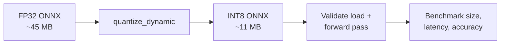

# Dynamic Quantisation for Model Compression

## Why Compression After Standardisation

Standardising a model to ONNX and optimising with ONNX Runtime improves portability and runtime performance. When targets still require **smaller and faster** models — mobile storage limits, serverless memory caps, edge battery constraints — **model compression** addresses the model's substance, not just its container format.

**Typical trigger**: baseline model ~45 MB FP32 — too large for on-device download or tight serverless memory.

---

## Quantisation: First Principles

Neural network weights are stored as numbers. Standard training uses **32-bit floating point (FP32)** — high precision, wide dynamic range, 4 bytes per weight.

**Quantisation** asks: do we need full precision at inference time? Can weights be represented with **8-bit integers (INT8)** — whole numbers in range approximately $-128$ to $127$?

### Analogy

Like saving a high-resolution photo as JPEG: some fine detail is lost, but the **main picture remains recognisable**. The trade-off is precision for size and speed.

### Expected Effects

| Effect | Mechanism |
|--------|-----------|
| ~**4× size reduction** | 32 bits → 8 bits per weight |
| **Faster CPU inference** | Integer arithmetic is typically faster than FP32 on CPUs |
| **Potential accuracy drop** | Less precise weights → small metric degradation (must be measured) |

---

## Baseline Setup

Before any compression, establish a **baseline artefact**:

1. Load pre-trained model (e.g. ResNet-18)
2. Save PyTorch checkpoint
3. Export to ONNX (FP32)
4. Record baseline size — e.g. ~44.67 MB

Every optimisation is measured **against this baseline**.

---

## Dynamic Quantisation with ONNX Runtime

ONNX Runtime provides `quantize_dynamic` — a utility that:

1. Reads the FP32 ONNX model
2. Finds floating-point weights in the graph
3. Converts them to **INT8**
4. Writes a new compressed model file

Key parameter: `weight_type=QuantType.QInt8` (8-bit signed integers).

### Example Workflow

```text
Input:  resnet18.onnx     (FP32, ~44 MB)
Output: resnet18_int8.onnx (INT8, ~11 MB)
```

Result: ~75% size reduction (~4× smaller) — often achievable with a **single function call**.

### Sanity Check

After quantisation, verify:

- Model loads in ONNX Runtime without error
- Forward pass produces valid output tensor shapes

This confirms a **valid, runnable** model — but not yet that accuracy or latency improvements meet requirements (next step: benchmarking).

---

## Quantisation vs Other Compression Techniques

| Technique | What it reduces | Typical accuracy impact |
|-----------|-----------------|-------------------------|
| **Dynamic quantisation** | Weight precision (FP32→INT8) | Small — often <1 pp |
| **Static quantisation** | Weights + activations (calibration data needed) | Small to moderate |
| **Pruning** | Number of connections/neurons | Depends on sparsity level |
| **Knowledge distillation** | Model architecture (student mimics teacher) | Tunable via student size |

This lab focuses on **dynamic quantisation** as a powerful, easy-to-apply first compression step.



---

## Common Pitfalls / Exam Traps

- **Trap**: Skipping baseline measurement — cannot report improvement percentage.
- **Trap**: Assuming 4× size reduction guarantees 4× speedup — speed depends on hardware and ops still in FP32.
- **Trap**: Deploying quantised model without accuracy check on validation set.
- **Trap**: Confusing dynamic quantisation (weights only) with full static quantisation (weights + activations).

---

## Quick Revision Summary

- Compression targets model size/speed when ONNX export alone is insufficient.
- **Dynamic quantisation**: FP32 weights → INT8 — ~4× smaller, faster on CPU, possible small accuracy loss.
- Always establish FP32 baseline size before optimising.
- ONNX Runtime `quantize_dynamic` with `QInt8` is a one-call compression path.
- Valid forward pass ≠ production-ready — benchmark size, latency, and accuracy next.
