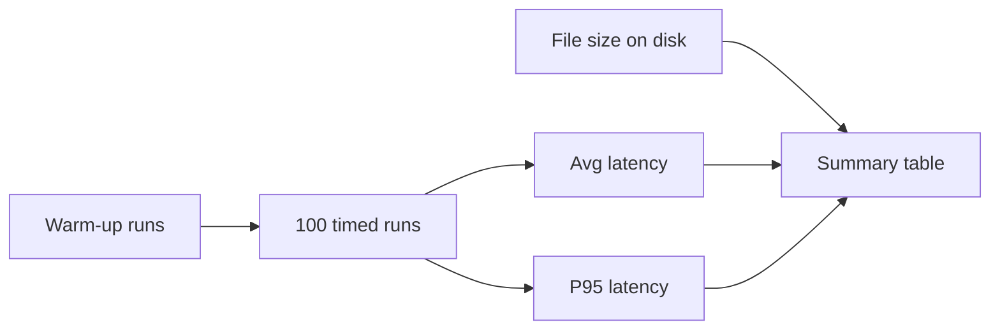

# Benchmarking Compression: Size, Latency, and Accuracy

## Why Benchmark After Compression

A smaller model is useless if it is not actually faster — and dangerous if accuracy dropped unacceptably. Benchmarking quantifies the **full trade-off** across dimensions that drive deployment decisions.

---

## What to Compare

Head-to-head comparison of **original FP32** vs **compressed INT8** (or pruned) model:

| Dimension | Measurement | Production relevance |
|-----------|-------------|----------------------|
| **File size (MB)** | On-disk model artefact | Edge download, RAM, storage cost |
| **Inference latency** | Average and **P95** over N runs | UX, SLA compliance, fleet sizing |
| **Accuracy** | Validation set metrics | Product quality, risk tier acceptance |

---

## Fair Benchmark Methodology

### Warm-Up

Run several inference iterations before timing — excludes one-time model load and cache cold effects from measured runs.

### Repeated Runs

Execute inference many times (e.g. 100 iterations) to stabilise:

- **Average latency** — typical case
- **P95 latency** — tail case that drives SLA violations and perceived slowness

### Controlled Environment

- Same hardware (CPU type, thread count)
- Same input shape and batch size (typically batch size = 1 for online simulation)
- Same runtime (ONNX Runtime) and session options

---

## Example Results Pattern (ResNet-18, CPU)

| Metric | FP32 | INT8 | Change |
|--------|------|------|--------|
| Size | ~44.67 MB | ~11 MB | ~75% reduction (~4×) |
| Avg latency | Higher | Lower | Significant CPU speedup |
| P95 latency | Higher | Lower | Better tail performance |

INT8 wins clearly on **size and CPU latency**. Accuracy must be evaluated separately on a validation dataset.

---

## The Accuracy Gap in Lab vs Production

A benchmark script may measure size and latency without validation data (e.g. baseline pre-trained model without domain-specific labels). In **production compression workflows**, accuracy evaluation is **mandatory**:

1. Run validation set through both models
2. Compare primary metric (accuracy, F1, AUC — domain-dependent)
3. Ask: **Is the accuracy drop worth the size/speed gain?**

Typical outcome: quantisation causes a **small** accuracy drop; for many applications the trade-off is highly favourable.

---

## Decision Question

> Is a potential small accuracy drop worth the gain in size and speed?

Answer depends on **constraint tier**:

| Domain | Typical tolerance for small accuracy drop |
|--------|----------------------------------------|
| Object recognition on mobile | Often yes |
| Content recommendations | Often yes |
| Medical diagnosis, payment fraud | Often no — without explicit risk analysis |

---

## Benchmark Summary Table Template

| Model variant | Size (MB) | Avg latency (ms) | P95 latency (ms) | Accuracy (val set) |
|---------------|-----------|------------------|------------------|---------------------|
| FP32 baseline | — | — | — | — |
| INT8 quantised | — | — | — | — |
| Δ | % reduction | % change | % change | pp change |

All key performance information for deployment decisions in **one place**.

---

## Common Pitfalls / Exam Traps

- **Trap**: Benchmarking without warm-up — first-run load time skews averages.
- **Trap**: Reporting only average latency — P95 is what SLAs and UX use.
- **Trap**: Measuring latency on GPU then deploying on CPU — hardware changes results entirely.
- **Trap**: Skipping accuracy because "quantisation usually works" — always validate on your data and model.

---

## Quick Revision Summary

- Benchmark FP32 vs compressed across **size, latency (avg + P95), and accuracy**.
- Use warm-up + repeated runs for stable latency numbers.
- Size and latency often show clear INT8 wins on CPU; accuracy requires validation data.
- The decision question: is small accuracy loss acceptable for size/speed gains in **your** use case?
- Production compression workflow always includes accuracy on a representative validation set.
