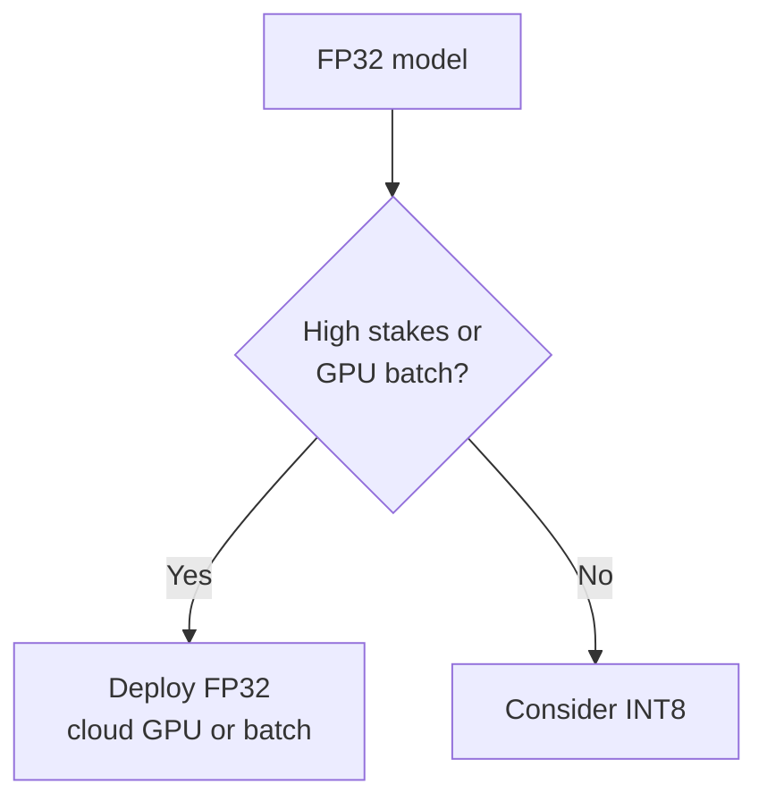
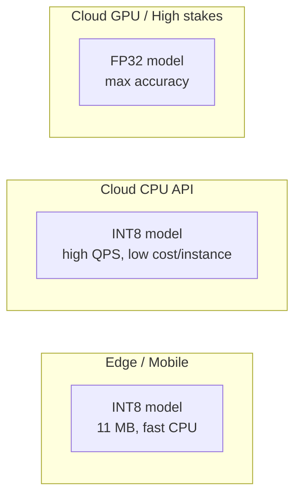
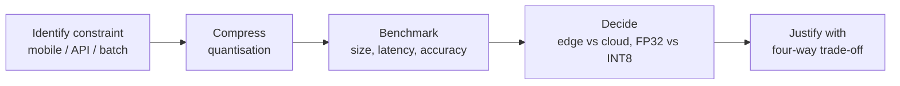

# Deployment Fit: Edge vs Cloud for Compressed Models

## Deployment Is a Product Decision

Choosing which model variant to deploy — and where — is not purely technical. It requires aligning model performance characteristics with **business and product goals**, using benchmark data and the constraint framework.

---

## When to Keep FP32 (Full Precision)

### Primary Reason: Maximum Precision and Accuracy

Choose FP32 when even a tiny fraction of a percentage point in accuracy matters.

| Domain | Why FP32 may win |
|--------|------------------|
| Medical diagnosis | False negatives/positives have severe consequences |
| Financial fraud detection | Cost of mistake exceeds infrastructure cost |
| High-stakes automated decisions | Business value of precision outweighs cloud spend |

In these cases, infrastructure cost is **secondary** to correctness.

### Secondary Reason: Unconstrained Cloud Environment

FP32 also fits when:

- **Powerful GPU servers** — GPUs excel at FP32; INT8 speed advantage is less pronounced on GPU
- **Overnight batch jobs** — inference time not critical; server cost fixed regardless of speed
- **Simplicity priority** — no compression pipeline to maintain; maximum accuracy by default

---

## When to Deploy INT8 (Compressed)

INT8 profile: ~4× smaller, significantly faster on **CPU** — different application fit.

### Edge and Mobile Deployment

| Factor | INT8 advantage |
|--------|----------------|
| Size (~11 MB vs ~45 MB) | Manageable app download and on-device storage |
| CPU latency | Real-time inference on phone CPU without draining battery |
| Use cases | Live camera filters, instant object recognition, on-device classification |

### Latency- and Cost-Sensitive Cloud Services

High-traffic API serving millions of predictions per second:

- Lower latency → better UX and higher concurrent capacity per server
- Faster CPU inference → run on **cheaper CPU instances** instead of expensive GPUs
- Massive operational cost reduction at scale

---

## Decision Matrix

| Criterion | FP32 | INT8 |
|-----------|------|------|
| Accuracy priority | Maximum | Good enough (validate drop) |
| Hardware | GPU cloud, unconstrained batch | CPU, mobile, edge, cost-sensitive cloud |
| Size constraint | None | Tight (download, RAM, serverless limit) |
| Latency target on CPU | Less critical | Critical |
| Stakes | High (medical, fraud) | Lower (recognition, recommendations) |
| Cost sensitivity | Low | High |

---

## Balancing Competing Priorities

Quantisation is a **deliberate choice** to optimise speed and efficiency, often accepting a small accuracy trade-off.

Production workflow:

1. Measure impact on accuracy with validation data
2. Confirm trade-off is acceptable for the use case
3. Document justification using latency, cost, and UX framing

For many real-world applications, latency and cost gains produce **better overall UX** than marginal accuracy from FP32 — but not for all domains.

---

## Full Workflow Recap

This end-to-end path — need → compression → measurement → decision — is the essence of **production-oriented ML engineering**.

---

## Common Pitfalls / Exam Traps

- **Trap**: Deploying INT8 to fraud/medical without measuring recall/precision drop — unacceptable risk.
- **Trap**: Choosing FP32 for mobile because "accuracy is king" — 45 MB model may not ship at all.
- **Trap**: Assuming INT8 speedup on GPU matches CPU — benchmark on **target hardware**.
- **Trap**: Ignoring download size for mobile — latency per frame useless if users won't install the app.

---

## Quick Revision Summary

- **FP32**: max precision — high-stakes domains, GPU cloud, unconstrained batch jobs.
- **INT8**: 4× smaller, much faster on CPU — edge/mobile, high-QPS cost-sensitive cloud APIs.
- Deployment aligns model profile with business goals — not benchmark wins alone.
- Always validate accuracy drop against risk tier before deploying compressed models.
- Full workflow: identify need → compress → benchmark → decide → justify trade-offs.
