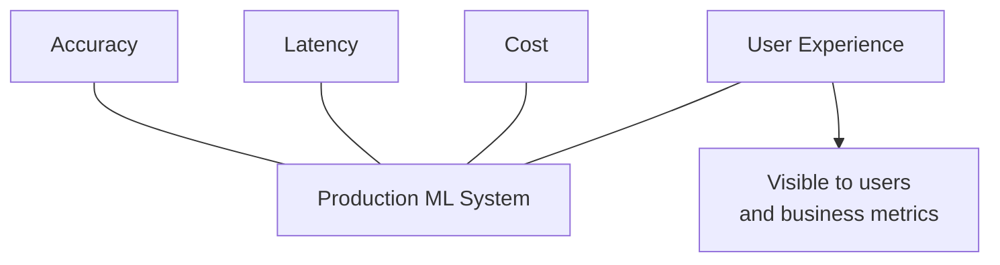
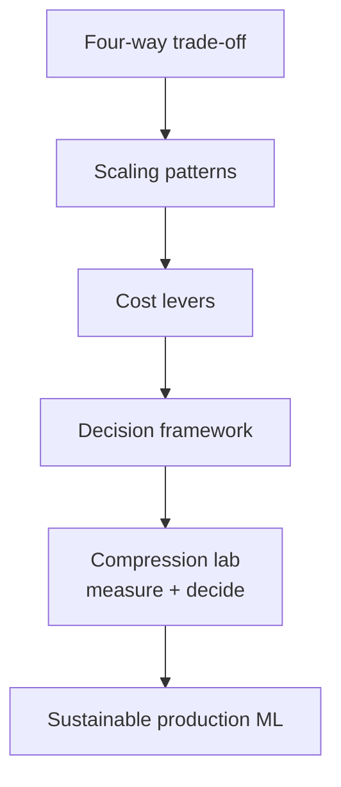

# Module Summary: Production Trade-Offs and Sustainable ML Systems

## Central Framework: The Four-Way Tug-of-War

Production ML is framed as competing forces pulling a system in four directions:

| Force | Core question |
|-------|---------------|
| **Accuracy** | How often is the model correct? |
| **Latency** | How fast does it respond? |
| **Cost** | What infrastructure and engineering spend is required? |
| **User experience** | How does it feel — fast, reliable, trustworthy? |

A pure accuracy mindset is insufficient. Lowering latency has **both user and cost implications**. UX is where all decisions become **visible** to users and the business.

---

## Module Topic Map

### Topic 1: Trade-Off Framing

- Four forces interact — maximising one degrades others
- Latency–cost–UX triangle
- Four-question checklist for every production change

### Topic 2: Scaling Patterns

| Pattern | Role |
|---------|------|
| **Vertical scaling** | Bigger machine — quick win, limited ceiling |
| **Horizontal scaling** | More replicas + load balancer — standard at scale |
| **Autoscaling** | Dynamic capacity from CPU, QPS, P95 — needs cooldowns and caps |

### Topic 3: Cost Optimisation Levers

| Lever | Best for |
|-------|----------|
| **Spot / preemptible** | Batch, offline scoring, training with checkpoints |
| **Serverless** | Spiky, low-volume, internal/prototype workloads |
| **Batching / micro-batching** | GPU efficiency, cost per request reduction |

### Topic 4: Decision Framework

1. Read constraints: latency/UX, accuracy/risk, cost, traffic
2. Apply scenarios: fraud (online, high stakes), churn (batch, spot), mobile (edge, compressed)
3. Four-step flow: user waiting → mistake risk → traffic/budget → model fit

### Lab: Compression Workflow

1. Apply quantisation (FP32 → INT8)
2. Benchmark size, latency (avg + P95), accuracy
3. Decide edge vs cloud, FP32 vs INT8 — justify with trade-off framework

---

## Integrated Mental Model

---

## Key Insight

The goal is making ML systems **not just smart, but sustainably affordable and usable** in production. Model engineering means:

- Choosing good-enough accuracy with better latency and cost when appropriate
- Scaling intelligently under load
- Using cost levers matched to workload shape
- Compressing and benchmarking before deployment
- **Justifying** every setup against product constraints

Keep the four-way tug-of-war picture as the lens for every future infrastructure and model decision.

---

## Common Pitfalls / Exam Traps

- **Trap**: Treating module topics as independent — scaling, cost levers, and compression all serve the same four forces.
- **Trap**: Forgetting UX as the synthesis metric — accuracy and latency metrics alone miss product impact.
- **Trap**: Applying one scenario's answer everywhere — fraud architecture ≠ churn architecture ≠ mobile edge.
- **Trap**: Skipping measurement before and after compression — trade-offs cannot be defended without data.

---

## Quick Revision Summary

- Production ML = four-way tug-of-war: accuracy, latency, cost, UX.
- Scaling (vertical, horizontal, autoscaling) keeps latency stable under load.
- Cost levers: spot (batch), serverless (spiky/low), micro-batching (GPU efficiency).
- Decision framework: read constraints → match architecture → fit model and compression.
- Lab closes the loop: quantise → benchmark → decide edge/cloud with data-driven justification.
- Sustainable production ML balances intelligence with affordability and user experience.
