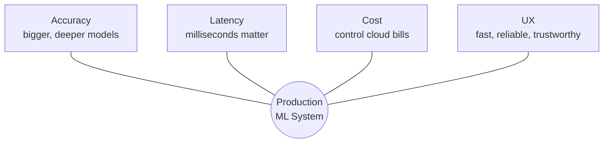

# The Four-Way Tug-of-War Mental Model

## Intuition: The Knot in the Middle

Picture a tug-of-war rope. At the centre sits a knot representing the **production ML system**. Four teams pull from different sides:

| Force | Pulls toward… | Typical mechanism |
|-------|---------------|-------------------|
| **Accuracy** | Larger, deeper, more powerful models | More parameters, heavier compute per request |
| **Latency** | Sub-second (often sub-100 ms) responses | Smaller models, more replicas, specialised hardware |
| **Cost** | Minimal infrastructure spend | Fewer/smaller instances, batch workloads, spot pricing |
| **UX** | Snappy, reliable, trustworthy interactions | Balance of the other three — users never see AUC |

The engineering task is **not** to let one side win. It is to **adjust the knot** to a position acceptable for the product and company.

---

## Three Recurring Failure Patterns

### Pattern 1: Accuracy-First Without Latency Check

A team ships a more complex model. Offline accuracy improves by ~3 percentage points. In production, response time doubles, page load slows, users abandon flows, and **business metrics worsen** despite better model metrics.

### Pattern 2: Latency-First Without Accuracy Check

A team ships an extremely fast tiny model. Predictions are poor — bad recommendations, wrong fraud flags, annoying false positives. Users **lose trust** even though the UI feels fast.

### Pattern 3: Cost-First Without Capacity Planning

Finance pushes aggressive hardware cuts. The system survives but becomes slow or jittery under load. Users notice; reviews decline; growth slows.

**Common thread**: optimising one dimension in isolation hurts the others.

---

## Why This Framing Matters

Production decisions are **multi-objective optimisation under constraints**, not single-metric maximisation. Every model change, config tweak, or infrastructure change should be evaluated against all four forces — not just the one you care about most this sprint.

---

## Common Pitfalls / Exam Traps

- **Trap**: "We improved accuracy, so the release is a success" — ignore latency/UX at your peril.
- **Trap**: "Users care about accuracy" — users feel responsiveness; they rarely see ROC-AUC or F1.
- **Trap**: Treating cost cuts as free wins — under-provisioned systems degrade latency and UX.
- **Trap**: Believing there is a single "best" model — the best model is **context-dependent**.

---

## Quick Revision Summary

- Production ML sits at the centre of a four-way tug-of-war: accuracy, latency, cost, UX.
- Accuracy pulls toward bigger models; latency pulls toward speed; cost pulls toward frugality; UX reflects all three.
- Isolated optimisation on one axis reliably damages the others.
- The goal is an acceptable balance for product and business constraints, not winning one side.
